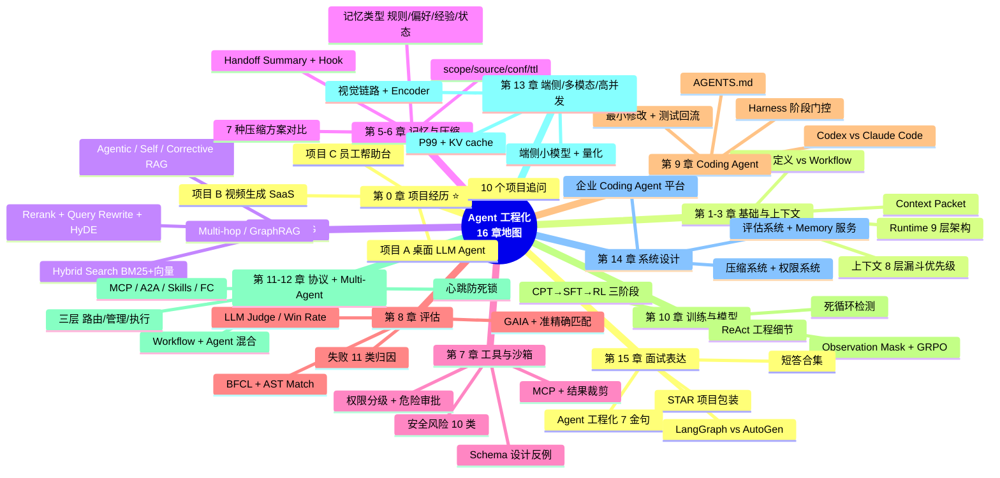

### **🗂️ 16 章主结构**

| 章 | 主题 | 核心内容 |
| --- | --- | --- |
| **第 0** | ⭐ **项目经历**（面试核心） | 项目 A 桌面 LLM Agent · 项目 B 视频生成 SaaS · 项目 C 员工帮助台 · 10 个项目级追问 |
| **第 1** | Agent 基础概念 | 定义 · vs Chatbot · vs Workflow · 工作循环 · 核心组件 · 难点 |
| **第 2** | Runtime 架构 | 9 层架构 · 状态管理 · 上下文一般包含 · prompt 为什么不够 |
| **第 3** | 上下文工程 | 优先级 8 层漏斗 · Context Packet 字段 · Token 预算分配 · 去重 |
| **第 4** | RAG 与检索 | 标准流程 · Chunking · Hybrid Search · Rerank · Query Rewrite · HyDE · Multi-hop · GraphRAG · Agentic/Self/Corrective RAG · 评估 · 权限 |
| **第 5** | 记忆系统 | 记忆类型 · Memory vs RAG · 自动记忆风险 · 数据结构 · 短期 vs 长期 · 抽取 · 检索 · 隐私 |
| **第 6** | 上下文压缩 | 7 种主流方案对比 · Handoff Summary 模板 · 触发时机 · 一致性验证 · 5 大生产陷阱 |
| **第 7** | 工具与沙箱 | 工具协议 · Schema 设计反例 · MCP · 结果裁剪 · 沙箱权限 · 错误处理 · 安全风险 |
| **第 8** | 评估体系 | 为什么难 · 指标矩阵 · BFCL（AST 匹配）· GAIA（准精确匹配）· LLM Judge · Win Rate · 评估集构建 · 失败归因 · 线上观测 |
| **第 9** | Coding Agent / Harness | 设计要点 · Codex vs Claude Code · AGENTS.md · Harness 工程 · 沙箱与最小修改 · 产品对比 |
| **第 10** | 训练流程与模型 | ReAct 工程细节 · CPT→SFT→RL · Observation Mask · GRPO 奖励 · 死循环检测 · 上下文爆炸 · 规划/反思 |
| **第 11** | 协议与生态 | MCP / A2A / Skills / Function Calling 四件套对比 · Workflow + Agent 混合 |
| **第 12** | Multi-Agent 编排 | 三层架构（路由/管理/执行）· A2A 心跳防死锁 · 三大落地挑战 |
| **第 13** | 端侧 / 多模态 / 高并发 | 端侧部署 · 视觉链路 · P99 优化 · KV cache |
| **第 14** | 系统设计综合题 | 设计企业 Coding Agent 平台 · 评估系统 · Memory 服务 · 压缩系统 · 权限系统 · 企业知识库 |
| **第 15** | 面试表达汇总 | 项目经验讲法 · 高级观点金句 · 高频追问 · 框架对比 · STAR 包装 · 短答合集 |

### **🎯 16 个 项目Story 分布**

```
项目 A · 桌面 LLM Agent (5 个 Story)
  Story 1 · Agent Loop + 防循环
  Story 2 · Tool Orchestrator 智能分段
  Story 3 · 4 层 system prompt + 96% Cache 命中
  Story 4 · 上下文分级压缩
  Story 5 · PolicyEngine 三级风控 + Bash 双通道

项目 B · AI 视频生成 SaaS (5 个 Story)
  Story 1 · 蓝绿部署优雅停机三连修 ⭐⭐⭐
  Story 2 · 任务可恢复架构（无 MQ）⭐⭐⭐
  Story 3 · 自研 Agent Tool-Calling Loop
  Story 4 · FIFO 过期感知积分系统 ⭐⭐⭐
  Story 5 · 多 AI Provider 抽象 + 模型路由

项目 C · 员工帮助台 (6 个 Story)
  Story 1 · 问题清晰度判断 + 参数补全
  Story 2 · 推荐问题召回（语义/全文/混合三种对比）⭐⭐⭐
  Story 3 · 全词匹配 + FAQ 语义拦截二层
  Story 4 · 领域分类 + 子域 Agent 编排
  Story 5 · MCP → Skill CLI 演进 + SSO 鉴权 ⭐⭐⭐
  Story 6 · RAG 知识库设计（切片 / 维护 / 版本）⭐⭐⭐
```

---

## **🎤 长题答题框架与视觉速记**

遇到长系统设计题，不要按散文背，统一用下面这个结构回答。

| 长题类型 | 一句话抓手 | 推荐回答结构 | 最适合补充的图/表 |
| --- | --- | --- | --- |
| Agent Runtime / 企业平台 | 模型只是推理核心，稳定性来自运行时系统 | 入口 → 状态 → 上下文 → 模型 → 工具 → 权限 → 观测 | 分层架构图 |
| Context / RAG | 不是塞更多信息，而是让模型看到高信号信息 | 信息来源 → 优先级 → 检索 → 裁剪 → 注入 → 验证 | 优先级表、RAG 流程图 |
| Memory / Compaction | Memory 服务未来任务，Compaction 服务当前续跑 | 生命周期 → 写入条件 → 检索策略 → 冲突/过期处理 | 对比表、handoff 模板 |
| Tool / Sandbox | Agent 会做事，所以必须可控、可审计 | 工具 schema → 权限判断 → 执行 → 观察 → 失败恢复 | 权限决策流程图 |
| Evaluation | 不能只看答案，要看过程轨迹和任务类型 | 数据集 → 执行轨迹 → 指标 → 失败归因 → 回归评估 | 指标矩阵表 |
| Coding Agent / Harness | 阶段内自主，阶段间门控 | PRD → 方案 → 开发 → Review → 测试 → 总结 | 生命周期图 |

长题回答的万能模板：

| 步骤 | 面试表达 | 避免的问题 |
| --- | --- | --- |
| 1. 背景和目标 | 先说这个系统解决什么问题、约束是什么 | 一上来堆模块名 |
| 2. 架构分层 | 用 5 到 8 个层次讲清职责边界 | 把所有能力混在一个“大模型”里 |
| 3. 核心链路 | 描述一次任务从输入到交付的路径 | 只讲静态组件，不讲运行过程 |
| 4. 关键取舍 | 解释为什么这样分层、为什么需要门控 | 没有 tradeoff，像背八股 |
| 5. 风险和兜底 | 讲上下文丢失、工具失败、权限、安全、成本 | 只讲理想情况 |
| 6. 指标和验证 | 用任务完成率、测试通过率、工具准确率等收口 | 不能证明系统有效 |



---
