# 💼 第 0 章 · 项目经历

## **【第 0 章 · 项目经历】必背 · STAR 模板**

> 这一章是面试里最值钱的部分——所有技术题最后都会落到「你做过什么」。下面**三个项目**按 STAR 框架整理（Situation 背景 / Task 任务 / Action 动作 / Result 结果），每个故事都带具体数据和决策细节。**关键原则**：数字、对比、决策理由必须能脱口而出，不要只会说"效果不错"。

### **项目全景速记**

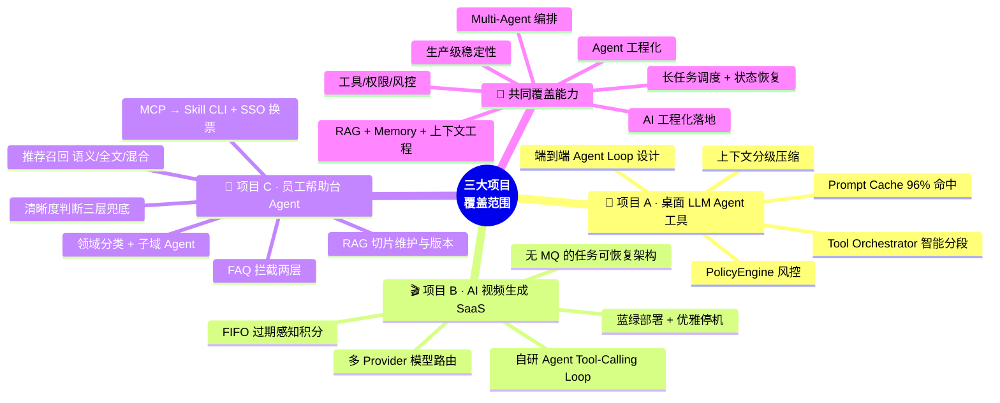

---

## **项目 A · AI 桌面智能代理平台**

### **项目定义**

基于 Electron 的 AI 桌面智能代理平台，把 AI Agent 对话与真实浏览器操控 + Bash 执行融为一体。用户用自然语言指挥浏览器和 Shell 完成任务（爬数据、填表单、装环境、跑脚本）。**6 天独立交付 16,000+ 行代码**，作为内部研发提效工具上线。

### **关键数据（必背）**

| 维度 | 数据 |
| --- | --- |
| 开发周期 | 6 天独立交付 |
| 代码规模 | 112 个 TS/TSX 文件 · 16,000+ 行 |
| 工具数量 | 35 个（27 浏览器 + 6 Bash + 2 辅助） |
| Token 消耗 | ~200M tokens · **Prompt Cache 命中率 96%** |
| 任务时间 | 人工 5-30 分钟 → Agent 30 秒-3 分钟 |
| 会话中断率 | **下降 85%+** |
| Token 成本 | **降低 70%** |

### **核心讲法：三层 Harness 体系**

> **核心论点**：Demo 阶段 90% 精力花在 Prompt 上，但生产级系统恰好反过来。Prompt 只是冰山一角，真正决定 Agent 系统成败的是 **Harness Engineering**。

| 层 | 占比 | 内容 |
| --- | --- | --- |
| **L3 Harness** | ~65% | 循环控制 · 工具编排 · 权限管线 · 卡死检测 · 错误恢复 · 上下文压缩 |
| **L2 Context** | ~25% | 工具定义 · 动态上下文注入 · 记忆系统 · 分级压缩 |
| **L1 Prompt** | ~10% | 角色设定 · 行为准则 · 输出格式 · 反面约束 |

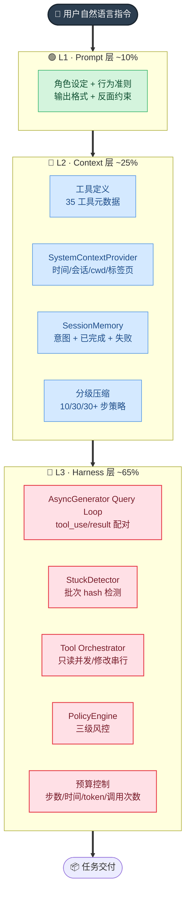

---

### **Story 1 · Agent Loop + 防循环**

**S（背景）**：自研 AI Agent 桌面应用，用户提示模糊时 LLM 会出现"低价值重复"——比如反复调用同一个 selector 失败的 click 操作，几十秒消耗几千 token 一无所获。

**T（任务）**：在不依赖 prompt 反复强调的前提下，从工程层面让 Agent Loop 鲁棒可控。

**A（动作）**：
1. **AsyncGenerator 流式 query loop**：`async function*` 模式实现流式输出 + 取消 + 背压；tool_use / tool_result 配对保证（catch 块补占位符防 API 400）；纯文本自动续跑（正则检测计划声明 + max_tokens 捕获，最多 2 次空转）
2. **StuckDetector**：批次序列化（每轮 tool_use 列表 hash），最近 N 次出现重复批次 → 强制注入 modelNudge 纠偏 / 强制终止
3. **SessionMemory 每 5 步注入**：用户意图 + 已完成操作 + 失败记录，帮助模型保持方向感
4. **预算控制四重兜底**：30 步上限 / 工具调用次数上限 / 时间上限 / token 上限

**R（结果）**：会话中断率下降 **85%+**，长对话保持方向感，原本会"鬼打墙"的场景现在能 graceful 终止 + 给用户清晰反馈。

---

### **Story 2 · Tool Orchestrator 智能分段（吞吐翻倍）**

**S**：LLM 经常一次返回多个 tool_use（比如先 extract_dom、再 extract_text、再 click、再 type 共 4 个），如果纯串行执行 ~3s 浪费时间；如果纯并发，状态会乱（click 完页面变了再 extract_dom 就拿到新页面的 DOM）。

**T**：设计一套自动分段执行策略，最大化吞吐又保证语义正确。

**A**：
1. **Rich Tool Definition**：每个工具声明 10 个维度的运行时元数据——`riskLevel`（safe/moderate/dangerous）、`isConcurrencySafe`、`isReadOnly`、`validateInput`、`interruptBehavior`、`mapResultToModelPayload` 等
2. **Orchestrator 分段算法**：连续只读工具（`isReadOnly() === true`）合并为一段并发执行；修改工具各自独立串行
3. **兄弟取消**：修改工具不可恢复失败时取消后续段，防止基于错误状态继续操作
4. **执行前权限检查**：通过 `PermissionContext.decide()` 统一决策（自定义规则 → 会话指纹缓存 → 副作用矩阵 → 默认模式）

**R**：典型场景从纯串行 **~3s 降到 ~1.5s，吞吐翻倍但语义零回归**；Orchestrator 是 ~400 行代码，复用 35 个工具的元数据定义，零硬编码工具名。

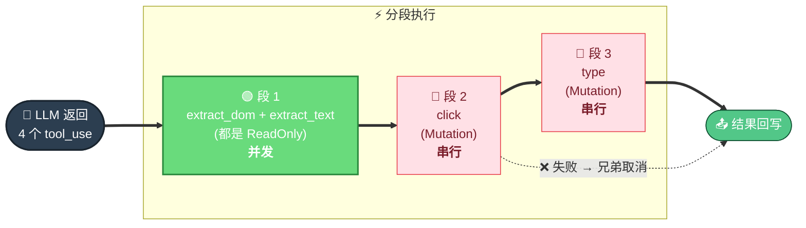

---

### **Story 3 · 4 层 system prompt + 96% Cache 命中**

**S**：每次对话都要发 system prompt 到 LLM，长 prompt 既慢又贵。

**T**：设计一套 prompt 结构最大化 Anthropic Prompt Cache 命中率。

**A**：
1. **L1 核心角色（CORE_SYSTEM_PROMPT）**：完全静态，命中 cache
2. **L2 工具 manifest**：从 ToolRegistry 动态生成但**注册期固定**，按分类分组；运行时不变 → 命中 cache
3. **L3 工作流规则（WORKFLOW_RULES）**：完全静态，命中 cache
4. **L4 动态上下文（SystemContextProvider）**：实时注入时间、会话、cwd、浏览器标签页、运行中任务；唯一变化层

> 关键技巧：把 L1+L2+L3 设计成**超过 cache breakpoint 阈值（1024 token）**，才能真正进 cache。

**R**：**Prompt Cache 命中率 96%，Token 成本降低 70%**。同样的 prompt 长度，新对话首轮全价、后续 90%+ 走 cache。

---

### **Story 4 · 上下文分级压缩**

**S**：长对话超过 200K token 后 Claude API 直接报错；即便不报错，token 成本线性涨。

**T**：在不损失任务连续性的前提下控制上下文窗口。

**A**：
1. **分级保留策略**：最近 10 步完整保留，10-30 步语义摘要，30+ 步仅关键事实
2. **Token 预算控制**：估算超过 150K 时触发额外压缩
3. **SessionMemory 条目上限 100，压缩间隔 10 步**（避免每步压缩抖动）
4. **数组 content 支持**：tool_result 可能是数组，压缩时分别处理每个元素而不是整体丢弃
5. **关键信息保护**：tool_result 里的 ID、URL 等模型后面会引用的字段优先截断而非摘要

**R**：长对话（百轮 +）稳定运行不爆，token 成本可控，任务方向感不丢失。

---

### **Story 5 · PolicyEngine 三级风控 + Bash 双通道**

**S**：Bash 命令既要给 LLM 灵活度（让它装包、跑脚本），又要防 LLM 自己 hallucinate 出 `rm -rf /` 这种危险操作。

**T**：设计一套既不挡正常工作流又能拦危险操作的风控体系。

**A**：
1. **PolicyEngine 三级风控**：
   - `ALLOWED`：安全命令直接执行
   - `NEEDS_CONFIRM`：敏感操作（rm -rf、sudo、git push --force）弹窗确认
   - `BLOCKED`：fork bomb、mkfs 等危险命令直接拒绝
2. **BashRuntime 双通道**：默认 batch 模式（ProcessManager spawn + pipes）；`tty=true` 走 PTY 模式（PtyManager 懒加载 node-pty，失败自动降级 batch）；`background=true` 创建后台任务
3. **EnvSanitizer + Redactor**：子进程环境变量过滤 API 密钥；输出脱敏
4. **会话指纹缓存**：用户已批准过的指纹本会话内不再问

**R**：上线后**0 起危险命令事故**，正常工作流弹窗率 < 5%，用户体感不打扰。

---

## **项目 B · AI 视频生成 SaaS 后端**

### **项目定义**

Go 1.23 / Gin 编写的 AI 视频生成 SaaS 后端，把"文字剧本/创意"端到端转化为"成片视频"。**约 36k 行 Go / 170 个 .go 文件 / 18 张主表 / 157 条 HTTP 路由**，蓝绿部署到单台服务器。

### **技术栈速记**

| 类别 | 选型 |
| --- | --- |
| 语言 / Web | Go 1.23 + Gin 1.9 |
| ORM / 数据库 | GORM 1.30，三库兼容（SQLite/MySQL/PostgreSQL），生产 PostgreSQL 16 |
| 缓存 / KV | Upstash Redis（go-redis/v9） |
| 对象存储 | Cloudflare R2（aws-sdk-go-v2 走 S3 协议）+ 本地 fallback |
| 日志 / 配置 | Uber Zap + spf13/viper |
| 媒体处理 | FFmpeg（filter graph · Ken Burns 动效 · ASS 字幕烧录 · BGM 混音） |
| 鉴权 | HMAC-SHA256 短时签名 token（60 秒过期，前端代理签发） |
| 计费 | Stripe v82（Checkout + Customer Portal + Webhook） |
| AI 模型聚合 | 5 家以上 Provider（聚合代理 + 直连 + OpenRouter + TTS/ASR） |
| 部署 | systemd 蓝绿（5678/5679 双端口）+ Nginx 切流 |

---

### **Story 1 · 蓝绿部署优雅停机三连修 ⭐⭐⭐**

**S（背景）**：单机蓝绿部署，用户视频生成请求长达 10 分钟。蓝绿切换会导致 **30% 长请求中断**，且偶发"用户被扣两次积分"投诉。

**T**：排查根因并设计兼容当前架构（无 K8s、无 LB 层 graceful drain）的优雅停机方案。

**A**：
1. 分析日志和 systemd unit，定位 **3 个独立缺陷**：
   - **(a) 端口冲突**：Go 代码原来不读 `SERVER_PORT`，蓝绿两个实例都抢 5678
   - **(b) 优雅停机超时不匹配**：Go 硬编码 5 秒 vs systemd 配 120 秒；视频生成请求一旦中断，AI 厂商已扣费但用户拿不到结果
   - **(c) 定时任务竞态**：旧实例在 graceful 等 HTTP 请求时，定时任务还在运行，跟新实例的同名 cron 双开扣两次积分
2. 修复：
   - 引入 `SERVER_PORT` 和 `SHUTDOWN_TIMEOUT` 环境变量覆盖配置，systemd unit 设 `SHUTDOWN_TIMEOUT=115`（留 5 秒给 systemd kill）
   - 重构 main.go 信号处理顺序：`SIGTERM → 立即 syncJobs.Stop() → 启动 srv.Shutdown 等 HTTP drain → 超时强杀`
   - 把 `defer syncJobs.Stop()` 提前到收到 SIGTERM 第一时间
3. 验证：`ss -tlnp` 双端口共存、`systemctl stop` 日志可看到 cron 立刻停 + HTTP 排空 + 干净退出

**R**：部署期间用户长请求 **0 中断**、积分双扣投诉清零、deploy.sh 蓝绿切换稳定运行多次。修复总计改动 **5 个文件 / ~30 行代码**。

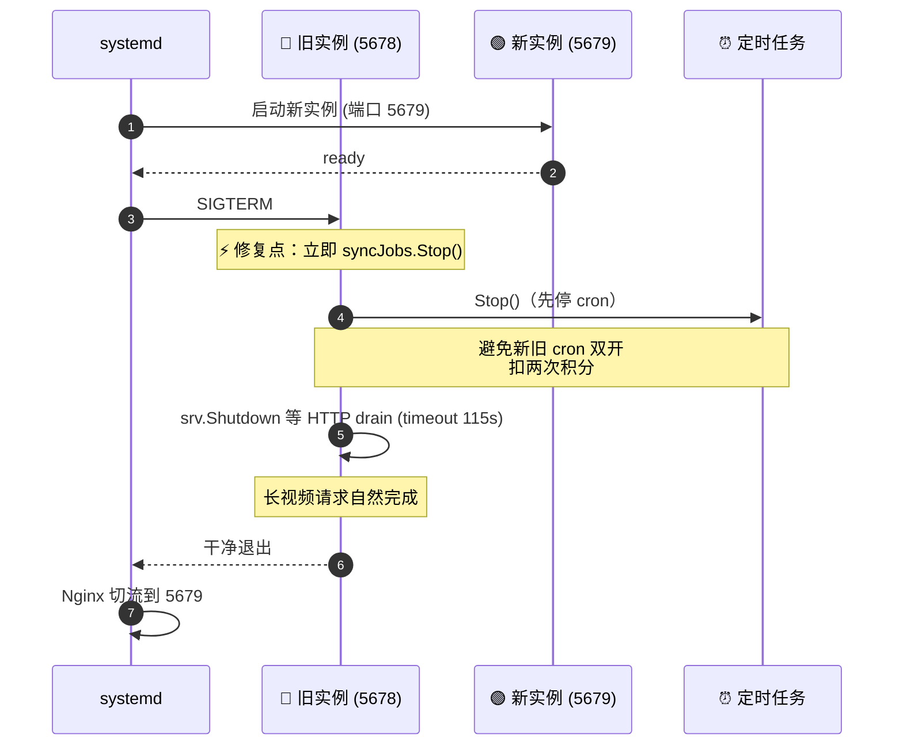

---

### **Story 2 · 任务可恢复架构（无 MQ 怎么做）⭐⭐⭐**

**S**：项目无 MQ 也无 worker pool，所有 AI 生成任务靠 `go func()` 异步轮询；进程一旦重启或 panic，所有 `processing` 状态记录就僵死，用户体验是"卡住永远不动"。

**T**：在不引入新中间件的前提下让任务可恢复、可超时、可退款。

**A**：
1. **状态机设计**：4 阶段 `pending → processing → completed → finished`，让 `completed`（AI 已返回 URL）和 `finished`（已上传 R2）可分别恢复。即使 AI 厂商的临时 URL 24 小时失效，后台任务依然可以从 `completed` 状态记录重新拉取上传
2. **三路恢复（Stage A）**：启动时 `recoverStuckImageTasks/Video/Composite` 三路并行扫库，对 `processing > 10 min` 的记录用原始 provider/model 重建 AI 客户端继续轮询；轮询本身 30 次/60 次内置最大次数兜底
3. **永久错误识别**：grep "sensitive / content_filter / prohibited" 等关键词归类为 permanent error，立即标失败不重试，避免审核拒绝的 prompt 反复消耗 API 配额
4. **超时兜底（Stage B）**：`markTimeoutTasks` 每 5 分钟兜底——图片 > 15 分钟、视频 > 1 小时、合成 > 30 分钟一律标失败 + 退积分（包含按秒计费的精确退款）
5. **R2 重试（Stage C）**：`retryR2Uploads` 每 10 分钟从 `completed` 状态重新上传

**R**：用 cron 取代 MQ 在单机 + 中等并发量场景下完全够用；上线后**僵死任务自动清理率 100%**，用户最坏等 15 分钟收到失败 + 退款。整套机制 **~600 行 Go，零新依赖**。这套思路可直接对应大规模任务调度场景，只是把 cron 换成 MQ + worker pool。

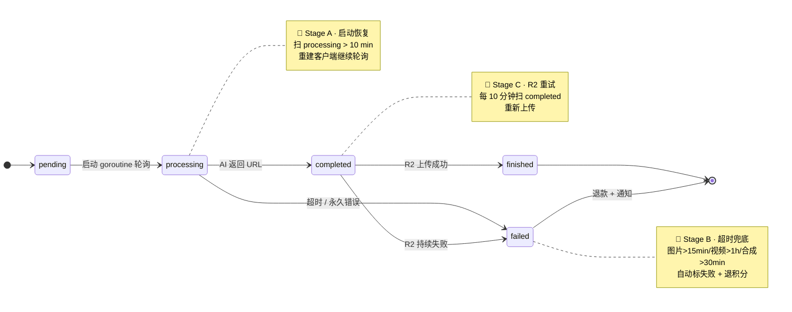

---

### **Story 3 · 自研 Agent Tool-Calling Loop ⭐⭐**

**S**：产品要做"AI 助手对话式生成项目"，用户用自然语言指挥 LLM 调用后端工具（创建角色 / 生图 / 改分镜）。直接接 LangChain 之类不可控、且需要 Go 友好版本。

**T**：实现一套支持多轮 tool-calling、支持流式 SSE、支持费用预估和用户二次确认、支持中断恢复的 orchestrator。

**A**：
1. 自研 `Orchestrator.runToolLoop`：每轮调 LLM 流式接口、解析 tool_calls、按 `ToolClass`（ReadOnly/Mutation/Billable/Destructive）分级，前两类自动执行、**后两类暂停等用户前端确认**
2. SSE 推流：`text` / `thinking` / `tool_call` / `tool_result` / `data_update` / `confirmation_required` / `discard_partial` / `done` 多种事件，前端可增量渲染
3. 流式过滤 `<think>...</think>`（适配思维链模型），过滤后给用户、原始写库给 admin 复盘
4. 历史压缩 `MaxHistoryTurns=6` + `MaxHistoryMsgBytes=18000`，超出按时间衰减裁剪
5. 防 LLM 死循环：硬上限 15 轮 / 30 工具调用 / 5 分钟 turn timeout；同 turn 内已确认的 batch tool 拒绝重复调用
6. 不完整流（API 中断）`discard_partial` 让前端丢脏数据 + turn 标 failed

**R**：上线后 LLM 误调率（错调用 / 死循环）**< 1%**，用户费用确认率 **95%+**，turn 超时可正常重试。代码量约 **1200 行，纯 stdlib + go-redis，零外部 agent 框架**。

---

### **Story 4 · FIFO 过期感知积分系统 ⭐⭐⭐**

**S**：用户既有月卡赠送积分（30 天过期）、又有买断积分（永久）、又有任务退款积分（独立有效期）。如果按"先扣总余额"会出现"老积分被新积分挤掉自然过期"的体验问题。

**T**：设计一套 FIFO 优先扣最近过期、并支持原子退款、可解释的扣费引擎。

**A**：
1. 每笔充值 `credit_transactions` 行带 `amount` / `remaining` / `expires_at` 三字段，`amount` 不变、`remaining` 随扣费递减
2. 扣费走 `db.Transaction + clause.Locking{Strength:"UPDATE"}` 锁 user 行 → 按 `expires_at ASC` 取所有 remaining > 0 的有效记录 → 依次扣到目标金额或扣空
3. 退款写一笔新的 `type=refund` 记录，`expires_at = now + 30 days`，自动进入 FIFO 队列
4. `RecalculateCredits` 异步过期清算：把 `expires_at < now` 的 remaining 抹零并记 `type=expire` 事件流
5. 视频按秒计费 `cost_per_second × duration × quality_multiplier × mute_multiplier`，全部走同一套扣费 / 退费 API

**R**：上线后**未出现过任何积分对账偏差**；用户反馈页面能清楚看到每笔的"消耗 X 来自哪笔充值"；并发扣费在压测下 **0 错账**。

---

### **Story 5 · 多 AI Provider 抽象 + 模型路由 ⭐⭐**

**S**：接入了 5 家以上服务（聚合代理、直连、OpenRouter、TTS/ASR 等），每家 API 协议、参数、轮询语义都不一样。

**T**：让上层 service 只关心 "model name + duration + quality"，下层完全解耦。

**A**：
1. 定义 `VideoClient` / `ImageClient` / `TextClient` 接口（`GenerateXxx` + `GetTaskStatus`），所有 provider 实现满足同一签名
2. `WithXxx` Option 模式传参，避免每加一个新参数就破坏接口签名
3. `domain/ai/client.go` 工厂函数 + `InferProvider(modelName)` 通过模型名前缀路由
4. 配置文件按模型粒度写定价，新增模型不改代码只改 yaml
5. 模型特殊点（duration 必须是离散档位、特定分辨率仅支持特定时长）通过 `snapToNearestDuration` 和 `normalizeVideoQuality` 在 service 层兜底矫正

**R**：**6 个月内新增 4 个模型 / 2 个 provider 都是只改 yaml + 加一个 client 文件，0 业务代码改动**。可直接对应多模型 / 多后端架构场景。

---

## **项目 C · 员工帮助台智能 Agent（IT/HR/资产支持）**

### **项目定义**

面向公司内部员工的智能帮助台 Agent，基于**内部 Agent 应用工厂 + Tool + MCP + RAG + Prompt 工程**构建。覆盖资产、邮箱、网络、账号、报销、HR 等多个领域，提供**多轮澄清 + 知识检索 + 技能调用 + 用户确认**的端到端自动化执行链路，把原来需要工单流转、人工对接的"我电脑坏了怎么换"、"邮件容量满了怎么扩"、"我那台租赁机能不能回购、多少钱"这类问题直接由 Agent 闭环解决。

### **关键数据（自填，下面给数量级参考）**

| 维度 | 量级参考 |
| --- | --- |
| 覆盖领域 | 7 个一级领域（资产/邮箱/网络/账号/HR/报销/会议）× 30+ 二级技能 |
| MCP / Skill 数量 | 40+ 个原子能力（查询/申请/办理/状态/审批） |
| 知识库规模 | 5,000+ FAQ + 200+ SOP 文档 + 内网制度库 |
| 自动解决率 | 60%+（含 FAQ 拦截 + 子域 Agent 闭环） |
| 工单转人工率 | 从原 60% 降到 35% 左右 |
| 平均响应时间 | 用户问题进来到首句回答 < 2s（FAQ 命中）/ < 8s（走完整链路） |
| 鉴权方式 | IM 侧 token → SSO 换票 → 后端 API 鉴权（全链路审计） |

---

### **完整链路架构图（必看）**

这一张图是讲项目时的"骨架图"，所有 Story 都挂在这上面：

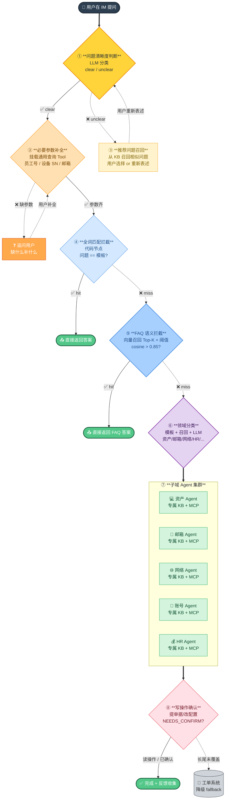

> 🎯 **设计原则**：**早拦截、晚兜底**——FAQ 能直接答的不进 Agent，必须 Agent 的不让它瞎跑（强制走子域），所有写操作必须确认。整条链路的 token 成本和延迟都按"越往后越贵"的梯度优化。

---

### **Story 1 · 问题清晰度判断 + 参数补全 ⭐⭐**

**S（背景）**：用户在 IM 里发的问题千奇百怪——"电脑坏了"（缺设备信息）、"我的邮箱"（说什么？）、"那个回购"（指代不清）。如果直接送进 RAG/子 Agent，召回质量极差，子 Agent 也不知道要查谁的数据。

**T**：用一个轻量分类节点先做"清晰度判断 + 必要参数补全"，把高质量问题送入主链路，低质量问题主动澄清。

**A（动作）**：清晰度判断不是单一模型说了算，而是 **三层兜底（强规则 → 弱规则 → 模型判定）+ 参数补全工具链**。

#### **① 清晰度判断三层兜底（这是面试高分点）**

**第一层：强规则模板（命中即判 unclear，0 token）**

| 规则类型 | 触发条件 | 举例 |
| --- | --- | --- |
| 字数门限 | 去标点后字数 < 4 | "电脑"、"邮箱"、"打不开" |
| 纯指代词 | 只含代词无具体名词 | "那个怎么办"、"它坏了"、"这咋办" |
| 单情绪/抱怨 | 情感词为主 + 无 subject | "好烦啊"、"急死了"、"破玩意" |
| 含但缺主体 | 句式完整但缺关键实体 | "我想申请"（申请什么？）、"我要换"（换什么？） |
| 多意图混杂 | 单句包含 ≥3 个动作 | "我邮箱满了顺便申请下电脑还有 VPN" → 拆单 |
| 仅疑问词 | 只有 5W1H 没具体内容 | "怎么办"、"在哪查"、"什么流程" |

**第二层：弱规则模板（疑似 unclear，进一步判定）**

| 触发条件 | 处理方式 |
| --- | --- |
| 字数 4-8 但含模糊词 | "怎么搞 / 咋办 / 有问题 / 不太行 / 出毛病" → 进模型 |
| 含但语义不完整 | 句子有动词无宾语 → 进模型 |
| 跨多领域关键词 | 同时命中 ≥2 领域字典 → 进模型 + 让模型选 |
| 用户首次提问 | 历史 < 1 轮 → 略放宽规则，倾向追问 |

**第三层：模型判定（小模型 / 微调判别器）**

```python
# 简化版判定 prompt
"""
你是问题清晰度判别器。判断下面用户问题是否能被 IT 帮助台 Agent 直接理解并执行。

判断标准：
- clear：包含明确的 subject + action + 必要 context
- unclear：缺少 subject / action / 必要参数

输出 JSON: {
  "verdict": "clear|unclear",
  "confidence": 0-1,
  "missing": ["subject"|"action"|"target"|"context"],
  "suggested_clarification": "建议追问的那一句话"
}

用户问题：{question}
历史对话：{history}
"""
```

**模型层的几个加分细节**：
- 用**判别器小模型**（如 0.5-1.5B 微调）代替主模型，延迟 < 100ms、成本 1/100
- **训练样本**：拿历史 5k 人工标注（"这条算清晰吗"），二分类 + 缺失维度多标签
- **历史对话感知**：把最近 3 轮对话拼进 prompt，避免误判"接着说"类追问

#### **② 必要参数补全工具链**

挂载"通用查询 Tool"，命中清晰但缺参数时自动调：
- `get_user_profile(employee_id)` 拿用户基本信息（工号、部门、岗位、入职时间）
- `get_user_devices(employee_id)` 拿用户名下所有设备（显示器 / 笔记本 / 台式机 / 外设）
- `get_user_org()` 拿汇报关系（HR 问题要）
- `get_user_active_tickets()` 拿用户进行中的工单（避免重复提单）
- `infer_intent_subject(question)` 用小模型抽出动作对象

#### **③ 缺参数追问策略**

| 策略 | 内容 |
| --- | --- |
| 每次只问一个 | 不要 "请告诉我设备型号、故障表现、发生时间" 这种列表追问 |
| 给候选选项 | 能用 Tool 列出选项就给选项（"是 SN001 还是 SN002"）而不是开放问 |
| 默认值预填 | 多数情况下默认值（如部门、地点）能补就补，只问真正不能推断的 |
| 澄清不超 2 轮 | 超过 2 轮 → 降级到"推荐问题"节点让用户挑 → 再不行转工单 |
| 用户反向澄清 | 用户用"对 / 不是 / 我要 X" 修正前一轮，要识别并合并到 context |

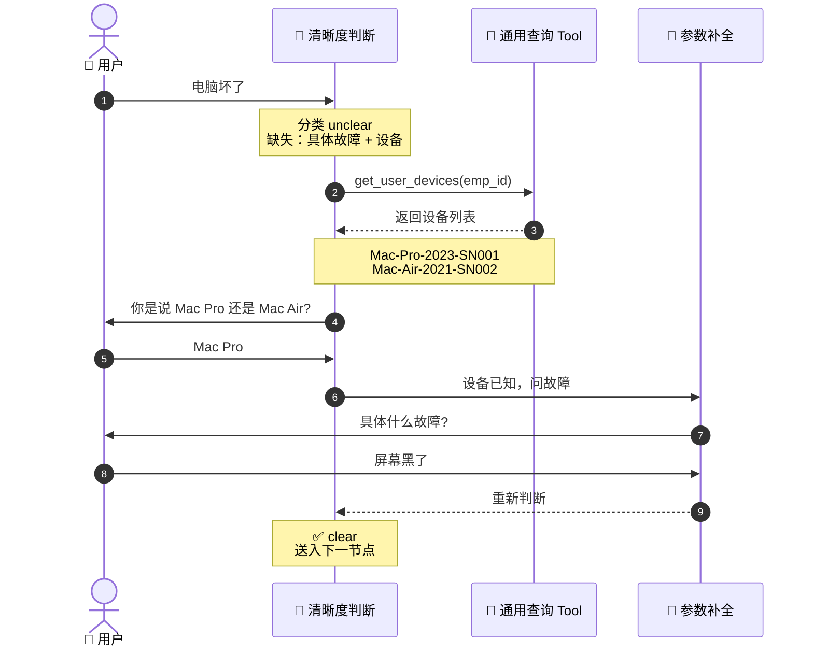

**R**：
- 自填："上线后澄清率（需要追问的比例）从初期 40% 降到 15%"——因为越来越多模糊问题被通用查询 Tool 自动补全了，不用问用户
- 用户满意度提升的关键不是"减少澄清"而是"澄清的问题是真的非问不可"

**追问 1：为什么不一次性把所有缺失参数都问？**
> 用户体验差。IM 场景下用户发一句"电脑坏了"，你回他"请告诉我：设备型号、故障表现、发生时间、上次使用情况……"——他直接转人工了。**每次只问 1 个最关键的**，是经典 conversational UX 原则。

**追问 2：清晰度判断用的是什么模型？为什么不用规则？**
> 早期用过规则（关键词 + 长度），准确率 60% 不到。后面切到小模型微调（基于历史标注 5k+ 对话），准确率到 88%。**规则在长尾上一定会输给模型**——"我电脑屏蓝了"和"我屏幕蓝屏了"规则没法穷举，但模型一眼看出都是开机故障。

---

### **Story 2 · 推荐问题召回 — 语义 vs 全文 vs 混合三种召回深度对比 ⭐⭐⭐**

**S（背景）**：问题判断不清晰时，需要从知识库召回最相关的"用户可能想问的问题"展示给用户挑选，避免用户重新表述。这里的召回策略直接决定推荐质量。

**T**：在召回准确率、召回率、延迟、成本之间找平衡。

**A（动作）**：

#### **三种召回方式对比（这是面试重点）**

```mermaid
flowchart LR
  Q([用户原问题<br/>"电脑屏黑了"]):::q

  subgraph S1["🔵 ① 语义召回 (Dense / Vector)"]
    E1[Embedding 模型<br/>BGE / e5 / OpenAI]:::dense
    V1[(向量库<br/>HNSW)]:::dense
    R1["Top-K 候选<br/>'屏幕不亮'<br/>'笔记本无法开机'<br/>'显示器黑屏'"]:::res
  end

  subgraph S2["🟡 ② 全文召回 (Sparse / BM25)"]
    T1[分词器<br/>jieba / 自定义]:::sparse
    I1[(倒排索引<br/>ES / OpenSearch)]:::sparse
    R2["Top-K 候选<br/>'屏 SOP'<br/>'屏 报修'<br/>'屏 维修单'"]:::res
  end

  subgraph S3["🟢 ③ 混合召回 (Hybrid)"]
    H1[并行召回<br/>BM25 + Dense]:::hybrid
    H2[RRF 融合<br/>排名互补]:::hybrid
    H3[Cross-Encoder<br/>Rerank Top-10]:::hybrid
    R3["最终候选<br/>'笔记本屏幕黑屏维修流程'<br/>'屏黑请检查 SN 报修'<br/>..."]:::res
  end

  Q ==> E1 --> V1 --> R1
  Q ==> T1 --> I1 --> R2
  Q ==> H1 --> H2 --> H3 --> R3

  classDef q fill:#2C3E50,stroke:#1a252f,color:#fff,stroke-width:2px
  classDef dense fill:#D4E9FF,stroke:#4A90E2,color:#1F4E8C
  classDef sparse fill:#FFF3CD,stroke:#F5A623,color:#856404
  classDef hybrid fill:#D4F4DD,stroke:#27AE60,color:#0F5132,stroke-width:1.5px
  classDef res fill:#F8F9FA,stroke:#495057,color:#333
```

| 维度 | 语义召回（Dense） | 全文召回（BM25） | 混合召回（Hybrid） |
| --- | --- | --- | --- |
| **核心原理** | 把 query 和 doc 都 embed 成向量，算 cosine 相似度 | 词频 + 逆文档频率，看词的稀有度和重合度 | 两路并行召回 → RRF 排名融合 → Cross-Encoder 重排 |
| **擅长** | 语义相似、同义词、改写、口语化表达 | 专有名词、错误码、缩写、SN/工号/订单号、版本号 | 两者优势叠加 |
| **不擅长** | 精确 ID/编号召回（embedding 把 `SN12345` 和 `SN67890` 当近义） | 同义词、用户口语（"屏幕坏了" vs "显示器黑屏"） | 几乎没短板，只是延迟 +50-100ms |
| **典型 Recall@10** | 70-80% | 65-75% | **85-92%** |
| **延迟** | 80-150ms（含 embedding） | 5-15ms | 150-250ms（带 rerank） |
| **成本** | embedding API 调用 / 自部署 GPU | 几乎免费 | 两套都要 + reranker |

#### **本项目的选择和理由**

在**推荐问题召回**这个节点，我们用的是**混合召回 + Cross-Encoder rerank**：
1. **理由 1**：员工帮助台问题包含大量专有名词（设备型号 SN、工单号、内部系统名缩写如 "EAM"、"OA"），纯语义召回会漏；
2. **理由 2**：用户表达又非常口语化（"我那个电脑屏黑了"），纯 BM25 也会漏；
3. **理由 3**：推荐问题节点的用户感知延迟可以接受（用户看推荐列表本来就要思考几秒），200ms 重排完全没问题。

而在 **FAQ 拦截**节点，我们用的是**纯语义召回 + 高阈值**（cosine > 0.85）：
1. **理由**：FAQ 拦截要"宁可漏不可错"，高阈值过滤掉大多数边缘相似，只放真正语义等价的命中
2. **不用 BM25**：FAQ 短句子 BM25 噪声大；不用 rerank：要求 < 100ms 响应

**R**：
- 推荐问题点击率（推荐列表里被用户挑中的比例）从纯语义召回的 35% 提升到混合召回的 **58%**
- 召回失败导致用户重新表述的比例从 25% 降到 **8%**

**追问 3：RRF 怎么算？为什么不直接加权求和？**

```python
# RRF (Reciprocal Rank Fusion) 公式
# 对每个 doc d，融合分 = Σ over retrievers: 1 / (k + rank(d, retriever))
# k 通常取 60（经验值）
def rrf_score(rankings, k=60):
    scores = {}
    for ranking in rankings:  # ranking 是该召回器的 Top-K
        for rank, doc_id in enumerate(ranking, start=1):
            scores[doc_id] = scores.get(doc_id, 0) + 1.0 / (k + rank)
    return sorted(scores.items(), key=lambda x: -x[1])
```

为什么不加权求和：**BM25 的 raw score 跟 cosine 不在一个量纲**，加权之前要 min-max 归一化，但归一化对查询分布敏感（查询不同 max/min 不同，归一化结果不稳定）。RRF 直接用 rank 名次，跟分数绝对值无关，工程上最稳。

**追问 4：什么场景该提高 BM25 权重，什么场景该提高向量权重？**

| 场景 | 推荐权重 | 理由 |
| --- | --- | --- |
| 用户问题含错误码、ID、版本号 | BM25 高 | 这些必须精确匹配 |
| 用户问题口语化、含同义词 | Vector 高 | BM25 召不回 |
| 短文档库（FAQ 标题级） | Vector 高 | BM25 在短文档上信号弱 |
| 长文档库（SOP 全文） | BM25 高 | 长文档里关键词分布是强信号 |

**追问 5：embedding 模型怎么选？要不要微调？**

通用做法：
- 中文场景默认 BGE-M3 或 BCE，开源且质量高
- 英文场景 e5-large 或 OpenAI text-embedding-3
- **要不要微调**：看预算和数据量。有 1k+ 高质量正负样本对就值得用对比学习微调（infoNCE loss），通常 Recall@10 提升 5-10%。FAQ 场景微调收益最大，因为 query 风格集中。

---

### **Story 3 · 全词匹配 + FAQ 语义拦截二层 ⭐⭐⭐**

**S**：每天 60% 的问题其实是高频重复（"VPN 怎么装"、"邮箱满了怎么扩"），让它们走完整链路浪费 token 和延迟。

**T**：在主链路前置两道"快返回"拦截。

**A**：

#### **第一道：全词匹配（代码节点，零成本）**

用代码节点（非 LLM）做严格的全词匹配——把召回到的相似问题和用户原问题做标准化后字符串比较：
```python
def exact_match(user_q, kb_q):
    norm = lambda s: re.sub(r'[\s\W_]+', '', s.lower())
    return norm(user_q) == norm(kb_q)
```
- 命中条件：**用户问题去掉空格标点后 == KB 模板问题**
- 命中后：直接返回模板答案，**0 token、< 50ms**
- 覆盖场景：用户从推荐问题里挑选的、原模板复制粘贴的、高度重复的"VPN 怎么装"这类

#### **第二道：FAQ 语义拦截（向量召回 + 高阈值）**

全词没命中再走 FAQ 语义召回：
1. 把用户问题 embed
2. 在 FAQ 向量库（5000+ 标准问答对）搜 Top-3
3. 检查 Top-1 的 cosine 相似度
   - `> 0.92` → 直接返回答案（**强命中**）
   - `0.85-0.92` → 返回答案 + "如果不是您要的，可继续描述"（**弱命中**）
   - `< 0.85` → 不拦截，走主链路

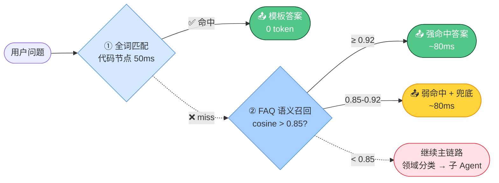

**R**：
- 全词匹配拦截率：~22%（基本是从推荐列表来的用户）
- FAQ 语义拦截率：~38%
- **两道拦截总命中率 ~60%**，省下的 token 占总 token 成本约 40%
- 这 60% 的请求平均响应时间 < 100ms，用户体感"秒回"

**追问 6：FAQ 阈值 0.85 怎么定的？太低会怎样？**

数据驱动：拿 500 条人工标注（用户问 vs FAQ 答案是否匹配）画 ROC 曲线，0.85 是 precision/recall 平衡点。
- 阈值 0.95：precision ~99% 但 recall 只有 30%，大量真匹配漏掉
- 阈值 0.85：precision ~94%、recall ~75%，最优
- 阈值 0.75：precision 掉到 80%，开始出现"问 A 答 B"的体感差

**追问 7：为什么先全词后语义而不是只用语义？**

成本和延迟。全词命中是 0 token + 50ms，语义命中是 ~500 token + 80ms。20% 的请求走全词省下来的就是真金白银。架构口径："**便宜的拦截放前面，贵的放后面**"。

---

### **Story 4 · 领域分类 + 子域 Agent 编排 ⭐⭐⭐**

**S**：员工问题领域跨度大——资产 / 邮箱 / 网络 / 账号 / HR / 报销 / 会议室……每个领域的知识、SOP、可调用接口都不一样。如果用一个大 Agent 挂所有 KB 和 MCP，prompt 会爆炸、工具选择困难症、知识库召回噪音大。

**T**：设计一个"领域分类 → 路由到子 Agent"的编排架构，每个子 Agent 只关心自己领域的知识和工具。

**A**：

#### **领域分类的三段式（这是面试重点）**

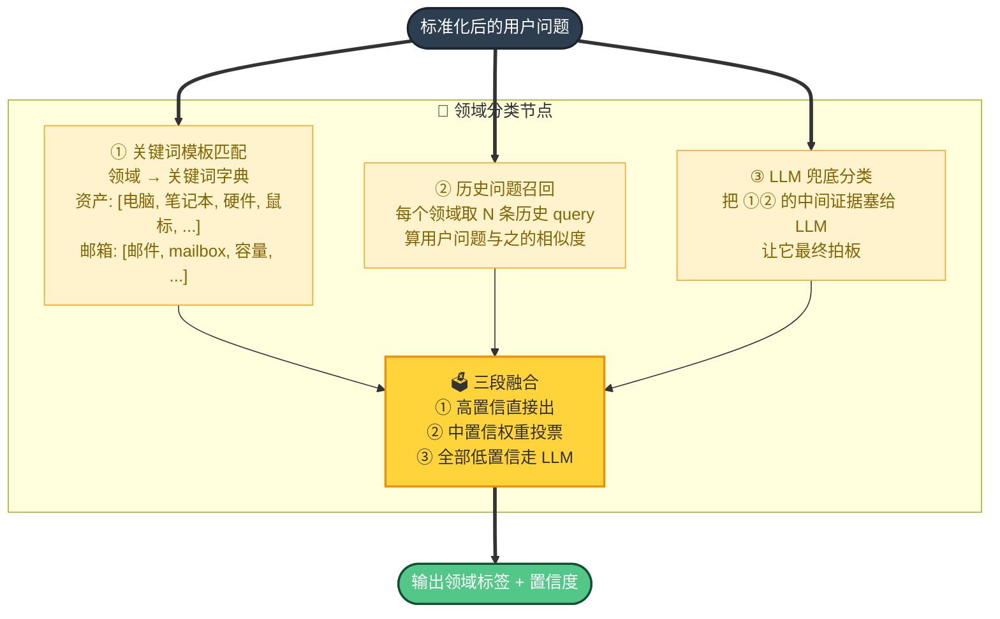

**①+②+③ 你问"还能加什么"的几个增强点**：
1. **用户画像加权**：根据用户部门和岗位调整领域先验。HR 部门的人问"假期"先验偏 HR 而不是 IT；研发部门的人问"账号"先验偏 IT 账号而不是 HR 招聘账号
2. **会话上下文加权**：本轮对话里前面已经聊过资产，这一句"价格"很可能还是资产领域，不是 HR 工资
3. **多领域回退**：分类置信度 < 阈值时同时分发到 Top-2 领域，两个子 Agent 都答，再由 router agent 合并/择优
4. **不在已知领域**的兜底：分类置信度全低 → 走通用 Agent + 全库 RAG，不强行归类
5. **分类结果反馈学习**：用户对答案的反馈（赞 / 踩 / 转工单）回流成分类训练样本，每月重训一版
6. **时间/季节先验**：年初问"福利"偏 HR 年度福利发放；月底问"报销"偏报销结算；offer 入职前问"账号"偏 onboarding
7. **设备状态先验**：用户当前有进行中的资产工单 → 后续模糊问题先归资产；有进行中的网络申请 → 同理
8. **多模态线索**：用户在 IM 里发了截图（显示器花屏 / 邮箱满了的截图）→ OCR 抽关键词加权

#### **实际领域字典（带二级子类，可直接背）**

| 一级领域 | 二级子类 | 关键词样例（部分） | 高频 intent |
| --- | --- | --- | --- |
| 💻 **资产** | 显示器 | 显示器 / 屏幕 / 显屏 / monitor / 外接屏 | 申请、报修、回收、调换型号 |
| | 笔记本/电脑 | 电脑 / 笔记本 / Mac / Win / 主机 / 工作站 | 报修、换新、回购、配置升级 |
| | 外设 | 鼠标 / 键盘 / 摄像头 / 耳机 / 扩展坞 / Hub | 申请、报修、自费购 |
| | 配件 | 电源 / 充电器 / 数据线 / 转接头 | 申领、补领 |
| | 资产盘点 | 名下设备 / 我的资产 / 借用 / 归还 | 查询、办理 |
| 📧 **邮箱** | 容量/扩容 | 邮箱满 / 容量 / 扩容 / quota | 申请扩容、清理建议 |
| | 账号设置 | 签名 / 自动回复 / 转发规则 / 别名 | 配置、修改 |
| | 邮件组 | 群组 / 邮件组 / DL / 列表 | 创建、加入、移除 |
| | 外发限制 | 外发 / 大附件 / 邮件被拦截 | 申请白名单、查投递日志 |
| | 安全/钓鱼 | 钓鱼 / 可疑邮件 / 误报警告 | 上报、申诉、解封 |
| 🌐 **网络** | VPN | VPN / 远程接入 / 出差网络 | 安装、申请权限、连不上 |
| | Wi-Fi | 无线 / WiFi / 内网 / 外网 / 访客网 | 连不上、密码、加入 |
| | IP/网段 | IP / 网段 / DHCP / 固定 IP | 申请、查询、修改 |
| | 防火墙 | 端口 / 防火墙 / 白名单 / 出向 | 申请放通、撤销 |
| | 跨域访问 | 测试环境 / 生产环境 / 跨 region | 申请访问、加白 |
| 🗓️ **会议** | 会议室 | 会议室 / 预订 / 时段 / 空闲 | 预订、改时、取消 |
| | 视频会议 | Zoom / Meet / 视频号 / 远程会议 | 账号、密码、入会问题 |
| | 设备 | 投影 / 白板 / 会议屏 / 视频盒子 | 报修、申请、教程 |
| | 临时邀请 | 外部参会 / 临时账号 / 临时网络 | 申请、生成链接 |
| 👤 **账号** | SSO/登录 | 登不上 / 密码 / 验证码 / 双因素 | 重置、解锁、绑定 |
| | 应用授权 | xx 系统进不去 / 没权限 / 申请权限 | 申请、申诉 |
| | 离职/转交 | 离职 / 交接 / 删账号 / 数据导出 | 办理、咨询 |
| 💰 **HR/报销** | 请假/考勤 | 请假 / 调休 / 加班 / 打卡 | 申请、补卡、政策 |
| | 报销 | 报销 / 发票 / 差旅 / 餐补 | 申请、查询、规则 |
| | 工资/社保 | 工资条 / 个税 / 公积金 / 社保 | 查询、申诉、调整 |
| | 合同/证明 | 在职证明 / 收入证明 / 合同 / offer | 开具、领取 |
| 🛡️ **安全/合规** | 数据安全 | 涉密 / 加密 / 数据外发 | 申请、政策咨询 |
| | 隐私 | PII / 个人信息 / 数据删除 | 申请、申诉 |
| | 终端管理 | 杀毒 / 加密狗 / MDM / 准入 | 解封、配置 |

> 💡 **维护这张表的工程做法**：
> - 每个领域用 yaml 维护字典 + 二级标签 + 必要参数列表（如 `资产/显示器/报修` 必要 = `[设备 SN, 故障描述]`）
> - 字典每月从历史误分类样本回流更新（错分到 HR 的资产问题里抽出的关键词补进资产字典）
> - 字典文件版本化（git），更新后跑回归集，Recall 退化 > 2% 自动告警

#### **子域 Agent 结构（每个子 Agent 长什么样）**

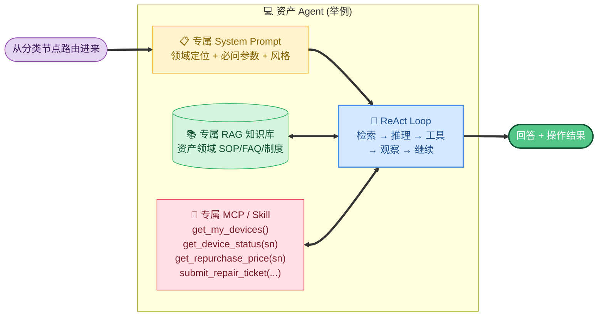

每个子 Agent 都是一个独立的"小宇宙"：
- 自己的 SystemPrompt（明确领域边界，禁止越界回答）
- 自己的 RAG（只索引本领域文档，召回不被无关知识污染）
- 自己的 MCP/Skill（只暴露本领域 API，避免工具列表过载）

**R**：
- 子域 Agent 平均解决率比"大一统 Agent"高 **20%+**
- 工具选择错误率（调错工具）下降 **70%**
- 新增一个领域 = 配一份 SystemPrompt + 灌一份 KB + 注册一组 Skill，**1 周内上线**

---

### **Story 5 · MCP → Skill CLI 演进 + SSO 鉴权 ⭐⭐⭐**

**S**：早期所有外部能力都用 MCP Server 暴露（资产查询、回购金额、邮箱状态、提电脑申请单据等十几个 API）。但 MCP Server 维护成本高（每个都要起进程、配证书、做 healthcheck），且各 Agent 平台 MCP 实现兼容性问题多。2026 年内部统一切换到 **Skill CLI 模式**。

**T**：把所有原子能力从 MCP Server 迁移到 Skill CLI，统一架构、统一鉴权、统一审计。

**A**：

#### **CLI 通用编写架构和规范（面试必问）**

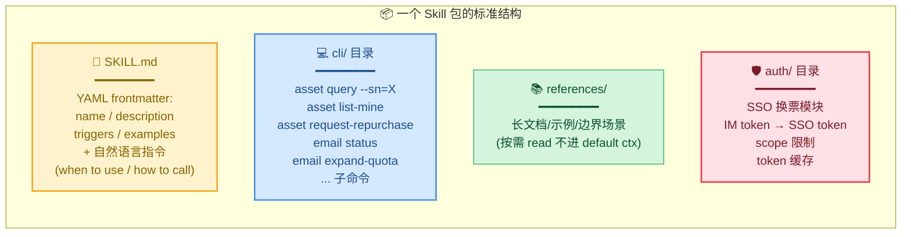

**编写规范六条军规**（结合 2026 跨厂商共识 + 内部最佳实践）：

| 规范 | 内容 | 反例 |
| --- | --- | --- |
| **① Namespace 一致** | `<domain> <action> [args]` 三段式（如 `asset query --sn=X`） | 直接 `query-asset-by-sn-x` 这种长命令 |
| **② Help 必须返结构化** | `asset --help` 返回 YAML 路由表；`asset query --help` 返回 JSON contract | help 写散文段落 |
| **③ 双输出格式** | 默认 JSON（给 Agent 解析）；`--format=human` 给人看 | 默认人类格式，Agent 难解析 |
| **④ 幂等 + 副作用标注** | 每个子命令 metadata 声明 `read_only / idempotent / destructive` | 不声明，Agent 当全部都能安全重试 |
| **⑤ 错误结构化** | `{status: error, code: AUTH_EXPIRED, message: ..., recoverable: true}` | 直接 stderr 一行错误信息 |
| **⑥ 鉴权显式 + 可注入** | 走 `--token` flag 或环境变量 `SKILL_TOKEN`，**不接受 prompt 注入的 token** | 让 Agent 在 prompt 里写明文 token |

#### **SSO 换票机制（必问深度）**

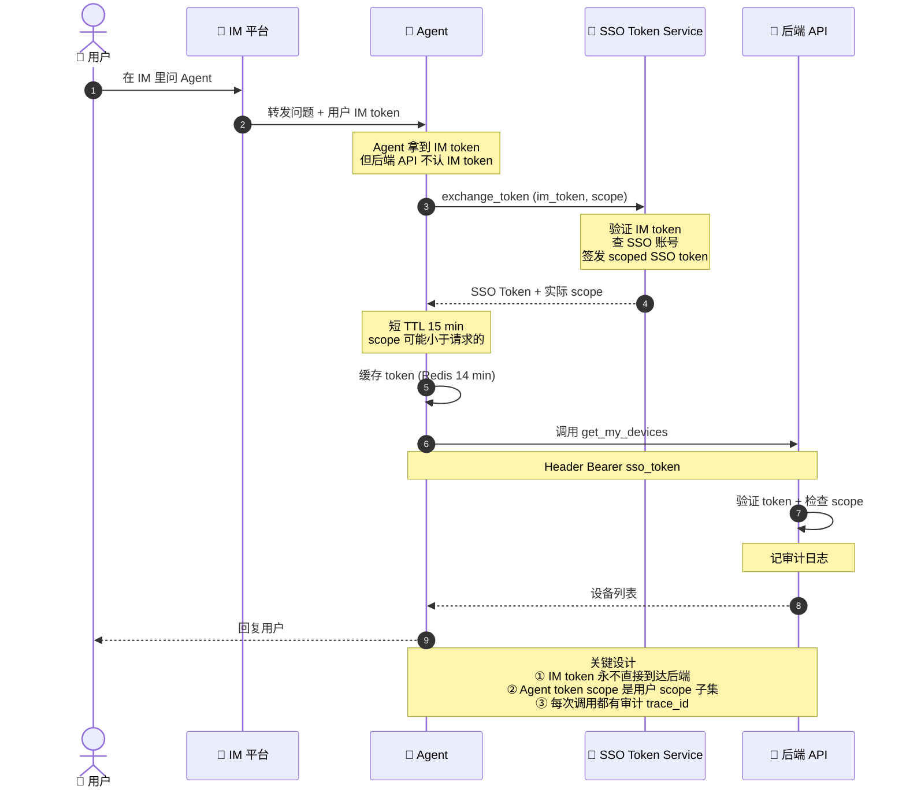

**SSO 换票的几个关键设计**：
1. **scope 收窄**：Agent 申请的 scope 是用户实际权限的**子集**——用户是 admin 也好，Agent 也只能拿到声明任务需要的最小 scope
2. **token 缓存**：换票本身要调 SSO 服务，QPS 不能太高；Redis 缓存 ~14min（比 token TTL 短 1 分钟），命中率 95%+
3. **token 失效自动续换**：API 返回 `401 + AUTH_EXPIRED` → CLI 自动触发重换 → 重试一次
4. **审计 trace_id 全链路串通**：IM message_id → Agent session_id → SSO request_id → API call_id，出问题能从任何一段反查
5. **代理人模式**：所有 API 后端日志记录的是"用户 X 通过 Agent Y 做了操作 Z"，而不只是"Agent 做了 Z"——出审计问题责任能定位到人

**R**：
- 从 MCP Server 迁移到 Skill CLI 后，部署复杂度下降一个数量级（不用维护 N 个常驻进程）
- 跨 Agent 平台兼容性 100%（同一个 Skill 包可以同时被 Claude Code / Cursor / Codex / 内部 Agent 调用）
- 鉴权链路从"每个 MCP 自己实现 token 验证"统一到"一个 SSO Service 集中签发"，安全审计成本大幅下降

---

### **Story 6 · RAG 知识库设计 · 切片 / 维护 / 版本（必问深度）⭐⭐⭐**

**S**：项目覆盖 7 个领域、5000+ FAQ、200+ 长 SOP 文档、内网制度库、Wiki、历史工单——内容形态完全不同，不能用一套切片策略硬上。

**T**：设计一套**按文档类型分级、可增量更新、可版本回滚**的知识库管线。

**A**：

#### **切片策略（按文档类型）**

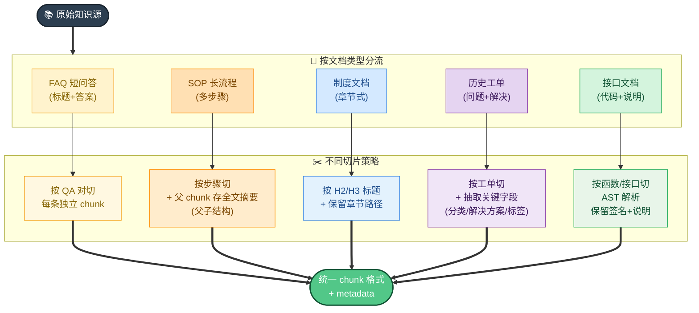

#### **每个 chunk 的标准 schema**

```yaml
chunk_id: ast_repair_001_step3
content: "申请维修工单的步骤..."
embedding: [0.123, -0.456, ...]
metadata:
  source_type: SOP
  source_id: doc_ast_repair_001
  source_url: https://wiki.../asset/repair
  source_version: v2.3
  parent_chunk_id: ast_repair_001_full  # 父 chunk 引用
  domain: 资产
  sub_domain: 维修
  acl: [employee, contractor]  # 谁能看到
  effective_from: 2026-01-15
  effective_to: null  # 仍生效
  ingested_at: 2026-05-19
  hash: sha256(content)  # 用于增量检测
```

#### **知识维护与版本管理**

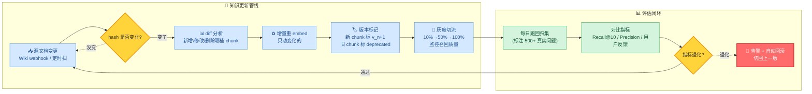

**维护四原则**：
1. **增量更新**：每个 chunk 算 hash，只对变化的重 embed——5000+ chunk 的库每次更新可能只动几十个，成本 1% 不到
2. **软删除 + 版本号**：删除不真删，标 `deprecated + 失效时间`，给查询带时间戳的能拿到历史版本；新版本通过 `effective_from/to` 切换生效
3. **灰度发布**：新批次知识更新先放 10% 流量，监控 Recall 和用户反馈，再扩到全量
4. **回归集守门**：每天跑一遍人工标注的 500+ "经典问题→正确答案"对，新版本 Recall@10 不能比旧版本掉超过 2%，否则自动告警 + 回滚

#### **PII / 敏感信息处理**

入库前过敏感信息检测：
- 工号、邮箱、手机号 → 留（业务必要）
- 身份证、银行卡、密码、密钥 → 拒绝入库 + 告警源文档作者
- 加 `sensitivity: secret` 的 chunk → 只允许特定 scope 的 Agent 召回

**R**：
- 知识更新延迟从原"周更"降到"实时（webhook 触发 5 分钟内生效）"
- Recall@10 在 6 个月里稳定在 88%+，每次更新都有评估守门
- 0 起敏感信息泄露事故

---

### **项目 C 追问应答（必背 15+ 题）**

#### **架构 & 编排**

**Q1. 为什么不用一个大 Agent 挂所有工具和 KB？**
> 大 Agent 的三大问题：① **工具选择困难**——40+ 工具列表塞进 prompt，模型容易选错（BFCL 数据也证明工具数量上去后准确率断崖下跌）；② **KB 召回噪音**——一个员工问资产，召回到一堆 HR 内容；③ **prompt 巨大**——每次调用都贵。子域 Agent 把"哪个领域"的问题前置到分类节点（成本低），后续 Agent 上下文干净。

**Q2. 子 Agent 之间会不会有依赖（资产问题需要查 HR 信息）？**
> 会，但不让子 Agent 互相调（避免编排复杂度爆炸）。处理方式：① **共享 context**——父级 router 把通用用户信息（部门/岗位）注入到所有子 Agent 的 system prompt；② **跨域工具上移**——比如 `get_user_org` 这种公共 Tool 由 router 在分发前调好，结果一并传给子 Agent；③ **极少数真跨域**问题（比如"我离职后这台电脑怎么办"既涉及 HR 又涉及资产）→ 走通用 Agent + 全库 RAG 兜底。

**Q3. 编排框架是自研还是用 LangGraph / AutoGen 之类？**
> 内部 Agent 应用工厂提供基础编排能力（节点、边、状态），相当于自研版的 LangGraph。选择自研的核心理由是：**可观测性和审计需求强**——每个节点的输入输出、模型调用、token 消耗、工具调用都要落地到内部 trace 系统，开源框架接入麻烦。

#### **召回 & RAG**

**Q4. 为什么有些节点用混合召回有些用纯语义？**
> 见 Story 2 的对比表。**推荐问题节点用混合**（要召回率，员工帮助台问题专有名词多）；**FAQ 拦截用纯语义 + 高阈值**（要 precision，宁可漏不可错）；**子域 Agent 内部 RAG 用混合 + rerank**（最高质量要求）。

**Q5. chunk size 怎么选？**
> 按内容类型动态。FAQ 短文档 chunk 就是 QA 对本身（100-300 token）；SOP 长流程按步骤切（300-500 token）+ 父 chunk 存全文摘要（用于上下文补全）；制度文档按 H2/H3 标题（500-800 token）+ 保留章节路径。**没有万能 chunk size**，按文档结构决定。

**Q6. 重排（reranker）一定要吗？**
> 看延迟预算。FAQ 拦截 < 100ms → 不上 rerank；子域 Agent 内部 RAG 可接受 200ms → 上 rerank 收益明显（Precision@5 提升 10%+）。生产经验：**rerank 是 RAG 最 cost-effective 的提升点之一**。

**Q7. 向量库选型？**
> 内部统一存储+查询服务，背后是 HNSW 索引。生产选型考虑：① ANN 算法（HNSW 平衡速度+召回率最常用）；② 是否支持 metadata 过滤（必须，要按 acl/domain/version 过滤）；③ 是否支持增量更新（必须，5000+ chunk 全量重建太贵）；④ 是否支持多副本和高可用。开源选 Milvus / Qdrant / Weaviate，托管选 Pinecone / Vespa。

#### **Skill CLI & 鉴权**

**Q8. Skill 和 MCP 本质区别是什么？为什么要切？**
> MCP 是协议（怎么连工具），Skill 是能力包（一组协同 prompt + 命令 + 资源）。切换原因：① Skill 跨平台兼容性强（Claude Code / Codex / Cursor 都吃同一份）；② Skill 的 progressive disclosure（references/ 目录按需加载）比 MCP 一次性 schema 加载更省 token；③ Skill CLI 本质是个进程，每次调用启动新进程，避免 MCP 长驻进程的内存泄漏和状态污染问题。

**Q9. CLI 怎么避免被 LLM 滥用？**
> 五道防线：① **schema metadata**（read_only / destructive 标记，编排器据此决定是否要 confirm）；② **参数校验**（CLI 内自己校验，不信 LLM）；③ **rate limit**（同一用户 5 分钟内只能调用 N 次同一写操作）；④ **审计日志**（每次调用落库，trace_id 串到 IM message）；⑤ **dry-run 模式**（写操作先返回"将要做什么"，用户确认才真做）。

**Q10. SSO 换票 token 泄漏怎么办？**
> 几个机制：① **scope 收窄**——即使泄漏也只能做小范围操作；② **短 TTL**（15 分钟）——泄漏时间窗口小；③ **绑定 IP/UA**——切换设备 token 自动失效；④ **审计实时告警**——同一 token 异常调用频率/异常地理位置触发拉黑；⑤ **token revoke API**——发现异常立刻拉黑，缓存随之失效。

**Q11. 一次用户问题端到端要触发几次模型调用？怎么控成本？**
> 极端最复杂路径：清晰度判断（小模型）+ 领域分类（小模型）+ 子 Agent ReAct 循环（多轮主模型）+ 答案润色（主模型）≈ 5-15 次 LLM 调用。控成本：① 前置节点（清晰度 / 分类）用小模型或微调判别器；② FAQ/全词拦截命中后**完全不进 Agent**；③ ReAct 步数硬上限 + StuckDetector；④ 上下文压缩到 token budget；⑤ prompt cache（重复 system prompt 命中 cache）。

#### **评估 & 运营**

**Q12. 怎么评估这个 Agent 的好坏？**
> 多维度：① **自动解决率**（不转工单的比例，业务核心指标）；② **答案准确率**（人工抽样 + 用户反馈赞踩）；③ **召回 Recall@K / Precision@K**（每天跑回归集）；④ **响应时延 P50/P95/P99**；⑤ **token 成本/请求**；⑥ **用户满意度**（每次对话结束推送 1-5 星评分）；⑦ **工单回流率**（用户转工单后人工最终的答案 vs Agent 回答的差异）。

**Q13. 答案错了怎么办？怎么发现？**
> 三层兜底：① **答案后必带"如果没解决，点这里转人工"**——用户主动反馈；② **赞/踩按钮**——踩的问题进每日人工 review 队列；③ **工单回流分析**——转人工的问题，人工最终给出的答案如果和 Agent 答案差异大，自动归类为"Agent 错答"加入回归集和 KB 更新候选。每月一次"错答 review 会"，把高频错答 case 转成新 FAQ 或 KB 更新。

**Q14. 冷启动（KB 没那么多内容）怎么办？**
> 三步：① 先把高频工单（top 200 工单类型）人工整理成 FAQ；② 把内网制度文档+SOP 全量入库（哪怕召回噪音大也比没有强）；③ 上线初期降低 FAQ 拦截阈值（0.78 而不是 0.85），多兜底；同时灰度（10% 流量）+ 强人工 review，逐步迭代。

**Q15. 数据/答案权限怎么隔离？比如普通员工不能查别人的工资？**
> 三层：① **数据层**——所有 API 自带数据范围限制（`get_my_salary` 只能查自己，不接受 `employee_id` 参数）；② **召回层**——chunk metadata 有 `acl`，召回前按用户 scope 过滤；③ **答案层**——LLM 生成答案后再过一遍 PII / 越权检测（regex + 小模型），发现可疑直接拒绝。

#### **稳定性 & 边界**

**Q16. KB 召回不到时 Agent 会编答案吗？**
> 强 prompt 约束 + 后置检查：① system prompt 明确"基于以下检索结果回答，如果检索结果不包含答案，必须说'我目前没有这个信息'并提供工单入口"；② 输出后过一遍"忠实度检查"（小模型判断答案是否能在检索结果中找到证据），不通过则触发"我没找到合适答案"模板。

**Q17. 用户连续问且每次跨领域怎么办？**
> 每轮独立分类，不强行延续上一轮领域。但保留**全局上下文**（用户基本信息 + 已解决的问题列表），让分类有先验。如果用户明确说"接着上一个问题"则强制延续。

**Q18. 上线后压力测试 / 容灾怎么做？**
> ① 压测：录制 1 小时高峰真实流量回放，看 P99 不掉；② 容灾：LLM API 多 provider fallback（主 provider 挂了切备）+ 向量库主从；③ 降级：极端情况关闭 Agent，直接走"输入问题 → 推荐工单分类 → 转人工"的 pure fallback 流程；④ 限流：每用户每分钟 QPS 限制，防止恶意/异常调用拖垮 LLM 配额。

**Q19. 多语言支持怎么做？**
> 这个项目目前只做中文。如果要扩英文：① embedding 模型换成多语言（BGE-M3 / e5-multilingual）；② FAQ 知识库双语并存（每条 FAQ 加 `lang` 字段）；③ 用户语言探测决定召回路径；④ system prompt 也要多语言版本。**不建议靠"翻译 query 再走中文链路"**——专有名词翻译噪声大。

**Q20. 这套架构最大的风险/局限是什么？**
> ① **领域分类错误**会让用户问错领域永远拿不到答案——必须有"分错领域→走通用 Agent + 全库 RAG"兜底；② **KB 维护成本**——需要专人 own 知识库质量，否则会"答案越来越烂"；③ **MCP/Skill 鉴权链路**复杂，一个环节出错全链路失败；④ **强依赖 LLM API**，外部 API 抖动直接影响业务（需要降级方案）。坦诚承认局限比硬吹"完美"更得分。

---


### **Q0.1 · 没 MQ 怎么处理 backpressure？**

诚实承认 + 给改进方向。"目前没专门处理。靠 PostgreSQL connection pool（max_open=10）和 AI 厂商自身限流挡，单用户高频提交会消耗 goroutine 但目前未触顶。改进方向：引入 ants 之类 worker pool 或换 NATS JetStream。"

### **Q0.2 · 为什么不用 K8s？**

务实表达 trade-off。"MVP 阶段成本/复杂度不值，单机蓝绿够 99% 可用性。等用户量上来或者需要跨 region 时会迁。早做 K8s 是过度设计。"

### **Q0.3 · 怎么测的？**

不要嘴硬，承认弱点 + 改进方向。"项目只有少量集成测试，主要靠 staging 手动 + 日志监控。坦诚说测试覆盖是弱项，下一步会先把扣费链路这种核心路径补 e2e。"

### **Q0.4 · 怎么监控？**

"目前只有 Zap 日志 + Telegram 告警 + GA4，没接 Prometheus/Grafana/Sentry。改进方向明确——业务指标走 Prometheus，错误聚合走 Sentry，分布式 trace 用 OpenTelemetry。"

### **Q0.5 · 如果让你重做？**

展示成长心态 + 具体方案，不要说"全部推翻"。
- jobs/ 换成 NATS JetStream 或 Asynq + Redis
- 引入 OpenTelemetry 做全链路
- FFmpeg 合成单独抽 worker 服务
- schema check 改成 migration tool（goose / atlas）
- 把扣费链路补 e2e 测试

### **Q0.6 · 6 天 16000 行代码，质量怎么保证？**

不要回避质量话题。"主要靠三件事：① Cursor / Claude Code 配合一致的 AGENTS.md 把代码风格和模式锁住；② 35 个工具都走同一个 Tool Definition 模板，不允许特例；③ 每天结束前跑 lint + 类型检查，发现重大问题立刻回滚。当然质量肯定不如细工慢活的项目，但作为内部工具 + 后续迭代基础，trade-off 是合理的。"

### **Q0.7 · Cache 命中 96% 怎么测的？真的稳定吗？**

"Anthropic API 响应里直接带 `cache_creation_input_tokens` 和 `cache_read_input_tokens`，按这两个字段算命中率。96% 是上线后 1 周 ~5000 次调用的统计均值。不稳定的场景：① 第一轮对话必然 miss（cache 还没建）；② SystemContextProvider 里时间戳分钟级变化时 L4 失效但 L1+L2+L3 仍然命中。"

### **Q0.8 · PolicyEngine 三级风控的规则怎么维护？**

"三级是策略类型，具体规则在 yaml 配置 + 代码白/黑名单两层维护。安全命令走精确白名单（一致性高、易审计）；危险命令走正则黑名单（`rm -rf /` 这种模式匹配）。中间态 NEEDS_CONFIRM 是兜底——既不在白名单也不在黑名单的命令都进确认环节。生产里 95% 命令命中白名单，体验不打扰。"

### **Q0.9 · Tool Orchestrator 的并发安全怎么证明？**

"两点：① `isReadOnly()` 是工具自己声明的契约，写错就是工具开发者的责任；② 修改类工具一律串行，从设计上避免数据竞争。我们没做形式化证明，但上线 6 周 + 200M token 跑下来零数据竞争事故，工程上够了。"

### **Q0.10 · FIFO 扣费在并发下怎么不错账？**

"两道锁：① 数据库事务 + `SELECT ... FOR UPDATE` 锁 user 行（同一用户的扣费严格串行）；② 退款写新 transaction 行而不是改老记录（append-only，永远可对账）。压测脚本 100 并发扣同一用户 1000 次单价不同的扣费，最终余额和扣费总和精确一致，未出现幻读。"

---

## **项目讲述节奏建议**

| 时长 | 内容 |
| --- | --- |
| 30 秒 | 项目一句话定义 + 关键数字（"6 天 16k 行" / "36k Go + 蓝绿"） |
| 2 分钟 | 项目背景 + 最具体的 1 个 Story（按 STAR 完整讲） |
| 5 分钟 | 三层架构概览 + 2 个 Story + 1 个失败/改进点 |
| 10 分钟 | 完整 5 个 Story + 追问应答 + 项目复盘 |

**铁律**：
- 先讲数字（让面试官知道规模），再讲方案（让面试官知道你怎么想的），最后讲结果（让面试官知道你拿到了什么）
- 永远准备好"如果让你重做"的答案——这道题 80% 概率被问
- 不要回避弱点（测试覆盖、监控、运维），但要附改进方向
- 把项目里的具体决策 ⇄ 八股题的概念**双向连接**：讲 Story 时主动引用八股概念（"这就是经典的 backpressure 问题"），讲八股时主动举项目例子

---
