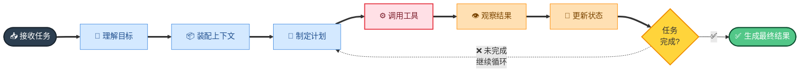

# 🧠 第 1 章 · Agent 基础

## **【第 1 章 · Agent 基础概念】**

### **Q1.1 · 什么是 AI Agent？**

AI Agent 是一种能够感知环境、理解目标、制定计划、调用工具并持续推进任务的智能系统。它和普通聊天模型最大的区别在于，聊天模型主要生成回答，而 Agent 会围绕一个目标进行多轮决策和行动。

一个典型 Agent 通常包含几个部分：大语言模型、任务规划模块、工具调用模块、状态管理模块、记忆模块、环境反馈模块。它不是一次性回答问题，而是在执行过程中不断观察结果、调整计划、继续行动。

如果用研发场景举例，用户说“帮我修复登录接口 bug，并补测试”，普通模型可能给出建议；Agent 则会读取代码、定位文件、修改实现、运行测试、根据失败结果继续修复，最后输出交付总结。

追问：Agent 和 Chatbot 有什么区别？

答：Chatbot 更偏对话，核心是生成自然语言回复；Agent 更偏任务执行，核心是目标驱动、工具调用和状态推进。Chatbot 通常不改变外部环境，Agent 可以通过工具读写文件、运行命令、调用 API、搜索网页或操作浏览器。

---

### **Q1.2 · Agent 的基本工作循环是什么？**

Agent 的基本循环可以概括为：

```text
接收任务
理解目标
装配上下文
制定计划
调用工具
观察结果
更新状态
继续执行
生成最终结果
```



更工程化一点，可以叫 Observe、Think、Act、Reflect 循环。Agent 先观察当前环境，比如用户输入、文件内容、工具结果；然后通过模型推理下一步该做什么；接着调用工具执行动作；拿到工具结果后再更新上下文，进入下一轮。

在 Coding Agent 场景里，这个循环很明显：它先读项目结构，再搜索相关文件，然后修改代码，运行测试，看到失败日志后继续修复。每一步都依赖前一步的反馈。

追问：为什么 Agent 不能一次性完成所有事情？

答：因为复杂任务的信息往往不完整。模型一开始不知道所有相关文件、历史约束、测试结果，也不知道自己的修改是否正确。必须通过工具和环境反馈逐步获取信息，动态调整计划。

---

### **Q1.3 · Agent 的核心组件有哪些？**

一个完整 Agent 系统一般包括：

| 组件         | 作用                                             |
| ------------ | ------------------------------------------------ |
| LLM 推理层   | 理解任务、生成计划、决定工具调用                 |
| 上下文装配层 | 把规则、历史、文件、记忆、工具结果组装成模型输入 |
| 工具层       | 执行搜索、文件读写、Shell、API、浏览器操作等动作 |
| 状态层       | 记录当前任务进度、工具结果、已完成事项、失败信息 |
| 记忆层       | 保存跨会话可复用的信息                           |
| 权限与沙箱层 | 控制 Agent 能读什么、改什么、执行什么            |
| 压缩层       | 长会话时压缩历史，保证任务能继续                 |
| 评估层       | 衡量 Agent 的准确率、任务完成率、工具调用质量等  |

面试时可以强调：Agent 的难点不只在模型本身，更在模型外围的工程系统。很多时候，Agent 失败不是因为模型完全不会，而是上下文装配错误、工具结果太乱、记忆过期、权限控制不足，或者压缩后丢掉了任务目标。

---

### **Q1.4 · Agent 和 Workflow 有什么区别？**

Workflow 是预定义流程，步骤比较固定；Agent 是动态决策系统，可以根据中间结果调整路径。

比如报销审批流程就是 Workflow：提交申请、经理审批、财务审批、打款。每一步基本固定。

但“帮我排查线上接口 500 错误”更适合 Agent：它可能要查日志、看代码、分析监控、复现问题、提出修复方案。每一步取决于上一轮观察结果。

不过两者不是对立的。实际工程中，常见做法是 Agent + Workflow。Workflow 提供边界和阶段，Agent 在每个阶段内做动态决策。我们之前讨论的 Harness 就是这个思路：它把需求交付拆成 PRD、技术方案、开发、Review、测试、上线准备、总结沉淀等阶段，避免 Agent 完全自由发挥。

追问：为什么不能完全交给 Agent 自主规划？

答：完全自主规划容易失控，尤其在研发交付里，需求确认、方案评审、测试验证、上线审批都需要明确门槛。Workflow 可以提供可解释、可恢复、可审计的流程边界，Agent 负责在边界内完成具体任务。

---

### **Q1.5 · Agent 的难点主要在哪里？**

主要难点有几个。

一是上下文不可控。Agent 需要读取很多信息，但上下文窗口有限，读太少会缺信息，读太多会引入噪音。

二是工具调用不稳定。Agent 可能选错工具、填错参数、重复调用、或者在不该调用工具时调用工具。

三是长任务容易丢状态。任务执行久了，历史对话和工具结果变长，需要压缩，但压缩可能丢掉关键约束。

四是记忆容易污染。自动记忆可能过期、错误、跨项目误用，甚至保存敏感信息。

五是评估困难。Agent 输出不确定，同一个问题可能有多个正确答案，不能只靠字符串匹配判断好坏。

六是安全问题。Agent 能读写文件、运行命令、调用外部服务，所以必须有权限控制、沙箱和审批机制。

---
