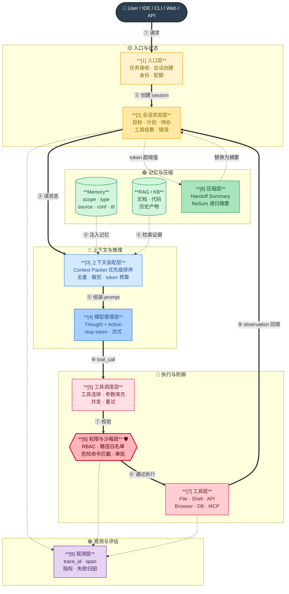

# 🏗️ 第 2 章 · Runtime 架构

## **【第 2 章 · Runtime 架构】Agent 架构设计**

### **Q2.1 · 如果让你设计一个 Agent Runtime，你会怎么分层？**

我会分成九层：

```text
入口层
会话状态层
上下文装配层
模型调用层
工具调度层
权限与沙箱层
记忆层
上下文压缩层
观测与评估层
```

入口层负责接收用户任务，可以来自 CLI、IDE、Web 或 API。会话状态层保存当前任务的历史、工具结果、计划和待办。上下文装配层负责把规则、文件、记忆、历史摘要等组合成模型输入。模型调用层负责推理。工具调度层负责执行文件读写、搜索、Shell、API 等动作。权限与沙箱层负责判断动作是否安全。记忆层保存跨任务经验。压缩层处理长上下文。观测与评估层记录行为并衡量效果。

这类架构的关键不是把所有东西塞进 prompt，而是把不同生命周期的信息分层管理。


面试里讲 Runtime 时，建议直接画成“模型在中间、状态和权限在外围”的结构：



> 🔒 **铁律**：模型可以建议动作，但是否允许执行必须由 [6] 权限引擎决定。
> 📊 **优先级**：系统规则 > 用户当前任务 > 项目规则 > 当前文件/工具结果 > 状态摘要 > 长期记忆 > 旧对话原文

一句话收口：Runtime 的核心价值是把“不确定的模型推理”放进“可控的状态、工具、权限和评估系统”里。

追问：上下文装配层为什么这么重要？

答：因为模型看到什么，就会基于什么推理。Agent 的很多错误来自上下文缺失、上下文过载或上下文冲突。好的上下文装配应该控制优先级、去重、裁剪工具结果，并保留关键任务状态。

---

### **Q2.2 · Agent 的上下文一般包含哪些内容？**

常见上下文包括：

```text
系统规则
开发者指令
用户当前问题
历史对话
长期记忆
RAG 检索结果
工具说明
文件内容
任务状态
笔记
代码片段
输出格式要求
```

但这些内容优先级不同。系统规则和安全约束优先级最高，用户当前任务也很高。项目规则、相关文件、最近工具结果会直接影响任务执行。长期记忆和历史摘要只能作为辅助，不应该覆盖当前任务和强规则。

追问：如果上下文太长怎么办？

答：可以通过检索、摘要、分块读取、工具结果裁剪、上下文压缩、优先级排序来控制。比如只保留最近关键工具结果，把旧对话压缩成 handoff summary，大文件只读取相关片段，不把整个仓库塞给模型。

---

### **Q2.3 · Agent 的状态管理应该保存什么？**

状态管理保存当前任务的过程信息，包括：

```text
用户原始目标
当前阶段
已完成事项
未完成事项
已读取文件
已修改文件
工具调用记录
测试结果
错误日志
用户审批记录
当前计划
压缩摘要
```

状态层的意义是让 Agent 可恢复。没有状态管理时，一旦对话中断或上下文被压缩，Agent 很容易忘记做到了哪一步。像 Harness 里的 `.harness/project/`、checkpoint、summary，本质上就是把状态和产物沉淀下来。

追问：状态和记忆有什么区别？

答：状态服务当前任务，回答“现在做到哪一步”；记忆服务未来任务，回答“下次遇到类似问题应该知道什么”。状态通常短期有效，记忆跨会话存在。

---

### **Q2.4 · 为什么说 Agent 不是一个大 prompt 就能解决的？**

因为真实任务不是单轮文本生成，而是持续交互和执行。一个大 prompt 只能提供初始约束，但无法很好处理工具反馈、状态更新、权限审批、长上下文压缩、错误恢复和经验沉淀。

例如 Coding Agent 修 bug，不是 prompt 写得长就能成功。它需要读取文件、定位问题、修改代码、跑测试、根据失败日志调整。这些都需要运行时系统支持。

更准确地说，prompt 是 Agent 的一部分，但不是 Agent 的全部。完整 Agent 需要 runtime。

追问：那 prompt engineering 还重要吗？

答：重要，但它更像局部手段。项目规则、工具说明、输出格式、评估标准都需要通过 prompt 表达。不过在复杂 Agent 里，还需要上下文工程、工具工程、记忆工程、评估工程配合。

---


---

### **【追问扩展】Runtime / 系统设计追问 6 题**

### **Q2.5 · 如果让你从零设计一个 Agent 系统，你会怎么拆模块？**

我会把 Agent 系统拆成几层，而不是只把它理解成一个模型调用。

最底层是工具执行层，负责真实动作，比如搜索、读写文件、调用 API、运行命令、访问数据库。工具上面是权限和沙箱层，用来判断哪些动作允许执行，哪些动作需要审批，哪些动作必须禁止。再往上是状态管理层，保存当前任务进度、已完成事项、失败记录、工具结果和用户确认信息。上下文装配层负责把当前任务、历史对话、项目规则、工具结果、检索内容、长期记忆组织成模型输入。模型推理层负责理解目标、制定下一步计划、决定是否调用工具。记忆层负责跨会话保存有复用价值的信息。评估与观测层负责记录 Agent 做了什么、哪里失败、效果如何。

比较完整的 Agent 不是一段 prompt，而是一套运行时。模型只是推理引擎，真正让它稳定工作的，是上下文、工具、状态、安全和评估这些外围系统。

追问：为什么不直接让模型自己规划和执行？

回答：完全交给模型自由执行会有两个风险。一个是任务容易跑偏，另一个是执行过程不可控。比如 Coding Agent 可能还没确认需求就开始改代码，或者在测试失败后直接总结完成。系统设计里要给它阶段边界、工具权限和状态检查，让它能自主处理细节，但不能随意跳过关键确认。

---

### **Q2.6 · Agent Runtime 和普通应用后端有什么区别？**

普通后端通常是确定性逻辑，输入输出相对固定。Agent Runtime 的特点是中间过程不完全确定，模型每一轮可能根据上下文决定不同动作。它需要处理模型输出解析、工具调用、工具结果回填、上下文裁剪、长会话压缩、权限审批、错误恢复和观测评估。

可以理解成，普通后端更多是“业务流程执行器”，Agent Runtime 则是“模型驱动的任务执行环境”。它既要允许模型灵活推理，又要把这种灵活性限制在安全、可追踪、可恢复的范围里。

追问：Agent Runtime 最难的地方是什么？

回答：最难的是状态和上下文。模型看到的信息有限，如果上下文装配不好，它会误判；如果状态保存不好，它会忘记任务进度；如果工具结果处理不好，它会被无关日志淹没。所以 Agent Runtime 的稳定性，很大程度取决于它如何管理信息流。

---

### **Q2.7 · Agent 的短期状态和长期记忆有什么区别？**

短期状态服务当前任务，长期记忆服务未来任务。

短期状态包括当前目标、已执行步骤、读过哪些文件、改过哪些文件、测试结果、失败原因、用户确认过什么。它回答的是“现在做到哪一步”。

长期记忆保存的是跨任务仍然有价值的信息，比如某个项目使用 pnpm、某个模块容易踩时区问题、用户偏好先看方案再改代码、团队要求不能自动新增依赖。它回答的是“以后遇到类似情况应该先知道什么”。

这两个东西不能混。把临时状态写进长期记忆，会污染未来任务；把长期规则只放在当前会话里，又会导致下次任务丢失。

追问：什么内容应该写进长期记忆？

回答：稳定、可复用、低敏感、跨任务有价值的信息。比如项目技术栈、常用测试命令、已确认的架构约定、用户偏好。临时 bug、一次性错误日志、未确认猜测、密钥、token、隐私数据都不应该写入长期记忆。

---

### **Q2.8 · 为什么说 Agent 开发里上下文工程比 prompt engineering 更重要？**

Prompt engineering 更关注如何写指令，而上下文工程关注的是模型每一轮到底看到什么。Agent 在执行过程中会不断产生新信息，包括工具结果、文件内容、检索片段、用户反馈、失败日志、历史摘要和长期记忆。怎么选择、排序、裁剪、压缩这些信息，直接影响模型决策质量。

生产环境里 Agent 出问题，经常不是 prompt 写得不够漂亮，而是上下文里塞了太多过期信息、重复信息、低质量检索结果，或者没有保留关键工具反馈。公开资料里也反复强调，Agent 失败往往不是模型本身的问题，而是上下文窗口被旧历史、重复检索和原始工具输出挤满，导致模型看不到真正重要的信号。 [MachineLearningMastery](https://machinelearningmastery.com/effective-context-engineering-for-ai-agents-a-developers-guide/) [Anthropic](https://www.anthropic.com/engineering/effective-context-engineering-for-ai-agents)

追问：上下文工程具体做什么？

回答：它要决定哪些内容进入上下文、哪些内容检索、哪些内容摘要、哪些内容丢弃、工具结果怎么裁剪、历史怎么压缩、长期记忆什么时候注入、冲突信息谁优先。

---

### **Q2.9 · 一个 Agent 的上下文优先级应该怎么设计？**

> 🔁 **重复题，统一以【第 3 章 · Q11 Agent 上下文的优先级如何设计】为准**——那里有完整 8 层漏斗图（L1-L8 颜色阶梯）+ 仲裁口径 + Context Packet 字段。
>
> **一句话答**：按权威性和时效性排序。`系统安全 > 用户当前任务 > 项目规则（AGENTS.md）> 当前文件+工具结果 > 任务状态 > 压缩摘要 > 长期记忆 > 旧对话原文`。冲突时**显式项目规则 > 自动记忆 > 旧摘要**。

---

### **Q2.10 · 什么是 Context Packet？为什么要结构化管理上下文？**

Context Packet 是对进入模型上下文的信息做结构化封装。它可以包含类型、来源、优先级、作用域、创建时间、过期时间、token 估算和去重 key。

例如项目规则是一个 packet，最近测试结果是一个 packet，压缩摘要是一个 packet，用户长期偏好也是一个 packet。装配上下文时，系统可以按优先级筛选，避免重复注入，也可以控制 token budget。

如果不做结构化管理，上下文很容易变成一大段拼接文本。长任务里会出现规则重复、摘要重复、memory 重复、旧信息覆盖新信息等问题。Coding Agent 里这种问题尤其明显，因为项目规则、历史对话、工具结果和压缩摘要都可能包含相似内容。

追问：Context Packet 的字段怎么设计？

回答：至少要有 type、source、priority、scope、content、token_estimate、dedupe_key、created_at。复杂一点还可以加 expires_at、confidence、sensitivity、version_hash。

---
