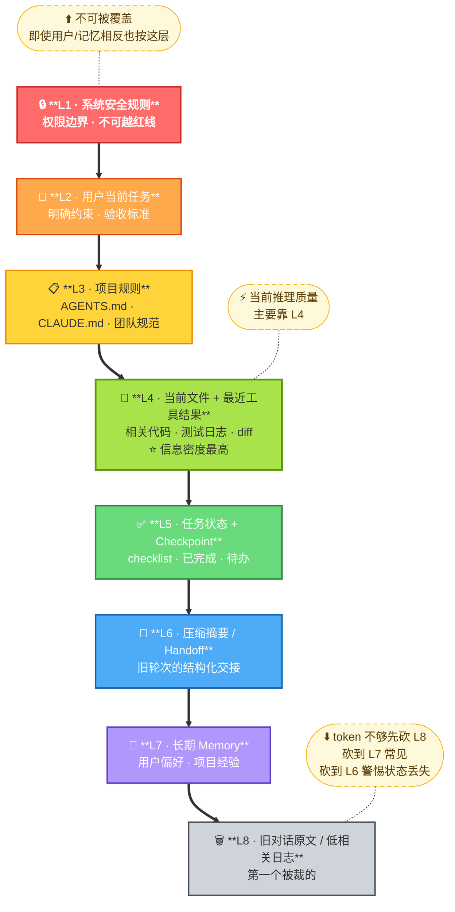

# 📦 第 3 章 · 上下文工程

## **【第 3 章 · 上下文工程】**

### **Q3.1 · 什么是上下文工程？**

上下文工程是指系统性地管理模型输入，让模型在合适的时间看到合适的信息。

它不只是写提示词，而是处理：

```text
哪些信息应该进入上下文
以什么顺序进入
保留多少原文
哪些内容要摘要
哪些内容要检索
哪些内容要丢弃
冲突时谁优先
```

在 Agent 场景中，上下文工程比普通问答更复杂，因为 Agent 的上下文会随着工具调用不断变化。

追问：上下文工程和 RAG 有什么区别？

答：RAG 是上下文工程的一种手段，主要解决外部知识检索问题。上下文工程范围更大，还包括历史对话、工具结果、状态、规则、记忆、压缩摘要、输出格式等所有进入模型输入的信息管理。

---

### **Q3.2 · Agent 上下文的优先级如何设计？**

可以按这个顺序设计：

| 优先级 | 内容                             |
| ------ | -------------------------------- |
| 最高   | 系统安全规则、权限边界           |
| 很高   | 用户当前任务、明确约束           |
| 高     | 项目规则、AGENTS.md、CLAUDE.md   |
| 高     | 当前相关代码、文件片段、工具结果 |
| 中     | 当前计划、任务状态、checkpoint   |
| 中     | 历史压缩摘要                     |
| 中低   | 长期记忆                         |
| 低     | 旧对话原文、重复日志             |


可以把上下文优先级理解成一个漏斗：越往上越强约束，越不能被自动记忆或旧历史覆盖。



> **冲突仲裁口径**：先看权威性（L1 > L3 > L7），再看时效性（同层取最新）。
> 例：长期记忆说"用 npm"，项目 AGENTS.md 改成"用 pnpm" → 听 L3，把 L7 标 deprecated。
> 例：旧工具结果说测试通过，新工具结果说失败 → 听 L4 里更新的那条。

**Context Packet 字段**：`type` · `source` · `priority (L1-L8)` · `scope (user/project/org/session)` · `dedupe_key` · `created_at` · `expires_at` · `token_estimate` · `confidence (0-1)` · `sensitivity (public/internal/secret)`

冲突处理口径：先看来源权威性，再看时效性。显式项目规则高于自动记忆，最近工具结果高于旧摘要，当前用户约束高于历史偏好。

关键原则是：长期记忆不能覆盖当前用户指令，历史摘要不能覆盖项目规则，旧工具结果不能覆盖新工具结果。

追问：如果不同上下文冲突怎么办？

答：要按来源和优先级处理。系统规则高于项目规则，项目规则高于自动记忆，用户当前明确要求高于历史偏好。工程上可以给每个上下文包加 source、priority、timestamp、scope、dedupe_key 等元数据。

---

### **Q3.3 · 如何避免上下文重复注入？**

可以把上下文当成结构化 packet 管理，而不是字符串拼接。每个 packet 带上：

```text
类型
来源
优先级
作用域
创建时间
去重 key
token 估算
```

例如项目规则来自 AGENTS.md，就给它一个 `dedupe_key = project_rules:root`。压缩摘要里不要重复塞入完整规则文件，memory 里也不要重复保存项目规则。

重复注入会导致 token 浪费、注意力分散、规则冲突，长任务里尤其明显。

追问：压缩摘要里应该包含规则吗？

答：不应该重复完整强规则。强规则应该由规则文件重新加载。压缩摘要主要保存当前任务状态，比如已做什么、未做什么、关键决策、失败尝试和下一步。

---

### **Q3.4 · Context Packet 实际长什么样（深度补充）**

工程实现里，一个 packet 通常是这样的结构（伪代码）：

```python
@dataclass
class ContextPacket:
    type: Literal["system", "user_task", "project_rule",
                  "file", "tool_result", "state", "summary",
                  "memory", "history"]
    source: str          # 文件路径 / session_id / message_id
    priority: int        # L1-L8，对应优先级漏斗
    scope: Literal["user", "project", "org", "session"]
    content: str
    token_estimate: int  # tiktoken 提前算好
    dedupe_key: str      # 用于去重的 hash
    created_at: datetime
    expires_at: Optional[datetime] = None
    confidence: float = 1.0   # 0-1，记忆类用
    sensitivity: Literal["public", "internal", "secret"] = "internal"
    version_hash: Optional[str] = None  # 绑定规则文件版本

def assemble_context(packets: list[ContextPacket],
                     token_budget: int = 100_000) -> str:
    # 1. 按 priority 排序
    packets.sort(key=lambda p: (p.priority, -p.created_at.timestamp()))
    # 2. 按 dedupe_key 去重（保留 priority 高的）
    seen = {}
    for p in packets:
        if p.dedupe_key not in seen or p.priority < seen[p.dedupe_key].priority:
            seen[p.dedupe_key] = p
    # 3. 过期过滤
    now = datetime.now()
    fresh = [p for p in seen.values() if not p.expires_at or p.expires_at > now]
    # 4. 按 budget 累积，超出从最低优先级砍
    selected, total = [], 0
    for p in sorted(fresh, key=lambda p: p.priority):
        if total + p.token_estimate <= token_budget:
            selected.append(p)
            total += p.token_estimate
    return render_packets(selected)
```

### **Q3.5 · Token 预算实际怎么分（举个真实例子）**

假设你用 Claude Sonnet 4，context window 200K，留 20K 给输出，实际可用 180K。

| 用途 | 预算 (token) | 占比 | 说明 |
| --- | --- | --- | --- |
| L1 系统规则 + 工具 schema | 4,000 | 2.2% | 固定开销 |
| L2 用户当前任务 | 2,000 | 1.1% | 用户原始 prompt + 对话 |
| L3 项目规则 (AGENTS.md) | 3,000 | 1.7% | 一次性加载 |
| L4 当前相关代码 + 工具结果 | 80,000 | 44.4% | **大头，按需读** |
| L5 任务状态 / checklist | 2,000 | 1.1% | 结构化短文本 |
| L6 压缩摘要 / handoff | 4,000 | 2.2% | 长任务才有 |
| L7 长期 Memory | 1,500 | 0.8% | Top-3 高相关 |
| L8 历史对话原文 | 30,000 | 16.7% | 最近 N 轮，超了就压缩 |
| **安全余量** | 53,500 | 29.7% | 给突发的大工具结果留缓冲 |

经验数字：
- **L4 长期超过 50% 是危险信号**，意味着读得太杂，应该改进检索/裁剪
- **L8 长期超过 30% 说明该压缩了**
- **安全余量低于 15%** 会经常被大工具结果撑爆，要么调小工具结果上限，要么提前触发 compaction

追问：怎么知道某个 packet 该不该进上下文？

答：三步判断。**相关性**（语义距离 < 阈值或显式触发）→ **新鲜度**（未过期且没被更新版本覆盖）→ **预算**（加上它后还在 budget 内）。三步都过才进，且按优先级排在合适位置。

---
