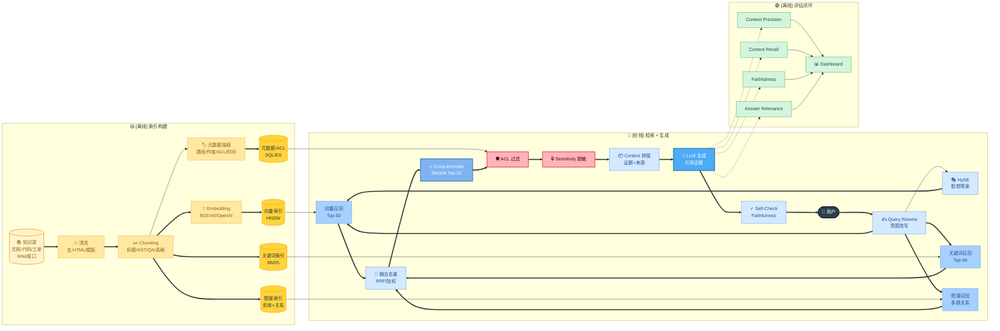

# 🔍 第 4 章 · RAG 与检索

## **【第 4 章 · RAG 与检索】**

> 📌 **本章包含**：标准 RAG 流程 · Chunking · Hybrid Search · Rerank · Query Rewrite · HyDE · Multi-hop RAG · GraphRAG · RAG 评估 · 权限过滤 · Agentic RAG · Self/Corrective RAG。
>
> 💡 **建议**：先看 [项目 C · Story 2 推荐问题召回] 的语义/全文/混合三种对比和实战选型，再看下面的系统化补全。

---


---

### **【追问扩展】RAG 高频题 11 题**

### **Q4.1 · 什么是 RAG？为什么 Agent 需要 RAG？**

RAG 是 Retrieval-Augmented Generation，也就是检索增强生成。它让模型在回答或执行任务前，从外部知识库中检索相关材料，再基于检索内容生成答案。

Agent 需要 RAG，是因为模型参数里的知识不一定新、不一定完整，也不一定包含企业内部知识。比如内部文档、代码仓库、历史需求、接口说明、故障复盘、项目规范，都不能只靠模型记忆。RAG 可以把这些外部信息动态带入上下文。

追问：RAG 和长上下文模型是不是二选一？

回答：不是。长上下文能放更多内容，但不代表应该把所有内容都塞进去。RAG 的价值是选择相关信息，减少噪音和成本。长上下文和 RAG 可以结合，RAG 负责召回，长上下文负责容纳更复杂的证据链。

---

### **Q4.2 · 标准 RAG 流程是什么？**

标准流程通常是：

```text
文档采集
清洗和切分
向量化
建立索引
用户查询改写
检索 Top-K 文档
重排序
上下文拼接
模型生成
答案评估
```

在 Agent 场景里，RAG 还会和工具调用、记忆、状态结合。比如 Agent 先根据任务决定是否需要检索历史需求，再根据检索结果决定是否下钻 PRD、技术方案或交付 summary。


如果面试官要求画架构，可以画成下面这条链路：



> ✂️ **切分策略按类型选**：技术文档按 H2/H3 · 代码按 AST · FAQ 按 Q/A 对 · 表格保留表头+主键 · 长文档父子 chunk
> ⭐ **为什么要 Rerank**：向量检索快但粗，Cross-Encoder 慢但准。Top-50 粗召回 → Top-10 精排，显著提升 context precision
> 🛡️ **权限三道关**：① 索引时存 ACL 元数据 ② 检索时按身份过滤候选 ③ 生成后检查输出是否泄露无权内容


追问：RAG 中最容易出问题的环节是什么？

回答：切分、召回和上下文拼接。切分不好会破坏语义，召回不好会找不到关键证据，拼接不好会让模型被无关内容干扰。

---

### **Q4.3 · RAG 的 chunking 怎么做？**

Chunking 要根据文档类型设计，不能简单按固定字符数切。

技术文档适合按标题层级切，保留章节路径。代码适合按函数、类、模块切。FAQ 适合按问答对切。表格适合保留表头和行语义。长文档可以用父子 chunk，父 chunk 保存章节摘要，子 chunk 保存具体细节。

chunk 太小会丢上下文，chunk 太大召回不精准。一般需要在召回准确率、上下文完整性和 token 成本之间平衡。上下文工程资料里也提到，chunking 的价值在于把内容拆成可管理单元，提升召回并减少幻觉。 [Neo4j](https://neo4j.com/blog/agentic-ai/context-engineering-tools/) [Weaviate](https://weaviate.io/blog/context-engineering)

追问：如何处理表格和代码的 chunk？

回答：表格要保留表头、单位和主键字段，不能只切单元格。代码要尽量按 AST 或符号级别切，比如函数、类、接口，而不是按固定长度硬切。

---

### **Q4.4 · RAG 中 Top-K 怎么选？**

Top-K 不是越大越好。K 太小容易漏召回，K 太大容易引入噪音。通常可以先用较大的 K 做初召回，再用 reranker 重排，最后只放少量高相关片段进上下文。

如果是问答场景，Top-K 可以小一些；如果是复杂分析或多跳推理，可以召回更多候选，再分阶段阅读。

追问：如何动态调整 Top-K？

回答：可以根据查询复杂度、检索分数分布、文档类型和上下文预算动态调整。如果最高分和后续分数差距很大，可以少取；如果分数接近，说明不确定性高，可以多取并重排。

---

### **Q4.5 · 什么是 Hybrid Search？**

Hybrid Search 是把向量检索和关键词检索结合起来。

向量检索擅长语义相似，比如用户说“员工离职资产回收”，它能找到语义相关文档。关键词检索擅长精确匹配，比如工单号、接口名、错误码、函数名、配置项。企业知识库和代码库里，经常同时需要语义召回和精确匹配，所以 Hybrid Search 很常见。

追问：Hybrid Search 怎么融合分数？

回答：可以用加权融合、RRF 排名融合，或者先分别召回候选，再交给 reranker 重排。具体方式要看业务场景和评估结果。

---

### **Q4.6 · 什么是 rerank？为什么 RAG 需要 rerank？**

Rerank 是对初召回结果重新排序。向量检索返回的 Top-K 不一定真正最适合回答问题，reranker 会结合 query 和文档内容做更细粒度匹配，把最有用的内容排到前面。

在企业 RAG 里，rerank 很重要。因为知识库文档多、相似内容多，初召回经常会把看起来相关但实际没用的内容排上来。rerank 能提高 context precision，减少模型读到噪音。

追问：rerank 会带来什么代价？

回答：增加延迟和计算成本。所以通常不会对全量文档 rerank，而是先召回几十条，再重排前几十条。

---

### **Q4.7 · 什么是 query rewrite？**

Query rewrite 是对用户问题进行改写，让它更适合检索。

用户的问题可能很口语化，比如“这个之前是不是做过”，直接检索效果很差。系统可以结合当前项目、会话状态，把它改写成“检索历史需求中与当前接口迁移、CMDB、EAM 兜底相关的 PRD 和 summary”。

追问：query rewrite 有风险吗？

回答：有。改写可能偏离用户原意。所以复杂场景可以生成多个查询，或者保留原始 query 和改写 query 同时检索。

---

### **Q4.8 · 什么是 HyDE？**

HyDE 是 Hypothetical Document Embeddings。它先让模型根据问题生成一个假想答案或假想文档，再用这个假想文档去做向量检索。这样可以把短问题扩展成更接近目标文档的语义表达。

它适合用户 query 很短、语义不明确的情况。

追问：HyDE 的风险是什么？

回答：假想文档可能引入错误方向。如果模型生成的假想答案偏了，检索也会偏。所以 HyDE 要结合 rerank、原始 query 检索和证据校验。

---

### **Q4.9 · 什么是 Multi-hop RAG？**

Multi-hop RAG 是多跳检索。问题不能通过一次检索回答，需要先找到一个线索，再根据线索继续检索。

比如问“某项目上线前引用的那个依赖是否在后续故障复盘中出现过”，需要先检索项目上线记录，再找到依赖名，再检索故障复盘。这种任务很适合 Agentic RAG，由 Agent 决定下一步检索什么。

追问：Multi-hop RAG 怎么防止跑偏？

回答：每一跳都要保存证据和中间结论，避免模型凭空跳转。可以要求每一跳输出 query、证据、结论和下一跳原因。

---

### **Q4.10 · 什么是 GraphRAG？它解决什么问题？**

GraphRAG 是把知识组织成图结构，让系统能基于实体和关系进行检索与推理。普通向量 RAG 擅长语义相似，但对复杂关系问题不一定好，比如“哪些员工在某项目公开前接触过相关材料”。这种问题需要实体、时间、关系和路径推理，知识图谱会更适合。

公开面试题里也提到，合规、金融、企业知识分析这类场景，普通向量检索可能找不到多实体之间的隐含关系，而 GraphRAG 可以通过关系遍历和证据链回答问题。 [Coprep](https://www.coprep.ai/blog/top-agentic-ai-interview-questions-for-2026-beyond-the-models)

追问：GraphRAG 的缺点是什么？

回答：构建成本高，需要实体抽取、关系抽取、图谱维护和权限控制。数据质量不好时，图谱推理也会出错。

---

### **Q4.11 · RAG 怎么评估？**

RAG 评估不能只看最终答案，还要看检索质量和生成质量。

常见指标包括：

```text
Context Precision：检索内容是否相关
Context Recall：需要的信息是否被检索到
Faithfulness：回答是否忠实于检索内容
Answer Relevance：回答是否解决用户问题
```

公开资料里也提到，RAGAS 等评估框架常用 faithfulness、answer relevance、context precision、context recall 这些维度评估 RAG 管道。 [Towards AI](https://towardsai.net/p/machine-learning/40-generative-ai-interview-questions-that-actually-get-asked-in-2026-with-answers) [DataCamp](https://www.datacamp.com/blog/rag-interview-questions)

追问：如果答案错了，怎么判断是检索错还是生成错？

回答：看检索上下文里是否包含正确证据。如果没有，是召回问题；如果有但模型回答错，是生成或上下文理解问题；如果有一堆无关证据干扰，是 precision 问题。

---


---

### **【追问扩展】Agentic RAG / Self-RAG 3 题**

### **Q4.12 · 普通 RAG 和 Agentic RAG 有什么区别？**

普通 RAG 通常是一次检索加一次生成，流程比较固定。

Agentic RAG 让 Agent 自己决定是否检索、检索什么、是否需要二次检索、是否需要调用其他工具验证。它适合复杂问题、多跳问题、需要文件分析或需要外部工具的任务。

比如用户问“这个需求是否和历史某个迁移项目类似”，普通 RAG 可能召回几篇文档就回答。Agentic RAG 会先检索历史 summary，再判断是否需要下钻 PRD 或技术方案，再比较影响面和风险点。

追问：Agentic RAG 的风险是什么？

回答：流程更复杂，成本更高，也更容易循环检索或跑偏。所以要有停止条件、最大检索轮次、证据记录和评估机制。

---

### **Q4.13 · 什么是 Self-RAG 或 Corrective RAG？**

Self-RAG 强调模型对自己的检索和回答进行反思，比如判断是否需要检索、检索结果是否足够、答案是否被证据支持。

Corrective RAG 强调当检索结果质量不够时，系统进行纠错，比如重新检索、改写查询、换检索源，或者拒答。

面试里不一定要讲具体论文细节，重点是表达：RAG 不能只做一次召回，要能检测召回质量，并在证据不足时修正。

追问：什么时候应该拒答？

回答：当检索不到可靠证据、证据互相冲突、用户问题超出权限，或者回答会涉及敏感操作时，应该拒答或请求更多信息。

---

### **Q4.14 · RAG 如何处理权限问题？**

企业 RAG 必须做权限过滤。不能因为文档进了向量库，任何用户都能检索到。

常见做法是索引时保存 ACL 信息，检索时按用户身份过滤；或者先按权限过滤候选文档，再做向量检索。回答时也要避免泄露用户无权访问的片段。

追问：如果用户无权限但模型知道答案怎么办？

回答：系统不应该输出无权限内容。即使模型从其他上下文推断出来，也要按权限策略拒绝或泛化回答。

---
