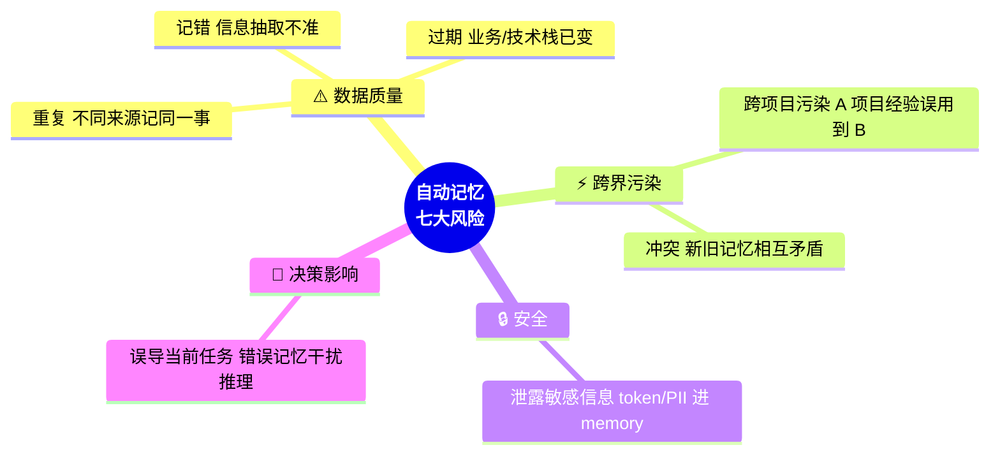

# 💾 第 5 章 · 记忆系统

## **【第 5 章 · 记忆系统】记忆与检索**

### **Q5.1 · Agent 的记忆可以分几类？**

可以分四类：

| 类型         | 生命周期       | 示例                               |
| ------------ | -------------- | ---------------------------------- |
| 强规则记忆   | 长期、团队共享 | 编码规范、测试命令、禁止修改目录   |
| 用户偏好记忆 | 长期、个人级   | 用户喜欢简洁回答、先给计划再改代码 |
| 项目经验记忆 | 中长期、项目级 | 某模块容易出现时区问题             |
| 会话状态记忆 | 当前任务内     | 已修改文件、失败测试、下一步       |

强规则应该写进 AGENTS.md、CLAUDE.md 或项目文档。自动记忆只能作为辅助 recall。会话状态应该放在 session 或 checkpoint 中。

追问：为什么强规则不能只靠自动记忆？

答：自动记忆可能过期、错误、跨项目污染，而且不可审计。强规则需要可版本控制、可审查、团队共享，所以应该显式写在项目文件里。

---

### **Q5.2 · Memory 和 RAG 的区别是什么？**

Memory 更偏长期经验和偏好，RAG 更偏外部知识检索。

Memory 可能保存用户习惯、项目常识、历史经验，比如“这个项目使用 pnpm”。RAG 则从文档库、代码库、知识库中检索相关内容，比如检索某接口的历史设计文档。

二者可以结合：Memory 帮助判断应该检索什么，RAG 帮助找具体证据。

追问：Memory 可以用向量数据库实现吗？

答：可以，但不一定必须。Memory 可以是结构化 JSON、Markdown 文件、KV 存储，也可以是向量库。关键不是存储形式，而是作用域、过期机制、冲突处理和注入策略。

---

### **Q5.3 · 自动记忆有哪些风险？**

主要风险包括：

```text
记错
过期
跨项目污染
重复
冲突
泄露敏感信息
误导当前任务
```



例如某个项目曾经使用 npm，后来迁移到 pnpm，如果 memory 没更新，Agent 可能继续运行错误命令。再比如某个临时调试结论被写入长期记忆，下次类似任务会被误导。

解决办法是给 memory 加 scope、source、confidence、ttl，并提供查看、编辑、删除能力。

追问：什么内容不应该进入 memory？

答：密钥、token、隐私信息、一次性任务细节、临时错误日志、尚未确认的猜测、容易过期的业务状态都不应该进入长期 memory。

---

### **Q5.4 · 如何设计一个好的 Memory 结构？**

可以设计成：

```json
{
  "scope": "project",
  "type": "project_convention",
  "content": "This project uses pnpm for package management.",
  "source": "session_2026_05_18",
  "confidence": 0.92,
  "created_at": "2026-05-18",
  "ttl_days": 180
}
```

关键字段包括 scope、type、content、source、confidence、ttl。scope 用来区分用户级、项目级、组织级；ttl 用来控制过期；source 用于追溯；confidence 用于过滤低可信记忆。


面试时可以把 Memory 结构进一步说成“数据模型 + 写入策略 + 读取策略”：

| 设计点 | 推荐做法 | 面试风险点 |
| --- | --- | --- |
| scope | user / project / org / session 分开 | 跨项目污染 |
| type | preference / convention / fact / procedure | 把临时日志当长期经验 |
| source | 记录来自哪次任务、哪个文件或人工确认 | 无法追溯 |
| confidence | 低置信记忆默认不注入 | 错误记忆误导模型 |
| ttl | 过期或需要复核 | 技术栈、命令、配置变化后仍误用 |
| sensitivity | 标记密钥、隐私、生产信息 | 敏感信息泄露 |
| version_hash | 关联规则文件或项目版本 | 规则更新后 memory 仍旧 |


追问：Memory 什么时候注入上下文？

答：不应该每次全部注入。应该根据当前任务检索相关 memory，只注入少量高相关、高可信、未过期的内容。

---


---

### **【追问扩展】Memory 设计进阶 5 题**

### **Q5.5 · Agent memory 可以有哪些类型？**

可以分为 in-context memory、episodic memory、semantic memory、procedural memory。

In-context memory 是当前上下文窗口里的历史。Episodic memory 是过去交互或任务经历。Semantic memory 是事实知识，比如项目规范、接口说明。Procedural memory 是流程性经验，比如“修复某类 bug 时先跑哪个测试”。公开资料里也有类似分类，把当前会话、外部经历记忆、事实知识和流程记忆区分开。 [Towards AI](https://towardsai.net/p/machine-learning/40-generative-ai-interview-questions-that-actually-get-asked-in-2026-with-answers)

追问：Coding Agent 最需要哪种 memory？

回答：项目级 semantic memory 和 procedural memory 很重要。比如技术栈、测试命令、模块边界是 semantic memory；历史调试经验、常见修复流程是 procedural memory。

---

### **Q5.6 · Memory 和项目规则文件怎么配合？**

项目规则文件保存强规则，memory 保存辅助经验。

规则文件适合写团队必须遵守的内容，比如测试命令、禁止修改目录、架构边界、上线流程。Memory 适合保存项目经验和用户偏好，比如“这个模块测试容易受时区影响”。

优秀 Coding Agent 通常不会把所有记忆都塞进一个黑盒系统，而是把显式规则、自动记忆、会话状态分层。调研资料里也提到，像项目级规则文件这种人工维护的上下文，适合承载编码规范和架构边界，而 RAG 或 memory 更适合补充历史经验。 [Heyuan110](https://www.heyuan110.com/posts/ai/2026-02-21-ai-agent-memory-systems/)

追问：为什么强规则不能写进 memory？

回答：memory 可能错、可能过期、可能无法审计。强规则必须可版本控制、可 review、团队共享。

---

### **Q5.7 · 自动记忆怎么抽取？**

可以在会话结束、阶段完成或压缩后触发抽取。抽取时让模型判断哪些内容具有长期价值，再经过过滤和合并。

抽取逻辑可以问几个问题：

```text
这条信息未来是否还会用
是否稳定
是否已被确认
是否属于当前项目
是否包含敏感信息
是否应该写入规则文件
```

写入前还要去重、合并冲突、加上来源和置信度。

追问：自动记忆什么时候不应该运行？

回答：任务尚未完成、结论未确认、上下文包含敏感信息、使用了外部临时数据、模型判断不可靠时，都不应该自动写入长期记忆。

---

### **Q5.8 · Memory 怎么检索？**

可以用关键词、向量、结构化字段过滤结合。先按 scope 过滤，比如只取当前项目 memory，再按任务语义检索相关内容，最后按置信度、时间和类型排序。

不要把所有 memory 都注入上下文。长期记忆如果过多，会变成噪音。

追问：如何处理 memory 冲突？

回答：优先使用更新、更高置信、更高权威来源的 memory。必要时让用户确认，并把旧 memory 标记为 deprecated，而不是直接混用。

---

### **Q5.9 · 如何防止 Memory 泄露隐私或敏感信息？**

写入前做敏感信息检测，比如 token、密钥、邮箱、手机号、内部账号、生产配置。对敏感内容拒绝写入或脱敏。读取时按用户和项目权限过滤。还要支持人工查看和删除。

追问：向量库里存了敏感信息怎么办？

回答：需要支持删除和重建索引。生产环境还应在源文档、索引、检索结果和生成答案四个环节都做权限和脱敏控制。

---
