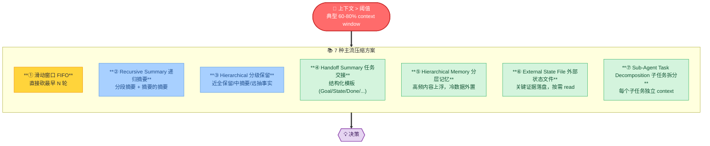

# 🗜️ 第 6 章 · 上下文压缩

## **【第 6 章 · 上下文压缩】**

### **Q6.1 · 主流压缩方案对比（核心追问，必读）**

业界常见的压缩做法有 7 大类，**不是单选一种，而是按场景组合**。下面是完整对比表 + 决策树。



#### **完整对比表**

| # | 方案 | 原理 | 优势 | 劣势 | 典型场景 | 信息保真度 |
| --- | --- | --- | --- | --- | --- | --- |
| ① | **滑动窗口 (FIFO)** | 超阈值直接砍最早 N 轮 | 实现极简、0 LLM 调用、延迟可忽略 | 一刀切丢早期目标和约束 | 短对话、客服 chitchat | ⭐ |
| ② | **Recursive Summary (ReSum)** | 每段摘要再摘要，越早越糊 | token 预算严控、信息有梯度 | 多轮摘要会丢细节、需要计算 | 长任务 Research、Agent 多步执行 | ⭐⭐⭐ |
| ③ | **Hierarchical 分级保留** | 最近 N 完保留 / 中 M 摘要 / 远只抽事实 | 平衡详略、近期细节完整 | 临界点效应、摘要质量决定一切 | Coding Agent、文档对话 | ⭐⭐⭐ |
| ④ | **Handoff Summary** | 按 Goal/State/Done/Pending/Risk 模板压缩 | 任务连续性最强、可断点续跑 | 模板设计成本高、不适合纯聊天 | Coding Agent / 长流程任务 | ⭐⭐⭐⭐ |
| ⑤ | **Hierarchical Memory** | 把历史按访问频率分层，热的留 ctx 冷的外置 | 长会话能扛、内存友好 | 需要 embedding + 检索基建 | 多用户多项目助手、长期对话 | ⭐⭐⭐⭐ |
| ⑥ | **External State File** | 关键证据（diff/失败堆栈/checkpoint）落到 `.harness/state/`，按需 `read_file` 拉回 | 状态永不丢、可审计、可回放 | 需要 Hook 配合、读取要花步骤 | Coding Agent / 生产级 Agent | ⭐⭐⭐⭐⭐ |
| ⑦ | **Sub-Agent 任务拆分** | 把任务拆给独立子 Agent，每个有自己 ctx | 主 Agent ctx 极轻、并行加速 | 子 Agent 协调成本、结果聚合难 | 复杂研究、Multi-Agent 编排 | ⭐⭐⭐⭐ |

#### **怎么选 · 决策矩阵**

| 场景 | 推荐组合 | 理由 |
| --- | --- | --- |
| 纯客服对话 | ① 滑动窗口 | 早期 chitchat 丢了不致命 |
| 单轮长查询（文档问答） | ③ Hierarchical | 当前问题 + 最近文档要完整 |
| Coding Agent 修 bug | ③+④+⑥ 三件套 | 近期 diff 完保留 + 阶段 handoff + 失败堆栈外置 |
| 多小时 Research Agent | ②+⑤ ReSum + 分层记忆 | 长跨度信息要分层管理 |
| Multi-Agent 系统 | ④+⑦ Handoff + 子任务 | 主编排者只看摘要 |
| 端到端工单流（项目 C） | ②+④+⑥ | 子域 Agent 间用 Handoff 交接，关键工单证据外置 |

#### **生产实战的 5 个陷阱**

1. **临界点抖动**：阈值设 80% 时，刚压完就跌到 75%，下一个工具结果又顶到 81%，反复压缩。**修复**：压缩后留至少 20% buffer，下次再压必须 > 上次压完后水位 + 10%
2. **强规则被压掉**：handoff 摘要忘了带"不允许改 schema"这种关键约束。**修复**：PostCompact Hook 强制重新加载 AGENTS.md / system prompt 的强规则段
3. **已失败方案被丢**：Agent 又走一遍刚试过的死路。**修复**：handoff 模板必须有 `Failed Attempts` 字段
4. **工具结果原文进摘要**：把 10K 行测试日志当 raw text 喂给 summary LLM，token 爆炸。**修复**：先工具结果裁剪（保留 stderr + 失败行），再进 summary
5. **压缩本身被取消**：用户点了"中断"刚好压缩进行中。**修复**：压缩操作必须可中断，且不能破坏当前 state file

#### **追问**

**Q：为什么不直接用 1M context 的模型，省得压缩？**

> Token 成本仍然线性涨 + 长 context 模型注意力会被噪音稀释（"Lost in the middle"现象）+ 延迟随 context 上涨。长 context 降低了压缩频率，但不消除压缩需求。**生产经验：64K 是性价比拐点，超过这个就开始性能/成本/质量三选二**。

**Q：能不能让模型自己决定什么时候压缩？**

> 可以但不推荐做主路径。模型对自己 context 用量的感知不准。生产推荐：**确定性触发（token 计数）+ 模型建议（Agent 觉得"上下文乱了"主动调 `request_compaction` 工具）双轨制**。

**Q：压缩后怎么验证没丢关键信息？**

> 让模型基于压缩后的 context 回答 5 个固定问题（原始目标 / 未完成 / 关键约束 / 已失败方案 / 下一步），任何一个答不出就回滚。详见 [Story 4 上下文分级压缩] 和 [第 6 章 Handoff 流程图]。

---

### **Q6.2 · 什么是上下文压缩？**

上下文压缩是指当会话历史过长时，把旧对话、工具结果和中间过程压缩成摘要，让任务能继续进行。

但在 Agent 里，压缩不是普通聊天摘要，而更像任务交接文档。它要保留当前任务状态，而不是简单总结“我们讨论了什么”。

追问：压缩和记忆有什么区别？

答：压缩服务当前会话，解决上下文窗口不够的问题；记忆服务未来会话，保存长期可复用经验。压缩是当前项目经理写交接单，记忆是长期知识库新增经验。

---

### **Q6.3 · 一个好的压缩摘要应该包含什么？**

应该包含：

```text
用户原始目标
当前阶段
已经完成的工作
未完成事项
关键决策
已读取文件
已修改文件
运行过的命令
测试结果
失败尝试
重要约束
风险点
下一步建议
```

例如在 Coding Agent 中，压缩摘要要写清楚：改了哪些文件、为什么改、跑了哪些测试、失败在哪里、哪些方案已经被否掉。否则压缩后 Agent 会忘记原始目标或重复走错路。


一个更适合背诵的 handoff 模板如下：

| 模块 | 必写内容 | 不应该写什么 |
| --- | --- | --- |
| Goal | 用户原始目标、不可违反约束 | 泛泛而谈“讨论了 Agent” |
| Current State | 当前阶段、正在处理的子任务 | 已经过期的中间猜测 |
| Completed | 已完成动作、关键决策、修改文件 | 大段流水账 |
| Pending | 未完成 checklist、下一步动作 | 没有 owner 的空泛建议 |
| Evidence | 测试结果、工具结果、错误摘要 | 全量日志原文 |
| Risks | 已失败方案、风险、需要人工确认点 | 未验证的结论 |


追问：压缩最容易丢什么？

答：最容易丢用户最初的限制、失败过的尝试、未完成 checklist、关键测试结果、为什么做某个技术决策，以及哪些文件不能动。

---

### **Q6.4 · 如何评估压缩质量？**

可以看几个指标：

```text
原始目标保持率
未完成事项保持率
关键约束保留率
错误事实率
重复信息比例
压缩后任务继续成功率
```

最直接的方法是压缩后让 Agent 继续任务，看它是否还能按原计划推进。如果压缩后频繁跑偏、重复读取同样文件、忘记已确认方案，就说明压缩质量不好。

追问：压缩摘要越短越好吗？

答：不是。压缩要在信息完整和 token 节省之间平衡。太短会丢状态，太长又失去压缩意义。对 Agent 来说，结构化摘要比散文式摘要更可靠。

---


---

### **【追问扩展】上下文压缩长任务追问 4 题**

### **Q6.5 · 为什么长任务 Agent 一定需要 compaction？**

> 🔁 **重复题，统一以【第 6 章 · Q17 什么是上下文压缩 + 6.0 主流方案对比 + Handoff 流程图】为准**。
>
> **一句话答**：长任务历史无限增长，上下文窗口有限——必须压缩。但 compaction 不是普通摘要，要保留**任务连续性**（原始目标 / 阶段 / 已完成 / 未完成 / 关键决策 / 失败尝试 / 下一步）。
>
> **最危险的丢失**：用户的强约束（"不允许改数据库 schema"）和已失败方案。生产级实现会把 compaction + hooks + 上下文重载 + 权限上下文绑在一起。 [Penligent](https://www.penligent.ai/hackinglabs/inside-claude-code-the-architecture-behind-tools-memory-hooks-and-mcp/) [Blake Crosley](https://blakecrosley.com/guides/agent-architecture)

---

### **Q6.6 · 什么是 handoff summary？**

Handoff summary 是面向任务续接的交接摘要。它不像普通摘要那样只说“我们讨论了什么”，而是告诉下一个执行者“现在做到哪里，接下来该做什么”。

一个好的 handoff summary 应该包含：

```text
用户原始目标
当前子任务
已完成工作
未完成任务
关键文件
已修改内容
测试结果
失败尝试
重要约束
风险点
下一步建议
```

追问：handoff summary 和项目 summary 有什么区别？

回答：handoff summary 面向当前任务继续执行，强调下一步；项目 summary 面向归档和复用，强调最终交付和经验沉淀。

---

### **Q6.7 · 什么时候应该触发压缩？**

常见做法是 token 接近阈值时自动压缩，或者用户手动触发。更高级的做法是由 Agent 判断任务边界，在一个子任务完成后主动压缩，而不是等到上下文快爆了才压缩。

如果压缩发生在子任务中间，可能破坏推理状态。比较合理的时机是阶段结束、测试完成、方案确认后、开发前 checkpoint、长日志处理后。

追问：压缩前可以做什么 Hook？

回答：可以保存当前 diff、生成待办清单、检查未完成事项、把关键工具结果写入状态文件，甚至阻止压缩。

---

### **Q6.8 · 压缩后如何验证没有丢关键内容？**

可以让模型基于压缩摘要回答几个检查问题：

```text
用户原始目标是什么
当前未完成事项有哪些
哪些文件已修改
哪些测试失败
有哪些约束不能违反
下一步应该做什么
```

如果回答不出来，说明摘要质量不够，需要重新压缩或补充状态。

追问：压缩摘要是否应该包含完整工具日志？

回答：不应该。完整日志可以归档到状态文件，摘要里只放关键信息，比如失败测试名、错误码、关键堆栈和影响文件。

---
