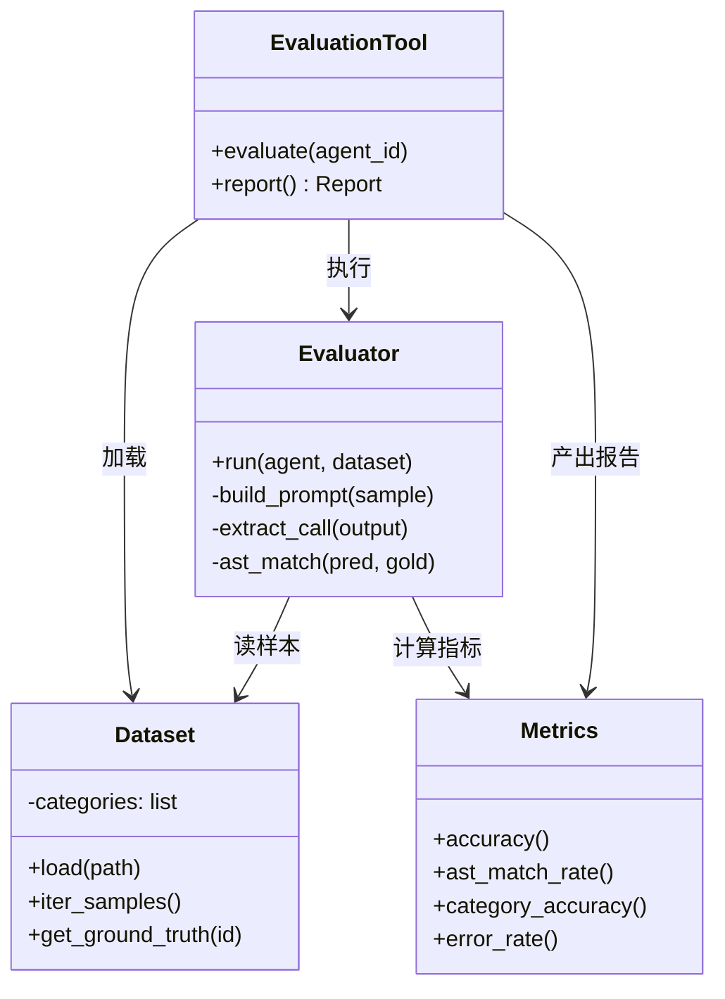
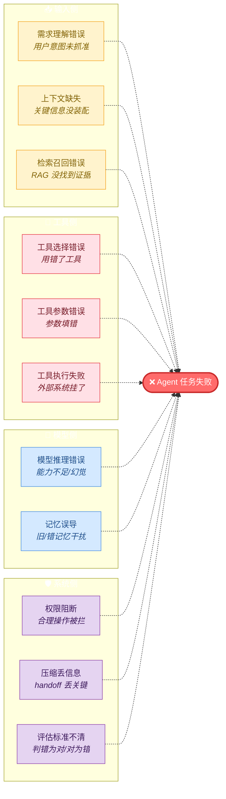

# 📊 第 8 章 · 评估体系

## **【第 8 章 · 评估体系】评估难点 + 指标矩阵**

### **Q8.1 · 为什么需要智能体评估？**

因为 Agent 的能力不能靠感觉判断。我们需要知道它是否具备预期能力，在不同任务上表现如何，和其他方案相比有没有提升，是否可靠到可以上线。

评估能把“感觉不错”变成具体指标，比如工具调用准确率、任务完成率、错误率、响应时间、token 使用量、测试通过率等。

追问：Agent 评估和传统软件测试有什么不同？

答：传统软件测试通常有确定输入输出，而 Agent 输出不确定。同一个问题可能有多个正确答案，不同任务需要不同评价标准，而且评估本身可能需要大量模型调用和工具调用，成本更高。

---

### **Q8.2 · Agent 评估面临哪些挑战？**

主要有三类。

第一，输出不确定。比如“42”“答案是 42”“42.0”都可能正确。

第二，评估标准多样。工具调用要看函数名和参数，问答要看语义，网页任务要看是否完成操作，生成数据要看质量。

第三，评估成本高。跑大量样本需要 API 调用、工具执行、文件处理，可能耗时也耗钱。

追问：怎么解决这些挑战？

答：可以使用标准 benchmark、分任务设计指标、小样本快速评估、LLM Judge、人工抽检、分层评估和持续评估系统。

---

### **Q8.3 · 常见 Agent 评估指标有哪些？**

常见指标包括：

| 类型     | 指标                                              |
| -------- | ------------------------------------------------- |
| 准确性   | Accuracy、Exact Match、F1                         |
| 工具调用 | Function Call Accuracy、AST Match Rate            |
| 效率     | Response Time、Token Usage、Tool Call Count       |
| 鲁棒性   | Error Rate、Failure Recovery                      |
| 任务完成 | Task Completion Rate                              |
| 代码质量 | Test Pass Rate、Lint Pass Rate、Patch Accept Rate |
| 生成质量 | LLM Judge Score、Win Rate                         |
| 安全性   | Dangerous Action Block Rate                       |

追问：只看准确率够吗？

答：不够。Agent 是任务执行系统，还要看效率、稳定性、安全性、成本和可恢复性。一个准确率高但调用工具极慢、成本极高、经常越权的 Agent 也不适合上线。

---

## **【第 8.3 · BFCL】函数调用评估**

### **Q8.3.1 · BFCL 是什么？**

BFCL 全称 Berkeley Function Calling Leaderboard，是一个评估模型或 Agent 函数调用能力的 benchmark。它主要考察 Agent 是否能理解用户意图、选择正确函数、填写正确参数，并判断是否需要调用函数。

BFCL 包含 simple、multiple、parallel、irrelevance 等类别，覆盖单函数调用、多函数调用、并行调用和不相关场景。

追问：BFCL 适合评估什么场景？

答：适合评估工具调用准确性，尤其是 API 调用、函数调用、参数抽取等能力。

---

### **Q8.3.2 · BFCL 的四类任务是什么？**

Simple 是单函数调用，比如查北京天气，只需要调用一个 `get_weather`。

Multiple 是多函数调用，比如同时查北京和上海天气。

Parallel 是并行调用不同工具，比如同时查天气和汇率。

Irrelevance 是判断不需要调用工具，比如用户只是打招呼，Agent 应该直接回答，而不是强行调用函数。


这题可以补一个对比表，避免只背四个名词：

| 类别 | 考察点 | 常见错误 | 评价重点 |
| --- | --- | --- | --- |
| Simple | 单个函数选择和参数填写 | 函数选错、参数漏填 | 函数名和参数键值是否匹配 |
| Multiple | 多个同类函数调用 | 漏调一个、合并错 | 调用数量和每次参数是否正确 |
| Parallel | 不同工具并行调用 | 顺序混乱、工具混用 | 工具选择、参数、并行意图 |
| Irrelevance | 判断不该调用工具 | 为了调用而调用 | 能否拒绝无意义工具调用 |

追问：为什么 irrelevance 重要？

答：因为好的 Agent 不只是会调用工具，还要知道什么时候不该调用。滥用工具会增加成本、延迟和错误风险。

---

### **Q8.3.3 · BFCL 为什么使用 AST 匹配？**

因为简单字符串匹配太死板。比如：

```python
get_weather(city="Beijing", unit="celsius")
get_weather(unit="celsius", city="Beijing")
```

这两个字符串不同，但语义相同。AST 匹配会把函数调用解析成语法树，比较函数名、参数集合和参数值是否等价，从而忽略参数顺序、格式差异和部分等价表达式。

追问：AST 匹配的核心条件是什么？

答：函数名必须一致，参数键值对集合相等，参数值语义等价。多函数调用时，还要匹配函数调用数量和每个函数调用内容。

---

### **Q8.3.4 · BFCL 的准确率怎么计算？**

准确率是 AST 匹配成功的样本比例：

$$
Accuracy = \frac{正确样本数}{总样本数}
$$

如果 100 个样本里有 85 个函数调用和标准答案匹配，准确率就是 85%。

也可以按类别统计，比如 simple accuracy、multiple accuracy、parallel accuracy，帮助分析模型在哪类工具调用上薄弱。

追问：加权准确率有什么意义？

答：不同类别难度不同，可以给复杂任务更高权重，避免模型只在简单任务上表现好却总体看起来不错。

---

### **Q8.3.5 · 如果让你实现一个 BFCL 评估器，你会怎么设计？**

通用做法是拆 4 个组件，职责清晰、可独立测试：



**各组件职责**：
- **Dataset**：加载 BFCL 数据（question / function / ground_truth），支持按类别迭代
- **Evaluator**：构造 prompt → 调 Agent → 从输出里提取 function_call → AST 匹配
- **Metrics**：accuracy / AST match rate / category-wise accuracy / error rate
- **EvaluationTool**：把以上组合成一键评估，可被 Agent 或 CI/CD 直接调用

**整体流程**：加载数据集 → 构造提示词 → 调用 Agent → 提取函数调用 → AST 匹配 ground truth → 计算准确率 → 生成报告。

**追问 1：为什么要封装成 Tool？**
> 封装后评估能力可以被 Agent 或 workflow 直接调用，也容易集成到 CI/CD 或自动评估流水线里。

**追问 2：函数调用提取为什么难？**
> 模型输出格式不稳定——可能是 JSON、代码块、自然语言混合。评估器要能从不同格式中可靠提取函数名和参数。生产实现通常用多策略 fallback：先 JSON.parse → 失败则 ast.parse → 再失败用正则抓 `func_name(...)` 模式。

---

### **Q8.3.6 · BFCL AST 匹配伪代码（深度补充）**

面试官如果让你白板写 AST 匹配，可以这样（用 `ast.literal_eval` 安全求值字面量，不要用动态求值函数）：

```python
import ast
import re

def parse_call(call_str):
    """把 'get_weather(city="北京", unit="celsius")' 解析成 AST Call 节点"""
    tree = ast.parse(call_str, mode="eval")
    if not isinstance(tree.body, ast.Call):
        raise ValueError("not a function call")
    return tree.body

def safe_value(node):
    """只接受字面量（str/num/list/dict/bool/None），杜绝任意代码"""
    return ast.literal_eval(node)

def call_equiv(pred, gold):
    # 1. 函数名必须一致
    if ast.unparse(pred.func) != ast.unparse(gold.func):
        return False
    # 2. 收集 keyword arguments
    pred_kw = {k.arg: safe_value(k.value) for k in pred.keywords}
    gold_kw = {k.arg: safe_value(k.value) for k in gold.keywords}
    # 3. 参数键集合相等
    if set(pred_kw) != set(gold_kw):
        return False
    # 4. 每个值语义等价
    for key in gold_kw:
        if not value_equiv(pred_kw[key], gold_kw[key]):
            return False
    return True

def value_equiv(a, b):
    # 数字：1 == 1.0 == "1"（按 ground truth 类型归一化）
    if isinstance(b, (int, float)):
        try:
            return float(a) == float(b)
        except (ValueError, TypeError):
            return False
    # 字符串：去前后空格，大小写视任务而定
    if isinstance(b, str):
        return str(a).strip() == b.strip()
    # 列表：顺序无关时排序比较
    if isinstance(b, list):
        return sorted(a) == sorted(b)
    return a == b
```

### **Q8.3.7 · BFCL 五大类别准确率参考（2025 公开数据）**

记住这几个量级，回答时更有说服力：

| 类别 | 顶级模型准确率 | 难点 |
| --- | --- | --- |
| Simple | 90%+ | 几乎都能做对 |
| Multiple | 80-90% | 容易漏调一个 |
| Parallel | 70-85% | 并行意图判断、顺序控制 |
| Multi-Turn | 60-80% | 跨轮上下文保持 |
| Irrelevance | 70-95% | 模型倾向"为了调用而调用" |

**Irrelevance 类**最考验工程实现，比如用户问"今天天气怎么样"但没说城市，好的 Agent 应该追问而不是瞎调 `get_weather(city="")`。

---

### **Q8.3.8 · GAIA Level 真实样例（深度补充）**

GAIA 官方公布的样例：

**Level 1（基础，单工具或简单推理）**
> "What is the capital of France?"
> 答："Paris"
> 难点：几乎没有，主要测能否给简洁答案

**Level 2（多步，需要工具组合）**
> "What is the surname of the equine veterinarian mentioned in 1.E Exercises from the 2023 Pearson edition of the chemistry textbook for openstax?"
> 答："Louvrier"
> 难点：要找到对应教材 PDF → 跳到指定章节 → 提取人名

**Level 3（复杂，多文件+多跳推理）**
> "In the year 2022, between what days were the Magic the Gathering: Phyrexia: All Will Be One Pre-Release events held? Answer in the format of MM-DD to MM-DD."
> 答："01-28 to 02-03"
> 难点：要搜索 → 跨多个来源验证 → 格式化输出

GAIA 顶级分数（2025）：
- GPT-4 + 工具：~30%
- 顶级 Agent 框架（如 Magnetic-One）：~38%
- 人类基线：~92%

**为什么 Agent 离人类还有这么大差距**？关键失败点：
1. 多步推理中间一步错就全错（错误累积）
2. 工具返回大量噪声时模型抓不住关键
3. 最终答案格式不符合要求（推理对了但输出格式错被判错）
4. 需要跨文件/跨网页交叉验证时容易满足于第一个看到的答案

---

### **Q8.3.9 · 准精确匹配实现要点**

```python
import re

def quasi_exact_match(pred, gold):
    def normalize(s):
        # 1. 去前后空格
        s = s.strip()
        # 2. 大小写归一化（视任务而定，人名地名要保留）
        # s = s.lower()  # 谨慎开启
        # 3. 去末尾标点
        s = re.sub(r'[.,!?;:]+$', '', s)
        # 4. 数字归一化（"42.0" -> "42", "1,000" -> "1000"）
        s = re.sub(r',(\d{3})', r'\1', s)
        if re.match(r'^\d+\.0+$', s):
            s = s.split('.')[0]
        # 5. 去常见前缀
        for prefix in ["The answer is ", "Answer: ", "It is "]:
            if s.lower().startswith(prefix.lower()):
                s = s[len(prefix):]
        return s

    return normalize(pred) == normalize(gold)
```

追问：为什么 GAIA 不直接用 LLM Judge？

答：成本高、不稳定、对客观题（"哪一天"、"谁"、"多少"）会引入额外噪声。GAIA 设计成"答案唯一可判定"，准精确匹配就够。LLM Judge 更适合开放生成（论文摘要、代码解释）这类没有唯一答案的任务。

---

## **【第 8.4 · GAIA】通用任务评估**

### **Q8.4.1 · GAIA 是什么？**

GAIA 是 General AI Assistants benchmark，评估通用 AI 助手在真实世界任务中的综合能力。它包含 466 个真实世界问题，分为 Level 1、Level 2、Level 3 三个难度级别。

GAIA 不只考工具调用，还考多步推理、文件处理、网页浏览、知识整合、多模态理解和最终答案提取。

追问：GAIA 和 BFCL 的区别是什么？

答：BFCL 重点看函数调用是否正确，输出是工具调用；GAIA 重点看真实任务是否解决，输出是最终答案。BFCL 更像工具调用考试，GAIA 更像综合应用题。

---

### **Q8.4.2 · GAIA 的三个难度级别有什么区别？**

Level 1 通常是基础任务，可能只需要一步查询或简单推理。

Level 2 需要多步操作，比如搜索网页、读取文件、整合信息。

Level 3 是复杂任务，可能需要多次搜索、跨来源验证、文件分析和复杂推理。

追问：GAIA 为什么适合评估通用助手？

答：因为它的问题更接近真实用户任务，不只是单点能力，而是考察 Agent 是否能综合使用工具和推理能力完成任务。

---

### **Q8.4.3 · GAIA 为什么使用准精确匹配？**

因为最终答案可能有不同表达方式。比如标准答案是“42”，模型可能输出“The answer is 42.” 或 “42.0”。严格字符串匹配会误判。

准精确匹配会先对答案归一化，比如去掉多余空格、统一大小写、处理标点和数字格式，再进行匹配。

追问：准精确匹配有什么局限？

答：它对语义等价但表达差异大的答案处理有限。比如同义表达、复杂句子、单位换算、近似答案，可能需要更智能的语义匹配或 LLM Judge。

---

### **Q8.4.4 · GAIA 的评估流程是什么？**

流程是：

```text
加载 GAIA 数据集
读取问题和附件
调用 Agent 完成任务
提取最终答案
归一化预测答案和标准答案
准精确匹配
按 Level 统计准确率
生成报告
```


追问：GAIA 评估时最容易出错的地方是什么？

答：最终答案提取。Agent 可能推理过程正确，但最终输出太啰嗦，导致匹配失败。所以需要明确要求输出 final answer，或者设计答案提取器。

---

## **【第 8.5 · LLM Judge / Win Rate】开放生成评估**

### **Q8.5.1 · 什么是 LLM Judge？**

LLM Judge 是用大语言模型作为评委，对生成内容进行评分或判断。它常用于评估开放式生成任务，比如题目生成、回答质量、代码解释、文档质量等。

在我们之前讨论的数据生成质量评估里，LLM Judge 用来评估 AIME 风格题目，从正确性、清晰度、难度匹配、完整性等维度打分。

追问：LLM Judge 相比规则评估有什么优势？

答：它能处理开放式内容，给出多维度评分和理由，不要求答案完全匹配固定格式，适合传统规则难以覆盖的生成质量评估。

---

### **Q8.5.2 · LLM Judge 有什么风险？**

风险包括：

```text
评委模型本身可能犯错
偏好长答案
偏好某种表达风格
评分不稳定
容易受提示词影响
可能和人类专家标准不一致
```

所以 LLM Judge 适合初筛和规模化评估，但重要场景还需要人工验证或多评委机制。

追问：如何提升 LLM Judge 可靠性？

答：可以设计明确评分 rubric，使用多评委投票，隐藏答案来源避免偏见，加入人工抽检，评估评委一致性，并定期校准评分标准。

---

### **Q8.5.3 · 什么是 Win Rate 评估？**

Win Rate 是相对比较评估。它把生成内容和参考内容成对比较，让评委判断哪个更好，最后统计生成内容胜出的比例。

例如生成 AIME 题和真实 AIME 题对比，如果 20 次比较中生成题赢 9 次，Win Rate 就是 45%。

$$
Win\ Rate = \frac{Wins}{Total\ Comparisons}
$$

追问：Win Rate 接近 50% 说明什么？

答：说明生成内容质量接近参考数据。如果显著低于 50%，说明生成质量不如参考；如果显著高于 50%，可能是生成质量更好，也可能是评估标准存在偏差。

---

### **Q8.5.4 · LLM Judge 和 Win Rate 的区别是什么？**

LLM Judge 是绝对评分，比如给一道题打 4.2/5 分。Win Rate 是相对评估，比如判断生成题和真题哪个更好。

LLM Judge 适合看整体质量和各维度短板；Win Rate 适合看生成结果与参考数据之间的差距。

追问：实际项目中应该选哪个？

答：最好结合使用。LLM Judge 做多维度绝对评分，Win Rate 做相对对比，人工验证做最终质量把关。

---


---

### **【追问扩展】评估观测补充 5 题**

### **Q8.5.5 · Agent 应该怎么做线上观测？**

Agent 观测要记录每轮模型调用、上下文组成、工具调用、工具结果、错误、审批、压缩事件、memory 写入和最终结果。

关键不是记录越多越好，而是能回放任务过程，定位失败原因。

追问：观测数据有什么风险？

回答：可能包含敏感信息、代码、密钥或用户隐私。所以日志要脱敏、权限控制、设置保留周期。

---

### **Q8.5.6 · Agent 失败如何归因？**

可以按链路拆：

```text
需求理解错误
上下文缺失
检索召回错误
工具选择错误
工具参数错误
工具执行失败
模型推理错误
权限阻断
压缩丢信息
记忆误导
评估标准不清
```



归因时要看证据。比如正确文档有没有被检索到，工具结果有没有进入上下文，模型有没有忽略测试失败。

追问：为什么失败归因重要？

回答：因为不同失败原因对应不同优化方向。检索错要改 RAG，工具错要改 schema，压缩错要改 summary，推理错可能才需要换模型。

---

### **Q8.5.7 · Agent 评估集怎么构建？**

评估集应该覆盖真实任务类型，而不是只放简单样例。

可以包括：

```text
工具调用任务
多步检索任务
代码修改任务
测试修复任务
长上下文任务
权限边界任务
记忆召回任务
压缩续跑任务
异常恢复任务
```

每个样本要有输入、期望行为、评分标准和可观测证据。

追问：真实业务评估集怎么维护？

回答：从历史工单、PR、需求文档、故障复盘中抽样，脱敏后形成评估集。定期加入新失败案例，防止评估集过时。

---

### **Q8.5.8 · 如何评估 Agent 的工具调用能力？**

可以用 BFCL 这类函数调用 benchmark，也可以自建业务工具调用评估集。

指标包括：

```text
工具选择准确率
参数准确率
调用顺序正确率
不必要调用率
工具失败恢复率
平均工具调用次数
```

如果是函数调用，可以用 AST 匹配评估函数名和参数是否等价——这正是 **BFCL** 的核心做法（详见第 8.3 章）。

追问：为什么不用字符串匹配？

回答：因为参数顺序、引号、格式可能不同但语义相同。AST 匹配更适合判断函数调用结构是否一致。

---

### **Q8.5.9 · 如何评估 Agent 的长任务能力？**

要看它能否在多轮工具调用、上下文压缩、状态恢复后仍然完成目标。

指标可以包括：

```text
长任务完成率
压缩后续跑成功率
重复工具调用率
任务目标保持率
未完成事项保留率
中断恢复成功率
```

追问：怎么设计长任务评估样本？

回答：设计需要多个阶段的任务，比如先读需求、再写方案、再改代码、再跑测试、再处理失败。中途强制触发压缩或中断，看 Agent 是否能恢复。

---
