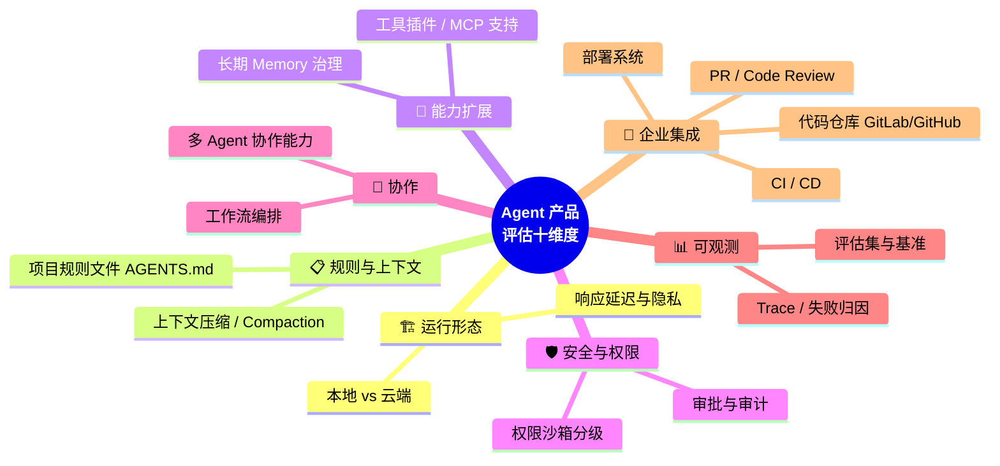
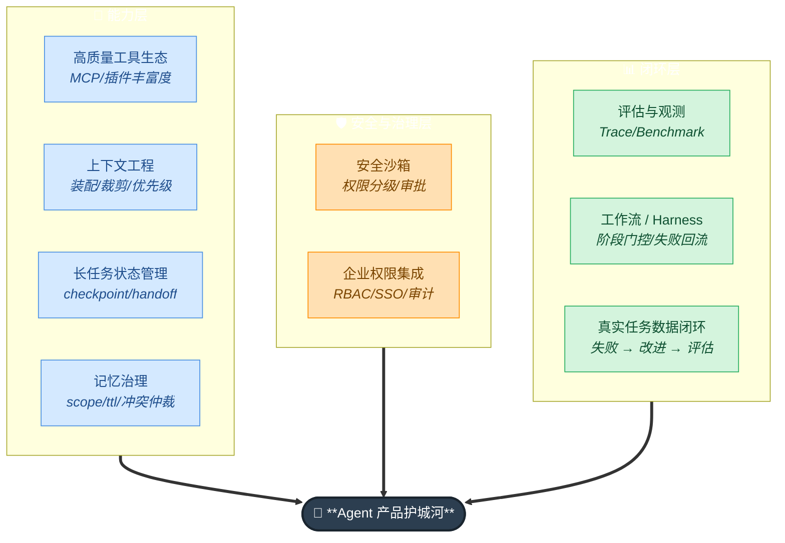

# 💻 第 9 章 · Coding Agent / Harness

## **【第 9 章 · Coding Agent / Harness】Coding Agent 设计要点**

### **Q9.1 · Coding Agent 和普通 Agent 有什么不同？**

Coding Agent 面向软件工程任务，需要读取项目、理解代码、修改文件、运行测试、查看 diff、遵守项目规范，并输出可交付结果。

它比普通问答 Agent 更依赖工具、状态、权限和评估。因为代码修改会真实影响仓库，必须可追踪、可回滚、可验证。

追问：Coding Agent 的关键能力有哪些？

答：代码检索、文件理解、最小范围修改、测试运行、错误日志分析、Git diff 理解、项目规则遵守、上下文压缩、任务恢复和安全控制。

---

### **Q9.2 · 一个 Coding Agent 的运行流程是什么？**

可以这样描述：

```text
接收需求
读取项目规则
分析目录结构
检索相关文件
理解需求和影响面
制定修改计划
修改代码
运行测试
根据失败结果迭代
生成总结
```

在更复杂的系统里，还会加入 PRD、技术方案、Review、上线准备和经验沉淀。

追问：为什么 Coding Agent 不应该一上来就改代码？

答：因为需求边界、影响范围、历史约束可能还不清楚。直接改代码容易沿着错误方向推进。更稳妥的方式是先理解需求、确认方案，再进入开发。

---

### **Q9.3 · Coding Agent 为什么需要项目规则文件？**

项目规则文件告诉 Agent 这个仓库应该怎么工作，比如：

```text
测试命令
构建命令
代码风格
目录结构
禁止修改的文件
提交规范
安全边界
```

它比临时对话中的提示更可靠，因为它可以跟随仓库版本管理，也能被团队共同维护。

追问：规则文件和自动记忆哪个更可靠？

答：规则文件更可靠。自动记忆适合作为辅助经验，规则文件适合承载必须遵守的团队规范。

---


---

### **【追问扩展】Coding Agent 产品设计 7 题**

### **Q9.4 · 你怎么看优秀 Coding Agent 的设计？**

优秀 Coding Agent 不是只会生成代码，而是能稳定参与软件工程流程。它应该能读项目规则、理解目录结构、最小范围修改、运行测试、解释 diff、处理失败日志、保存任务状态、遵守权限边界。

我会看几个维度：上下文装配是否稳、工具调用是否准、沙箱权限是否可靠、长任务是否能续跑、记忆是否可控、输出是否可验证、是否支持团队流程。

追问：为什么很多 Coding Agent demo 看起来很好，落地却不稳定？

回答：demo 通常任务短、上下文清晰、权限简单。真实项目有历史包袱、规则复杂、测试慢、依赖多、权限敏感，Agent 很容易因为上下文不完整或工具反馈处理不好而失败。

---

### **Q9.5 · 轻量本地 Coding Agent 的优势是什么？**

轻量本地 Coding Agent 的优势是启动快、贴近开发者环境、能直接读写本地项目、运行本地测试，适合个人开发者快速修 bug、补测试、重构小模块。

它通常依赖项目规则文件、工具调用、自动压缩和本地沙箱来工作。前面我们聊过的轻量本地运行时路线，重点就是让 Agent 快速在本机跑起来，并自动管理上下文。

追问：它的短板是什么？

回答：团队治理能力可能弱一些，比如压缩前后事件不够可控、权限策略不够细、长任务 checkpoint 和外部 memory 同步需要额外搭建。

---

### **Q9.6 · 生命周期平台型 Coding Agent 的优势是什么？**

生命周期平台型 Coding Agent 会把 SessionStart、PreToolUse、PostToolUse、PreCompact、PostCompact、InstructionsLoaded 这类事件暴露出来，让团队可以在关键节点插入规则。

它适合团队级场景，比如安全拦截、质量门禁、压缩后同步摘要、工具调用审计、配置变更监控。调研资料里也提到，某些代码 Agent 的设计已经不再是单个长 prompt，而是包含工具、记忆、Hooks、MCP、权限、compaction 等模块化系统。 [Penligent](https://www.penligent.ai/hackinglabs/inside-claude-code-the-architecture-behind-tools-memory-hooks-and-mcp/)

追问：生命周期平台型产品的缺点是什么？

回答：配置复杂，学习成本高。如果 Hooks、规则和 memory 管理不好，反而会造成流程负担和维护成本。

---

### **Q9.7 · OpenClaw、Hermes Agent 这类产品可能会从哪些设计点被问？**

如果面试官提到这类产品，即使你不了解具体内部实现，也可以从通用 Agent 产品设计维度回答。不要强行编造细节，可以说“我没有完整内部资料，但我会从以下几个层面分析”。

可以分析：

```text
它是本地执行还是云端执行
是否有项目规则文件
是否支持工具插件或 MCP
是否支持长期 memory
是否支持上下文压缩
是否有权限沙箱
是否支持多 Agent 协作
是否有工作流编排
是否有评估和观测
是否能接入代码仓库、CI、PR、部署
```



追问：如果让你快速评估一个 Agent 产品好不好，你看什么？

回答：我会看它能不能稳定完成长任务，能不能解释每一步动作，能不能控制权限，能不能在失败后恢复，能不能沉淀经验，能不能被评估，而不是只看它单次回答是否惊艳。

---

### **Q9.8 · Coding Agent 为什么需要沙箱？**

因为 Coding Agent 可以执行真实命令和修改文件。如果没有沙箱，它可能删除文件、读取密钥、修改生产配置、执行危险脚本、提交错误代码。

沙箱要限制文件访问范围、命令权限、网络访问、环境变量、外部服务调用。高风险操作需要人工审批。

追问：只读模式有什么用？

回答：只读模式适合代码审查、架构分析、问题定位。它能让 Agent 获取信息但不能修改环境，风险低，适合作为团队引入 Agent 的第一阶段。

---

### **Q9.9 · Coding Agent 如何做最小修改？**

要先明确需求边界和影响范围，再只改相关文件。修改前读取项目规则和相关测试，避免顺手重构无关代码。修改后通过 diff 检查是否超范围。

可以要求 Agent 在最终回答中列出变更文件、变更原因和未改动范围。

追问：为什么最小修改重要？

回答：因为 AI 容易为了“优化”做额外改动，增加 review 成本和回归风险。真实研发里，可控的小改动比看起来漂亮的大改动更容易合并。

---

### **Q9.10 · Coding Agent 怎么处理测试失败？**

测试失败后应该先提取失败用例、错误信息、相关文件和可能原因。然后判断是代码问题、测试问题、环境问题还是依赖问题。

如果是代码问题，回到开发阶段修复；如果是测试预期问题，需要确认需求；如果是环境问题，需要记录并请求用户协助。不能测试失败还直接总结完成。

追问：如何让 Agent 不忽略测试失败？

回答：把测试结果作为阶段门控。测试未通过时，不允许进入交付总结或上线准备。Harness 里的失败回流就是这种设计。

---

## **【第 9.2 · Codex vs Claude Code】路线对比**

### **Q9.2.1 · Codex 的核心架构可以怎么理解？**

可以理解为：

```text
本地 Agent 运行时
上下文装配层
工具/沙箱层
记忆层
压缩/交接层
扩展层
```

它的重点是轻量、本地、高效，让 Coding Agent 能在本机快速读取代码、修改文件、运行命令，并通过 AGENTS.md、配置、MCP、Memories 和自动 compaction 管理上下文。

追问：Codex 的优势是什么？

答：轻、快、本地体验好，适合个人开发者快速进入项目、完成代码修改和测试验证。AGENTS.md 机制也比较适合做项目级规则入口。

---

### **Q9.2.2 · Claude Code 的架构特点是什么？**

Claude Code 更像完整的 Agent 生命周期平台。它在规则加载、记忆、Hooks、权限、压缩前后事件上更显式、更可编排。

它支持 SessionStart、PreToolUse、PostToolUse、PreCompact、PostCompact、InstructionsLoaded 等生命周期事件，所以更适合团队把安全策略、质量门禁、外部 memory 同步、checkpoint 这些能力工程化。

追问：Claude Code 的优势是什么？

答：可治理性强。团队可以在工具调用前拦截危险操作，在压缩前保存状态，在压缩后同步摘要，在会话开始时注入规则。这对长任务和团队级自动化很重要。

---

### **Q9.2.3 · Codex 和 Claude Code 的核心区别是什么？**

Codex 更像高性能 Agent runtime，强调轻量、本地、高效、自动上下文管理。

Claude Code 更像可治理 Agent OS，强调生命周期暴露、Hooks、规则层级、记忆管理和团队流程编排。

如果是个人快速 coding，Codex 的轻量体验更舒服；如果是团队级自动化、长任务 checkpoint、质量门禁，Claude Code 的生命周期能力更适合。

追问：这两类设计路线哪个更好？

答：没有绝对更好，取决于场景。个人效率优先选轻量 runtime，团队治理优先选生命周期平台。

---

### **Q9.2.4 · AGENTS.md 和 CLAUDE.md 的作用是什么？**

它们都是项目级规则文件，用来告诉 Agent 如何在当前项目中工作。

AGENTS.md 更通用，常用于描述项目约定、测试命令、编码规范、禁止事项等。CLAUDE.md 更偏某个平台的规则入口，也可以支持多 scope 和路径规则。

本质上，它们都是显式规则记忆，应该承载强约束，而不是临时任务状态。

追问：这些文件应该写多长？

答：应该短、稳定、明确。不要塞入大量历史讨论和临时日志。最好写项目概览、常用命令、架构约定、测试要求、安全边界和最终回复格式。

---

### **Q9.2.5 · Coding Agent 的 compaction 应该怎么设计？**

应该把压缩摘要设计成 handoff document，而不是普通聊天摘要。

它需要保存：

```text
原始目标
当前状态
已完成工作
未完成事项
关键文件
修改内容
测试结果
失败尝试
重要约束
下一步动作
```

追问：为什么 Claude Code 的 PreCompact / PostCompact 很有价值？

答：因为它让压缩成为可观测、可干预的生命周期事件。压缩前可以保存 checkpoint 或阻止压缩，压缩后可以把 summary 同步到外部 memory 或审计系统。

---


---

### **【追问扩展】Agent 产品对比 4 题**

### **Q9.2.6 · 你如何评价“轻量 runtime”和“流程化 Harness”两种路线？**

轻量 runtime 适合个人效率，它让开发者快速在本地启动 Agent，读代码、改文件、跑测试。流程化 Harness 适合团队交付，它强调需求确认、方案评审、状态保存、测试验证和经验沉淀。

二者可以结合。轻量 runtime 做执行后端，Harness 做流程控制层。

追问：如果只能选一个方向做 MVP，你选哪个？

回答：如果面向个人开发者，先做轻量 runtime；如果面向企业团队，先做流程和权限，因为团队更关心可控、可审计、可恢复。

---

### **Q9.2.7 · 为什么优秀 Agent 产品都在做 Hooks？**

Hooks 能让用户在生命周期节点插入确定性逻辑，比如工具调用前拦截危险命令，工具调用后裁剪日志，压缩前保存 checkpoint，压缩后同步 summary。

模型行为不完全确定，但 Hook 是确定性的。它能把 Agent 从“黑盒自动执行”变成“可治理系统”。

追问：Hook 写多了会有什么问题？

回答：复杂度上升，调试困难，流程变慢。如果 Hook 之间依赖混乱，可能引入新的故障。所以 Hook 要清晰分层，保留日志和测试。

---

### **Q9.2.8 · 为什么优秀 Agent 产品都在做 compaction？**

因为长任务不可避免会超过上下文窗口。Compaction 是长任务连续性的基础。

不过优秀产品不会只做普通摘要，而是做任务交接、规则重载、状态恢复和关键文件引用。有些产品还会暴露压缩前后事件，让团队接入 checkpoint 和外部 memory。

追问：长上下文模型是不是让 compaction 不重要了？

回答：不会。长上下文降低了压缩频率，但上下文仍然有成本和注意力问题。信息越多，噪音越多。compaction 仍然是管理任务状态的重要手段。

---

### **Q9.2.9 · Agent 产品的护城河可能在哪里？**

不只是模型。护城河可能在：

```text
高质量工具生态
上下文工程能力
长任务状态管理
安全沙箱
企业权限集成
评估和观测体系
工作流和 Harness
记忆治理
真实任务数据闭环
```



模型能力会持续提升，但生产级 Agent 的稳定性更多来自系统工程。

追问：为什么说评估数据也是护城河？

回答：因为真实失败案例和任务轨迹能不断改进 Agent。谁有更好的评估集和反馈闭环，谁更容易把 Agent 做稳。

---

## **【第 9.4 · Harness 工程】阶段门控与产物管理**

### **Q9.4.1 · Harness 是什么？**

Harness 是一套让 Agent 以更稳定、更可控、更可恢复的方式完成研发任务的工程化框架。它不是更长的 prompt，也不是单个脚本，而是围绕研发交付设计的一套控制系统。

它通过阶段、状态、记忆、产物、扩展点和工具适配，把“让 Agent 帮我做需求”从临场发挥变成可复用流程。

追问：Harness 解决什么问题？

答：主要解决上下文不可控、过程不可恢复、交付不可验证、经验不可复用这四类问题。

---

### **Q9.4.2 · Harness 的主要流程是什么？**

主要流程可以概括为：

```text
需求输入
历史检索
PRD
技术方案
开发
Review
测试验证
上线准备
交付总结
经验沉淀
归档
```


可以把 Harness 画成一个带门控的研发生命周期：

```mermaid
flowchart LR
  Intake(["📥 **需求输入**<br/>Jira/PRD/口述"]):::intake

  subgraph S0["🟡 上下文准备"]
    Retrieve["🔍 **历史检索**<br/>.harness/summary/*<br/>+ Memory 召回"]:::retrieve
  end

  subgraph S1["🔵 规划阶段"]
    PRD["📋 **PRD 产出**<br/>目标/范围/验收/边界/风险<br/><i>产物 .harness/prd/</i>"]:::prd
    G1{"PRD<br/>确认?"}:::gate
    Design["🏗️ **技术方案**<br/>影响面/依赖/迁移/回滚<br/><i>产物 .harness/design/</i>"]:::design
    G2{"方案<br/>确认?"}:::gate
    CP["📌 **Checkpoint-Design**<br/>固化决策+不可改文件"]:::cp
  end

  subgraph S2["🔴 执行阶段"]
    Dev["⌨️ **开发**<br/>最小修改 · patch"]:::dev
    Review["👀 **Code Review**<br/>diff 越界/边界/安全"]:::review
    QA["🧪 **测试验证**<br/>单测+集成+lint+类型"]:::qa
    G3{"验证<br/>通过?"}:::gate
  end

  subgraph S3["🟢 交付与沉淀"]
    Summary["📊 **交付总结**<br/>变更/测试/验收对照"]:::sum
    Mem["💾 **经验沉淀**<br/>失败尝试 → Memory"]:::mem
    Done(["📦 **归档**<br/>.harness/release/"]):::done
  end

  Intake ==> Retrieve ==> PRD
  PRD --> G1
  G1 -->|"✅"| Design
  G1 -.->|"❌ 收集意见"| PRD
  Design --> G2
  G2 -->|"✅"| CP
  G2 -.->|"❌ 澄清"| Design
  CP ==> Dev ==> Review ==> QA
  QA --> G3
  G3 -->|"✅"| Summary
  G3 -.->|"❌ 失败回流<br/>分析类型"| Dev
  Summary ==> Mem ==> Done

  classDef intake fill:#FFF3CD,stroke:#F5A623,color:#856404,stroke-width:2px
  classDef retrieve fill:#FFE8A1,stroke:#F5A623,color:#856404
  classDef prd fill:#D4E9FF,stroke:#4A90E2,color:#1F4E8C,stroke-width:1.5px
  classDef design fill:#A8D0FF,stroke:#4A90E2,color:#1F4E8C,stroke-width:1.5px
  classDef cp fill:#7FB3F0,stroke:#1864AB,color:#fff,stroke-width:2px
  classDef gate fill:#FFD43B,stroke:#F08C00,color:#333,stroke-width:2px,font-weight:bold
  classDef dev fill:#FFE0E6,stroke:#E63946,color:#7A1D2A
  classDef review fill:#FFCDD2,stroke:#E63946,color:#7A1D2A
  classDef qa fill:#FFB3BA,stroke:#D0021B,color:#5C0009
  classDef sum fill:#D4F4DD,stroke:#27AE60,color:#0F5132
  classDef mem fill:#A9E5BB,stroke:#27AE60,color:#0F5132
  classDef done fill:#52C788,stroke:#0F5132,color:#fff,stroke-width:2px
```



这张图的核心表达是：Agent 可以在阶段内自主，但跨阶段必须经过门控。

它不会让 Agent 一拿到需求就直接改代码，而是先把需求边界、验收标准、技术方案和风险点确认清楚。

追问：这样会不会太重？

答：对非常小的需求可能显得重，但对复杂需求、团队协作、可追溯交付来说是必要的。它牺牲一点即时速度，换来过程稳定性和可恢复性。

---

### **Q9.4.3 · Harness 中状态、记忆、产物怎么区分？**

状态回答“现在做到哪一步”，比如当前阶段、已确认内容、下一步动作。

记忆回答“下次遇到类似问题应该知道什么”，比如项目稳定经验、历史坑点。

产物回答“这次需求具体做了什么”，比如 PRD、技术方案、交付总结、Review 记录。

三者不能混写。状态不应该变成流水账，记忆不应该塞满临时过程，产物不应该承担长期经验库职责。

追问：为什么要分这么细？

答：因为不同信息生命周期不同。混在一起会导致后续恢复困难，也会让 Agent 在下一次任务中被无关历史误导。

---

### **Q9.4.4 · Harness 的 `.harness/` 目录有什么作用？**

`.harness/` 用来保存项目级状态、记忆和需求产物。初始化后会生成项目骨架，包括项目画像、流程状态、PRD、技术方案、summary 等。

它的价值是让 Agent 的工作过程从聊天窗口沉淀到项目文件中，支持断点续跑、历史召回和团队协作。

追问：`.harness/` 应该提交 git 吗？

答：项目级产物建议提交，只有本地 runtime 缓存应该忽略。这样历史需求、方案和总结才能被团队共享和复用。

---

### **Q9.4.5 · Harness 中 AGENTS.md 的作用是什么？**

AGENTS.md 是项目级流程入口。它告诉 Agent 如何唤醒 Harness、如何按流程推进需求、应该读哪些规则、产物写到哪里、哪些阶段需要确认。

它不是普通提示词，而是项目与 Agent 之间的协作约定。

追问：为什么不直接每次在对话里说明？

答：对话会丢、会压缩、会换线程；项目文件更稳定，可以版本化，也能被不同 Agent 或不同人复用。

---

### **Q9.4.6 · Harness 的 checkpoint 有什么价值？**

checkpoint 是阶段确认后的恢复点。比如 PRD 和技术方案确认后，checkpoint-design 会保存需求边界、技术决策、风险、注意事项和开发前必须回读的信息。

如果对话中断或上下文被压缩，Agent 可以从 checkpoint 恢复，不必重新理解全部历史。

追问：checkpoint 和 summary 有什么区别？

答：checkpoint 面向当前任务继续执行，强调下一步怎么做；summary 面向交付归档和未来复用，强调这次需求最终做了什么、沉淀了什么经验。

---

### **Q9.4.7 · Harness 的阶段门控是什么？**

阶段门控是指前一阶段没有确认，就不能进入下一阶段。

例如 PRD 没确认，不进入技术方案；技术方案没确认，不进入开发；测试失败，不进入上线准备。

门控的目的不是增加流程负担，而是避免 Agent 在需求不清、方案不稳、验证不足的情况下继续执行高风险动作。

追问：阶段门控如何和 Agent 自主性平衡？

答：Agent 可以在阶段内部自主探索，但跨阶段推进需要满足条件或人工确认。这样既保留灵活性，又控制风险。

---

### **Q9.4.8 · Harness 和普通 Coding Agent 的区别是什么？**

普通 Coding Agent 更像直接执行者，用户提需求后直接读代码、改代码、跑测试。

Harness 更像研发交付控制层，它先组织需求、确认方案、保存状态、生成产物，再让 Agent 执行开发。它关注的不只是代码能不能写出来，还关注过程是否可恢复、结果是否可验证、经验是否可复用。

追问：Harness 是不是会降低效率？

答：短期看会增加一些流程，但复杂需求中能减少返工、降低沟通成本、避免上下文丢失，整体上反而更稳定。

---


---


---

### **【追问扩展】Harness 工程相关 5 题**

### **Q9.4.9 · Harness 和普通 Agent 有什么区别？**

普通 Agent 更偏执行，用户给任务后直接规划和行动。Harness 更偏控制系统，它把任务拆成阶段，定义每个阶段的输入、输出、检查点和失败回流。

Harness 关注的是让 Agent 可控、可恢复、可验证、可沉淀。它不是让模型更聪明，而是让模型在真实研发流程里更稳定。

追问：Harness 为什么适合研发交付？

回答：研发交付不是只写代码，还包括需求确认、方案设计、风险评估、测试验证、上线准备和复盘沉淀。Harness 把这些阶段显式化，避免 Agent 跳步。

---

### **Q9.4.10 · Harness 的最小上下文读取有什么价值？**

最小上下文读取不是把所有历史、所有规则、所有模块文档都塞给 Agent，而是先读稳定摘要，再用索引匹配相关历史，命中后先读 summary，不够再下钻 PRD、技术方案或 release。

这样可以降低上下文噪音，避免旧信息误导当前需求。

追问：为什么不能直接读全仓库？

回答：读全仓库成本高、噪音大，而且模型不一定能从大量信息中抓住重点。更好的方式是先检索定位，再按需读取。

---

### **Q9.4.11 · Harness 的阶段门控怎么设计？**

每个阶段要有明确输入、输出和通过条件。比如 PRD 阶段要明确业务目标、范围、验收标准；技术方案阶段要明确影响面、风险、回滚策略；开发阶段要基于确认方案最小修改；测试阶段要验证验收标准。

没有达到通过条件，就不能进入下一阶段。

追问：阶段门控会不会影响速度？

回答：小需求可能会慢一点，但复杂需求能减少返工。尤其是 Agent 场景，门控能防止它在需求不清时过早行动。

---

### **Q9.4.12 · Harness 里的状态、记忆、产物为什么不能混写？**

状态回答“现在做到哪一步”。记忆回答“以后遇到类似问题应该知道什么”。产物回答“这次需求具体交付了什么”。

如果混写，后续恢复和复用都会出问题。比如把临时调试过程写进 memory，下一次任务可能被误导；把长期规则只写进本次 summary，下次任务就丢了。

追问：什么内容适合进入 summary？

回答：最终交付内容、修改文件、验证结果、关键决策、风险和可复用经验。但临时日志和未确认猜测不适合。

---

### **Q9.4.13 · Harness 的未来可以怎么扩展？**

可以接入 PR 创建、CI 检查、自动测试、部署发布、上线观测、通知系统和评估系统。核心流程保持轻，扩展能力通过 Hooks 和 Addons 接入。

这比把所有能力硬塞进主流程更稳，因为不同项目需要的工具不同。Harness 只定义能力契约，比如读文件、写产物、跑测试、创建 PR、通知人类，具体由不同平台实现。

追问：什么是 Capability Contract？

回答：它描述 Harness 需要哪些能力，而不是绑定某个工具。只要后端能实现这些能力，就可以接入 Harness。

---
