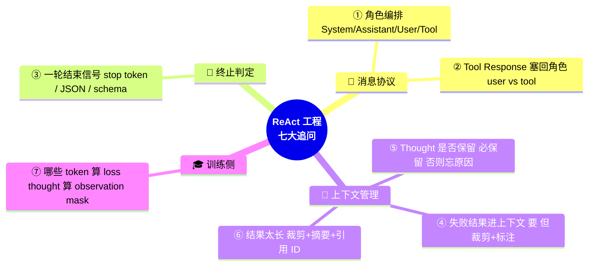
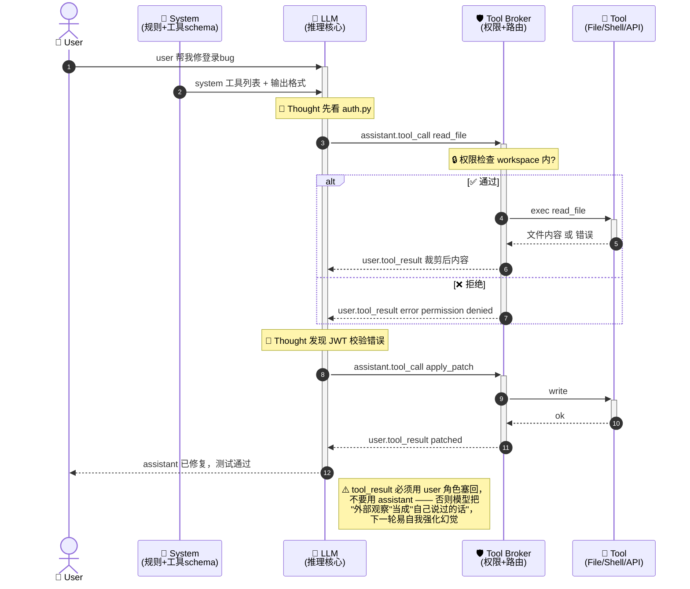
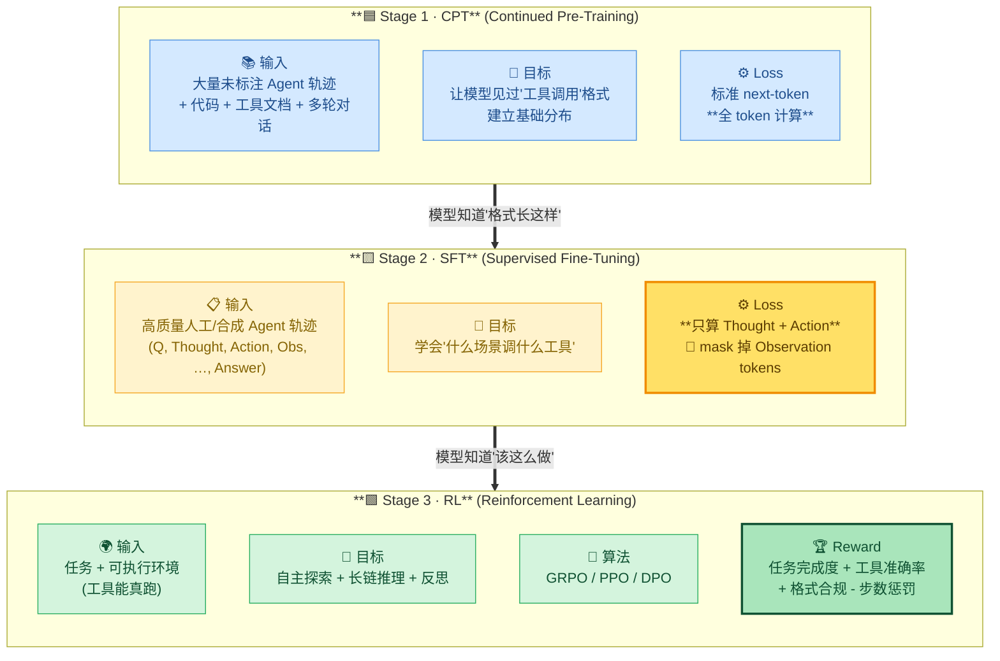
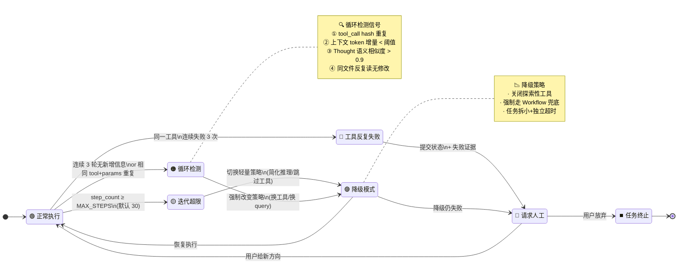

# 🎓 第 10 章 · 训练流程与模型

## **【第 10 章 · 训练流程与模型】ReAct 工程细节与三阶段训练**

### **Q10.1 · ReAct 在工程上有哪些容易被追问的细节？**

ReAct 论文层面好讲：Thought → Action → Observation 循环。但面试追问会落到工程实现：

```text
1. 消息角色怎么编排（System / Assistant / User / Tool 谁说什么）
2. Tool Response 用什么角色塞回去（直接用 tool 角色 vs 包成 user 角色）
3. 模型怎么知道一轮思考结束（stop token / 结构化 JSON / function_call schema）
4. 失败工具结果要不要进上下文（要，但要裁剪 + 标注失败）
5. 多轮工具调用之间要不要保留完整 Thought（保留，否则模型会忘了为什么调）
6. 工具结果太长怎么办（裁剪 + 摘要 + 引用 ID，不要原文塞）
7. Thought 内容要不要训练（多数实现 mask 掉 observation，但 thought 要训）
```



下面这张图是一轮典型的 ReAct 消息编排，覆盖正常路径 + 工具失败回流：



追问：为什么不用 `tool` 角色直接传回（OpenAI 的格式就是 tool 角色）？

答：OpenAI 的 ChatCompletion 协议确实有 `tool` 角色，配合 `tool_call_id` 做严格关联。但很多开源模型/自研 Agent 框架没有 `tool` 角色，只能在 `user` 或 `function` 角色里塞。用 `user` 角色的好处是兼容性最广，缺点是要在内容里加显式标记（如 `<observation>...</observation>`）让模型区分这是"外部观察"而不是"用户新提问"。生产环境一般是：原生支持 tool 角色就用 tool，否则用 user + 结构化标签，避免模型把工具结果误判成新需求。

---

### **Q10.2 · Tool Response 角色设计错了会出什么问题？**

会出现三类典型 bug：

| 错误用法 | 模型表现 | 根因 |
| --- | --- | --- |
| 用 assistant 角色塞工具结果 | 模型把观察当成自己说过的话，下一轮重复同样错误推理 | 模型对 assistant 内容有更高 trust，且会延续 reasoning style |
| 用 system 角色塞工具结果 | 模型把临时观察当成长期规则，跨轮持续受影响 | system 在多数模型里是不可覆盖的强约束 |
| 工具结果不带分隔符直接拼 | 模型把上一个工具的输出当成下一个工具的输入 | 上下文边界丢失 |

正确做法是：用 user 或 tool 角色，且每条工具结果都带 `tool_call_id`、`tool_name`、`status`（success/error）、`truncated`（是否裁剪）字段，让模型能精确知道这是哪次调用的回执。

---

### **Q10.3 · Agent 的三阶段训练 CPT → SFT → RL 是什么？**

工业界训一个能做 Agent 的模型，主流是三段式：



> 💡 **RL 阶段的核心价值**：SFT 只能模仿训练集里的轨迹，RL 让模型在**新任务**上自主探索，通过 reward 信号学会更优策略。

追问：能不能跳过 CPT 直接 SFT？

答：能，但效果会差。如果基座模型从来没见过 `<tool_call>...</tool_call>` 这种格式，SFT 阶段需要的样本量会大幅增加，且容易过拟合到训练集的具体工具列表。CPT 用海量未标注数据让模型先"熟悉这种语法"，SFT 再教"具体怎么用"，分工更清晰，数据效率更高。

---

### **Q10.4 · SFT 阶段为什么要 mask observation tokens？**

因为 observation 是**外部环境产生的客观结果**，不是模型该学的内容。

举个例子，训练样本是：

```text
Thought: 我需要查北京天气
Action: get_weather(city="北京")
Observation: {"temp": 15, "condition": "晴"}
Thought: 现在气温 15 度，建议穿外套
Final Answer: 北京今天 15 度晴天，建议穿外套
```

如果不 mask observation：
- 模型会学到"看到 get_weather 调用后要输出 `{"temp": 15, ...}`"——但下一次北京气温变了，模型可能还会输出 15！
- 模型把工具结果当成自己的"记忆"，下次直接编造而不去真的调工具。

mask observation 之后：
- 模型只学"什么时候该 Thought 什么、什么时候该发 Action"
- Observation 的具体值只作为上下文输入，不参与 loss 计算
- 推理时模型知道：observation 不是我说的，是工具说的，要看真实工具返回

工程实现上通常做一个 `loss_mask` 数组，observation 区段对应位置全设 0：

```text
tokens:    [Thought_1, Action_1, Obs_1, Thought_2, Action_2, Obs_2, FinalAnswer]
loss_mask: [   1,         1,       0,       1,         1,       0,       1     ]
```

追问：那 Thought 要不要算 loss？

答：要。Thought 是模型自己的推理，是要学的核心能力之一。如果连 Thought 都 mask 掉，只算 Action 和 Final Answer，模型会变成"直接输出工具调用"的格式化器，失去多步推理能力。

---

### **Q10.5 · RL 阶段（如 GRPO）的奖励函数怎么设计？**

GRPO（Group Relative Policy Optimization）是 DeepSeek-R1 那套，思路是同一个 prompt 采样多条轨迹，组内相对打分。Agent 场景的 reward 通常是多目标加权：

```text
R_total = w1 * R_task          # 任务完成度（关键）
        + w2 * R_tool_accuracy  # 工具调用准确率
        + w3 * R_format         # 输出格式合规（JSON 解析成功率）
        - w4 * P_steps          # 步数惩罚（鼓励短链）
        - w5 * P_repeat         # 重复调用惩罚
        - w6 * P_unsafe         # 危险操作惩罚
```

设计要点：
1. **R_task 必须可验证**：测试通过/检索结果命中/最终答案 exact match，不能用 LLM Judge 当唯一信号（噪声大、reward hacking 风险高）
2. **格式 reward 是底线**：模型连 JSON 都吐不对，后续 reward 全是 0，会陷入死循环
3. **步数惩罚要温和**：惩罚太重模型会学会"少调工具直接编答案"
4. **稀疏 reward 要 shaping**：长任务只在最后给 reward，模型几乎学不到东西，通常会引入中间检查点（如：调对工具 +0.1，参数对 +0.1，最终答案对 +1）

追问：为什么不用 PPO 用 GRPO？

答：PPO 需要训练一个 critic（价值网络），显存和工程复杂度都高。GRPO 用"同一 prompt 的 N 条轨迹组内归一化"代替 critic，省一半显存，工程上简单很多。代价是 N 必须够大（一般 8-16），采样成本高。Agent 场景因为轨迹本身长（多轮工具调用），GRPO 更友好。

---

### **Q10.6 · Agent 死循环怎么处理？**

生产级 Agent 必须有三层防御：



工程要点：
- **MAX_STEPS 不是越大越好**：30 步是一个经验值，超过后多数任务收益递减、风险递增
- **循环检测要看"信息增量"而不是"步数"**：模型可能每轮都调不同工具但都没拿到新信息，这种伪进展最危险
- **降级不是放弃**：好的降级会保留任务上下文，切换到更保守的策略而不是直接 abort

追问：相同 tool + 相同 params 一定是循环吗？

答：不一定。比如轮询任务状态（每 5 秒查一次）就是合法的重复调用。所以循环检测要看"在 N 步内"，且要排除明确标记的轮询工具（schema 里加 `idempotent: false, pollable: true`）。

---

### **Q10.7 · 上下文爆炸的工程方案有哪些？**

不只是"压缩"一个手段，生产环境通常组合用：

| 方案 | 触发时机 | 适用场景 | 风险 |
| --- | --- | --- | --- |
| 滑动窗口（FIFO 截断） | token > 阈值 | 短期对话、客服 | 丢早期目标 |
| 动态摘要（ReSum） | token > 阈值 | 长任务、Coding Agent | 摘要质量决定续跑成功率 |
| 分级压缩 | 不同年龄段不同力度 | 长会话 | 实现复杂 |
| Hierarchical Memory | 高频访问内容上浮 | 多用户/多项目 | 需要 embedding + 检索 |
| 外部 State 文件 | 阶段切换 | Coding Agent | 需要 Hook 配合 |
| 任务拆分 + 子 Agent | 任务边界清晰 | 多阶段流程 | 通信开销 |

**ReSum（Recursive Summarization）** 这个词最近面试问得多，意思是：每次压缩不是一次性把所有历史砍掉，而是递归地"摘要的摘要"。比如：
- Level 0：原始对话
- Level 1：最近 10 轮的摘要
- Level 2：上一段 Level 1 摘要的进一步浓缩
- 最早的 Level 2 摘要可能再被压成一行"目标 + 关键决策"

这样保证越早的内容压缩越狠，越近的内容保留越细，token 预算可控且信息有梯度。

追问：滑动窗口和动态摘要怎么选？

答：看任务类型。**纯对话**用滑动窗口够了，丢点早期 chitchat 不致命；**任务型**（Coding/Research）必须用摘要，原始目标和约束不能丢；**超长 Research**（几小时）用 ReSum + 外部 State 文件双保险。

---


---

### **【追问扩展】Agent 规划与反思 4 题**

### **Q10.8 · ReAct 是什么？**

ReAct 是 Reasoning + Acting，把推理和行动结合起来。Agent 一边思考下一步，一边调用工具，再根据观察结果继续推理。

它适合需要多步工具调用的任务，比如检索、调试、网页操作。

追问：ReAct 的缺点是什么？

回答：容易产生过长推理链和重复工具调用。如果没有状态管理和停止条件，Agent 可能陷入循环。

---

### **Q10.9 · Plan-and-Execute 和 ReAct 有什么区别？**

ReAct 是边想边做，适合动态探索。Plan-and-Execute 是先制定计划，再按计划执行，适合目标清晰、步骤可拆的任务。

复杂系统里可以结合使用。先生成高层计划，再在每个子任务里用 ReAct 执行。

追问：计划需要固定不变吗？

回答：不需要。计划应该随工具反馈更新。比如测试失败后，计划要从“提交总结”回到“修复失败用例”。

---

### **Q10.10 · Reflexion 或 self-reflection 有什么用？**

反思机制让 Agent 在失败后总结原因，调整策略。比如工具调用失败、测试失败、答案被评估为不忠实时，Agent 可以反思“为什么失败、下次怎么改”。

但反思不能只靠模型自言自语，最好结合真实反馈，比如测试结果、评估指标、人工评论。

追问：反思会不会增加幻觉？

回答：会。如果没有外部证据，模型可能编造失败原因。所以反思要基于工具结果和可验证证据。

---

### **Q10.11 · 如何防止 Agent 卡在循环里？**

可以设置最大步数、最大工具调用次数、最大相同工具重试次数。还要记录历史尝试，避免重复执行同一失败路径。

另外可以设计 loop detector，比如连续多轮没有新信息、重复读取同一文件、重复执行同一命令，就触发停止或请求用户确认。

追问：Agent 卡住时应该怎么让它恢复？

回答：可以让它输出当前状态、已尝试方案、失败原因和需要用户确认的问题，而不是继续盲目执行。

---
