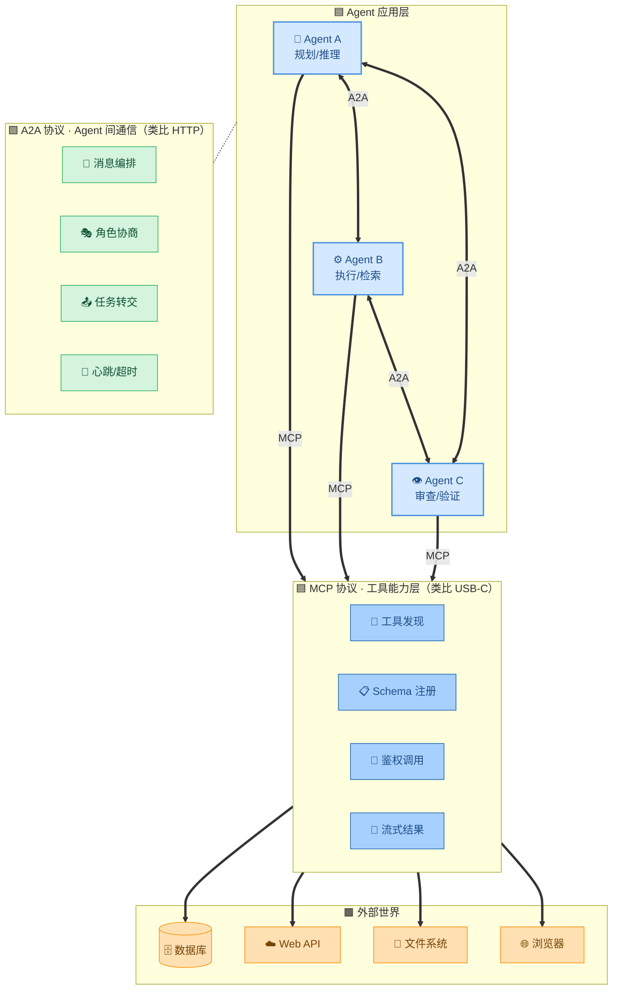
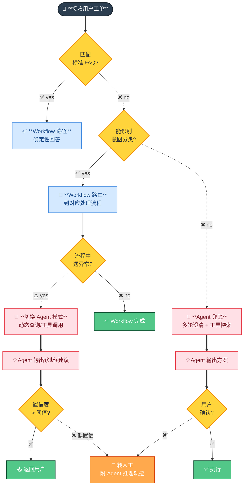

# 🔌 第 11 章 · 协议与生态

## **【第 11 章 · 协议与生态】MCP / A2A / Skills / Function Calling**

### **Q11.1 · MCP 和 A2A 是什么关系？**

最直白的类比：

> 🎯 **MCP 解决"Agent 怎么用工具"**（垂直），**A2A 解决"Agent 怎么和 Agent 协作"**（水平）。两者不冲突——一个 Agent 可以同时是 MCP Client（用工具）和 A2A Peer（和别的 Agent 通信）。

口径总结：
- **MCP**：Model Context Protocol，工具/数据源接入协议。USB-C 类比——任何设备都能插。
- **A2A**：Agent-to-Agent，Agent 间通信协议。HTTP 类比——任何服务都能调。
- **Skills**：以自然语言指令封装的可复用能力包，触发是关键词/语义匹配。
- **Function Calling**：模型 API 层的结构化函数调用接口（JSON schema），是单个模型的内部能力。

追问：MCP 一定要走标准协议吗？我自己撸一个 tool registry 不行吗？

答：能，单 Agent 单项目完全可以自己撸。MCP 的价值是**跨 Agent 生态复用**——你写一个 MCP Server，OpenClaw / Claude Code / Cursor / Codex 都能直接用，而不用每个 Agent 都重新接一遍。这是协议层的价值。

---

### **Q11.2 · Skills 和 Function Calling 的差异？**

| 维度 | Function Calling | Skills |
| --- | --- | --- |
| 触发 | 模型决策 + JSON schema 匹配 | 关键词/语义匹配 + 模型决策 |
| 描述 | 严格 JSON schema (type/required/enum) | 自然语言 description + frontmatter |
| 调用形式 | `{"name":"f","arguments":{...}}` | "用 xxx 做 yyy" 这样的自然指令 |
| 粒度 | 单个函数 | 一组相关能力 + 工作流 |
| 适合场景 | API 集成、结构化数据抽取 | 复杂任务、多步骤工作流、人机交互 |
| 复用 | 函数级 | 能力包级（含 prompts/scripts/资源） |

举例：查天气这种简单任务用 function calling 就够了；但"做一个 iOS 原型，导出 MP4，再做评审"——这是 Skills 的场景，里面包含很多 prompt、流程、子工具，整体作为一个能力暴露。

追问：Skills 本质是不是就是 prompt + tools 的打包？

答：是，但价值在于**约定**。Skills 把"什么时候触发、用什么 prompt、配套哪些工具/资源、输出什么格式"打包成一个可分发的单元，Agent 生态可以共享。Function calling 是协议，Skills 是能力包，不是一个层级的东西。

---

### **Q11.3 · Workflow 和 Agent 怎么组合落地？**

不是二选一，生产环境主流是混合架构：**Workflow 兜底标准流程，Agent 处理异常分支**。

口径：
- **能用 Workflow 的绝不用 Agent**：确定性、可测、可审计、成本低
- **Workflow 走不通了再切 Agent**：异常分支、长尾问题、需要工具组合探索的场景
- **Agent 兜底必须有人工 Fallback**：置信度低/用户拒绝时回人工，不要让 Agent 自己撑到底

追问：怎么判断"走不通了"？

答：几个信号——意图分类置信度 < 阈值、流程中工具连续失败、用户重复表达不满、命中明确的异常分支标签。这些信号触发后切到 Agent 模式，并把 Workflow 已经收集的上下文一并交接过去。

---
