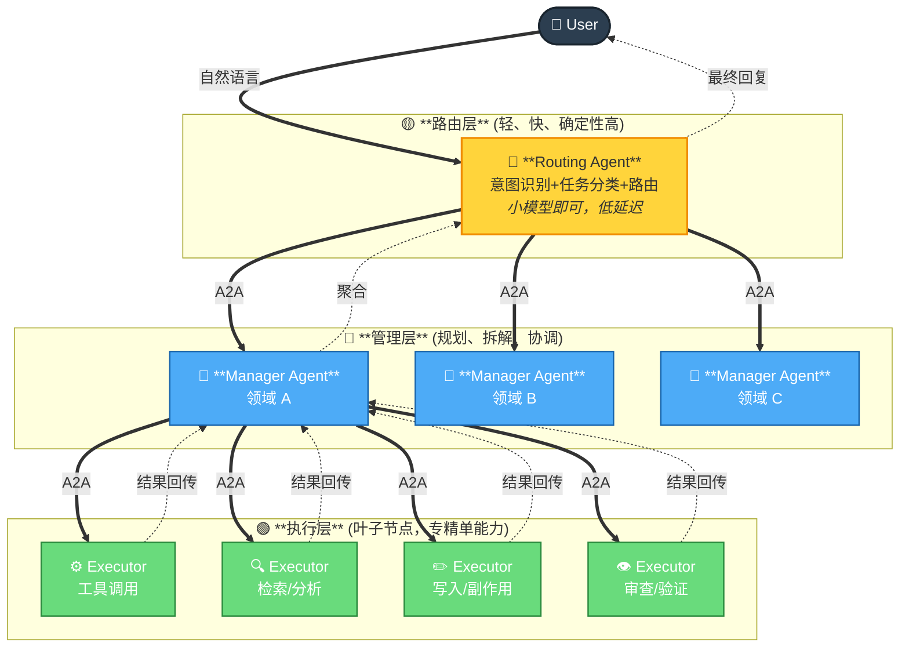
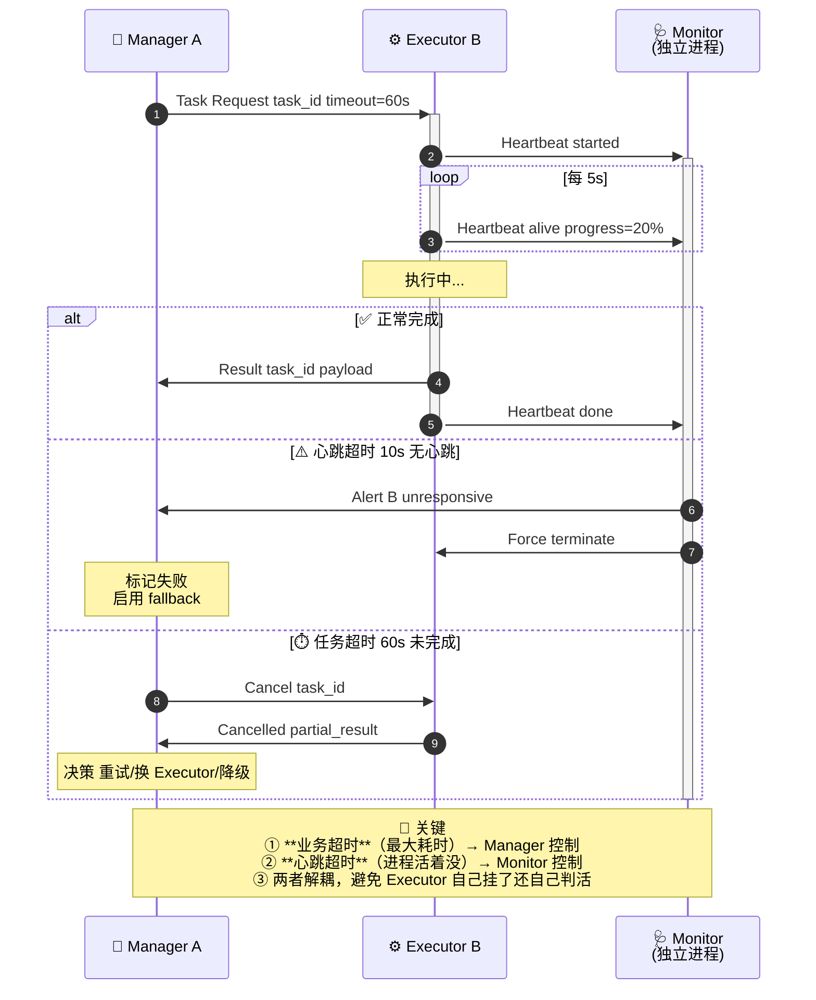

# 🤝 第 12 章 · Multi-Agent 编排

## **【第 12 章 · Multi-Agent 编排】三层架构与心跳防死锁**

### **Q12.1 · 三层 Multi-Agent 怎么分？**

主流分法是路由→管理→执行三层，每层职责清晰：

> 🌳 **设计要点**：Executor 是叶子节点，**不再调度其他 Agent**——保证树有限深度，避免协调爆炸。如果 Executor 内部真的需要拆，用 Workflow 在 Executor 内部串，不要再加一层 Agent。

设计要点：
- **路由层必须轻**：每次请求都过，重了延迟拉满
- **管理层是大脑**：planning / 拆解 / 重试 / 聚合都在这一层
- **执行层是手脚**：只做一件事，不要在 Executor 里再起 sub-Agent，否则树会爆
- **跨层一律 A2A 协议**：不要直接调函数，否则失去解耦和可观测性

追问：三层够用吗？要不要更多？

答：90% 场景三层够。超过三层后协调成本指数上升，调试也变难。如果真的需要更深（比如 Executor 内部还要拆），优先用 Workflow 在 Executor 内部串起来，而不是再加一层 Agent。

---

### **Q12.2 · Agent 间通信怎么防死锁？**

A2A 协议层必须设计**超时 + 心跳 + 重试**三件套：

工程清单：
- **每个 task 必有 timeout**：不设超时的 task 就是定时炸弹
- **心跳要走独立通道**：心跳和业务结果走同一通道时，业务卡住心跳也会卡
- **取消要可中断**：Executor 收到 Cancel 后必须能停下来，最好返回部分结果
- **重试要有上限**：同一 task 最多重试 N 次（通常 2-3），避免雪崩
- **Manager 要有 fallback**：Executor 反复失败时，Manager 应能切到备份 Executor 或降级方案

追问：心跳间隔怎么选？

答：看任务粒度。秒级任务心跳 1s，分钟级任务心跳 5-10s，长任务（小时级）心跳 30s + 进度上报。心跳太频带宽和处理成本高，太稀疏故障检测慢。

---

### **Q12.3 · Multi-Agent 落地的三大挑战？**

面试要能脱口而出这三个：

| 挑战 | 表现 | 工程对策 |
| --- | --- | --- |
| **推理断层** | 多步信息丢失，下游 Agent 不知道上游为什么这么决策 | 任务消息里带 `reasoning_chain`、关键决策附证据；用结构化 schema 而不是纯文本 |
| **结果对齐** | 不同 Agent 输出格式/口径不一致，聚合时矛盾 | 强制 output schema（JSON Schema 校验）；定义统一的 confidence 和 source 字段 |
| **可观测性** | 黑盒排查难，不知道哪个 Agent 在哪一步出错 | 全链路 trace_id；每次 A2A 调用记录 (caller, callee, input_hash, output_hash, latency, status) |

更细的追问：
- **推理断层**：典型场景是 Manager 拆任务时把"为什么这样拆"丢了，Executor 拿到子任务后自己猜上下文，猜错了。对策是任务消息里必带 `parent_task_id` + `parent_reasoning_summary`。
- **结果对齐**：典型场景是 Executor A 说"成功率 80%"，Executor B 说"成功率 0.8"，Manager 聚合时单位错乱。对策是 schema 里强制单位、值域、置信度区间。
- **可观测性**：典型场景是用户反馈"结果不对"，但日志里看不出哪个 Agent 出错。对策是 OpenTelemetry style trace，每个 A2A 调用都是一个 span，可视化整棵调用树。

---

---

### **【追问扩展】多 Agent 协作 2 题**

### **Q12.4 · 多 Agent 协作适合什么场景？**

适合任务复杂、角色分工明显的场景，比如研发交付可以拆成 Planner、Architect、Coder、Reviewer、Tester、Releaser。研究任务可以拆成搜索、阅读、事实核验、报告撰写。

追问：多 Agent 一定比单 Agent 好吗？

回答：不一定。多 Agent 会增加通信成本、状态同步成本和冲突风险。只有当任务天然需要角色分工或独立验证时，多 Agent 才明显有价值。

---

### **Q12.5 · 多 Agent 怎么避免互相扯皮？**

要有明确角色、共享状态、任务边界、产物格式和仲裁机制。

比如 Reviewer 只能审查代码，不直接改代码；Coder 负责修改；Tester 负责验证；Planner 负责维护任务清单。最终由 Orchestrator 决定是否进入下一阶段。

追问：多 Agent 的上下文是否共享？

回答：不一定。可以共享任务状态和关键产物，但每个 Agent 有自己的局部上下文。这样能减少污染和角色混乱。

---
