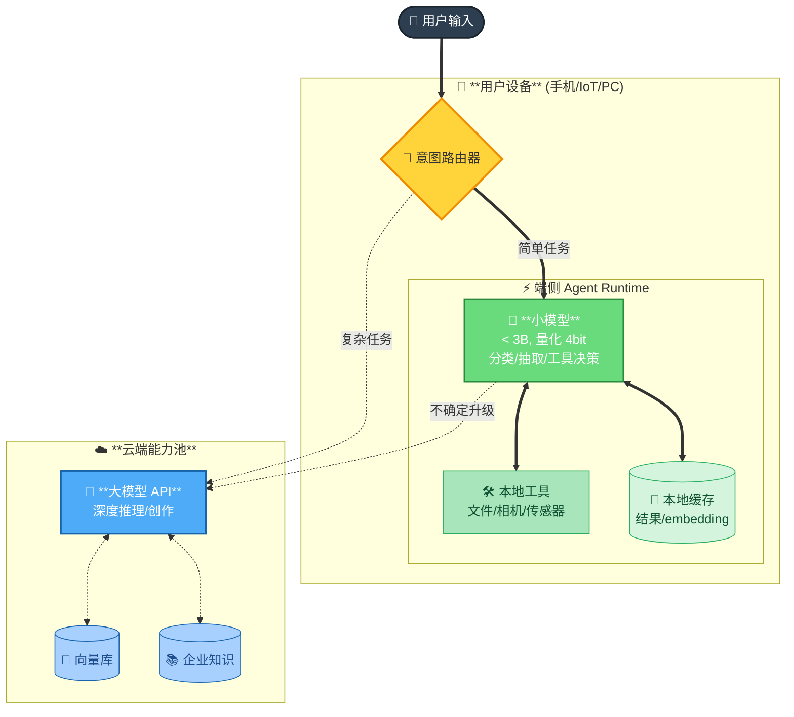
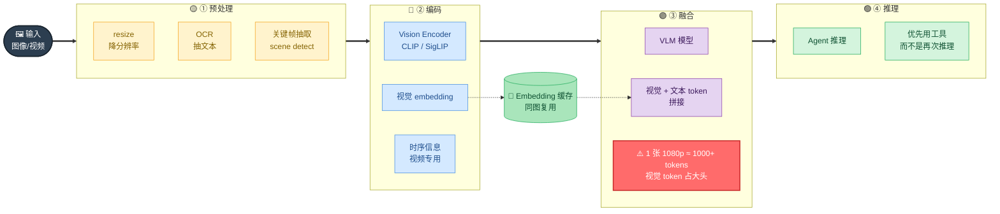

# 📱 第 13 章 · 端侧/多模态/高并发

## **【第 13 章 · 端侧 / 多模态 / 高并发】部署、视觉、扛量**

### **Q13.1 · 端侧 Agent 怎么部署？**

端侧约束：**算力小、内存小、电量敏感、断网可用**。



> 🧭 **路由策略**：① 离线优先（能本地不走云）② 隐私优先（含隐私不上云）③ 延迟优先（&lt;200ms 不走云）④ 成本优先（高频简单走本地）
> 🛠️ **端侧优化手段**：量化（INT4/INT8）· 蒸馏（大模型蒸到小模型）· 算子融合 + KV cache · 部署框架（CoreML / TFLite / ONNX Runtime / MNN）

关键 trick：
- **混合推理**：简单意图识别用 SLM（<1B），复杂推理用云端 LLM，路由器决策走哪条
- **预编译 + 算子优化**：CoreML/TFLite 把模型编译成端侧加速器（NPU/GPU）原生指令
- **KV cache 复用**：多轮对话场景下，KV cache 跨轮复用，省掉 prefix 重复计算
- **本地工具优先**：相机/麦克风/文件/位置——这些数据不上云，端侧 Agent 直接读

追问：端侧小模型能做 Agent 吗？

答：能做轻量 Agent。3B 量化后的模型在主流手机能跑，能做：意图分类、参数抽取、简单工具调用、短答案生成。但复杂规划（多步推理 / 长链思考）目前还是要云端兜底。设计上端侧负责"快/隐私敏感/低频"，云端负责"准/复杂/低延迟容忍"。

---

### **Q13.2 · 多模态 Agent 怎么整合视觉能力？**

视觉 Agent 的核心问题是**输入 token 极大** + **延迟敏感**。



```text
工程链路：
1. 输入阶段
   - 图像/视频先过预处理（resize / OCR / 关键帧提取）
   - 不要把原图直接喂大模型，先抽特征/文本

2. 编码阶段
   - Vision Encoder (CLIP / SigLIP) 抽视觉 embedding
   - 视频抽关键帧 + 时序信息

3. 融合阶段
   - VLM 把视觉 embedding 和文本 embedding 拼接
   - 注意：1 张 1080p 图片 ≈ 1000+ tokens

4. 推理阶段
   - 视觉 Token 占大头，prompt 优化空间小
   - 优先用工具调用而不是再次推理
```

工程优化：
- **图像分级处理**：高频简单任务用轻量 OCR / 物体检测，复杂场景才上 VLM
- **关键帧而不是全视频**：视频任务先用 scene detection 抽 N 张关键帧，VLM 只看关键帧
- **芯片级加速**：端侧 NPU / 云端 GPU Tensor Core，视觉 encoder 通常有专门优化路径
- **缓存视觉 embedding**：同一张图反复问，embedding 算一次就够

追问：多模态 Agent 的工具设计有什么特别？

答：要支持**返回结构化视觉信息**。比如截图工具不只返回 base64 图片，还要返回 OCR 文本、检测到的物体、UI 元素树，让 Agent 不必每次都重新过 VLM。

---

### **Q13.3 · Agent 怎么扛高并发？**

高并发 Agent 系统的瓶颈通常不是模型本身，而是**长尾延迟 + 状态管理**：

| 瓶颈 | 工程对策 |
| --- | --- |
| LLM 长尾延迟（P99 远高于 P50） | 多副本 + 动态分配；早停（早期 token 信心高就提前 return）；speculative decoding |
| 工具调用慢（外部 API/DB） | 并行调用；超时熔断；结果缓存（参数 hash 作 key） |
| 状态读写热点 | 状态分片（按 user_id / session_id sharding）；Redis Cluster；冷热分离 |
| 排队雪崩 | 请求分级（VIP / 普通 / 批量）；优先级队列；过载时拒绝低优先级 |
| 上下文重复计算 | KV cache 服务化（vLLM PagedAttention / SGLang RadixAttention 共享 prefix） |
| 成本失控 | 模型分级（简单走小模型/廉价模型）；token 配额；缓存命中率监控 |

最容易被追问的几个点：
- **P99 是 Agent 的命门**：一个 Agent 平均 5 秒响应，但 P99 30 秒，用户体验就崩。要看 P99 不要只看均值。
- **流式输出救体感**：哪怕实际还要算 10 秒，token 一边算一边吐，用户感知延迟降一半
- **降级而不是失败**：高峰时切到小模型/简化流程，比直接 503 体验好

追问：怎么测一个 Agent 的并发能力？

答：用真实任务回放集做压测（不要用 hello world 这种简单 prompt），关注：QPS、P50/P95/P99 延迟、token 吞吐、错误率、成本/请求、状态读写延迟。压测要分阶段：稳态压测看上限，scale-up 测试看弹性，长跑测试看稳定性。

---


---
