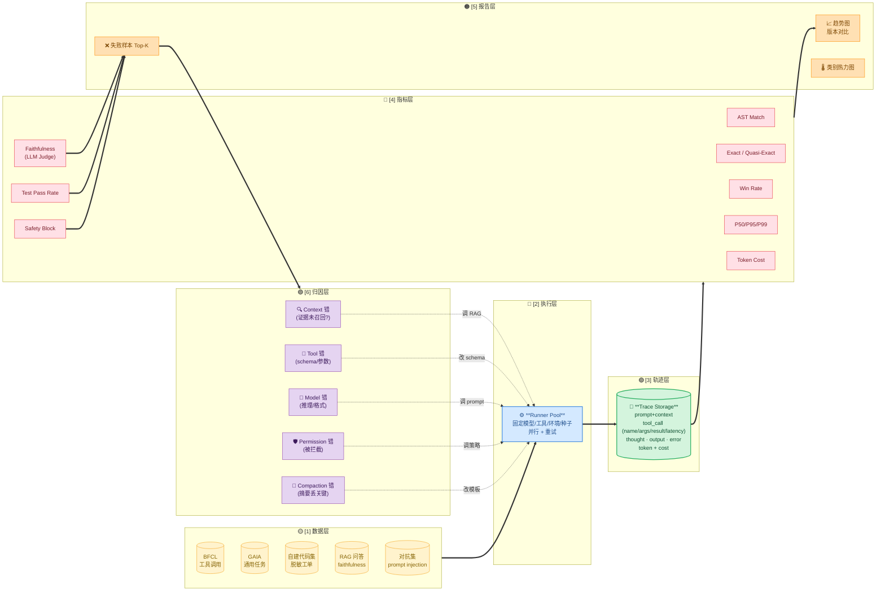
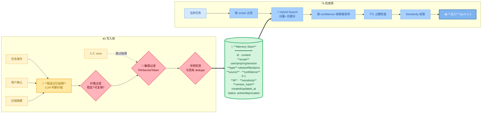
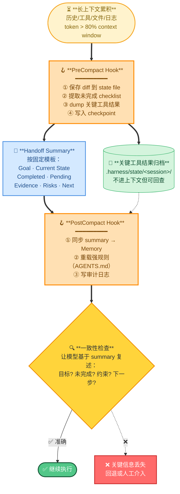
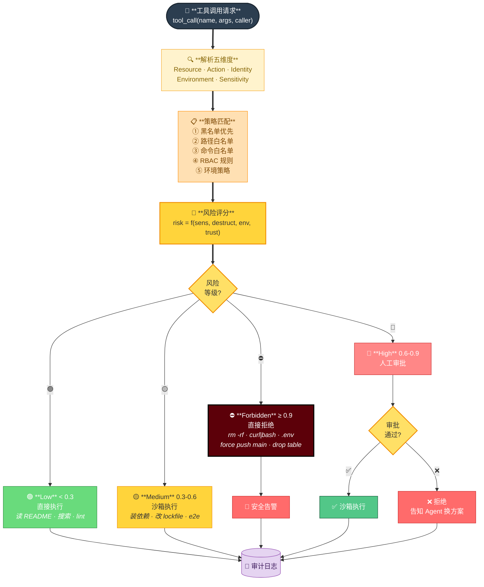
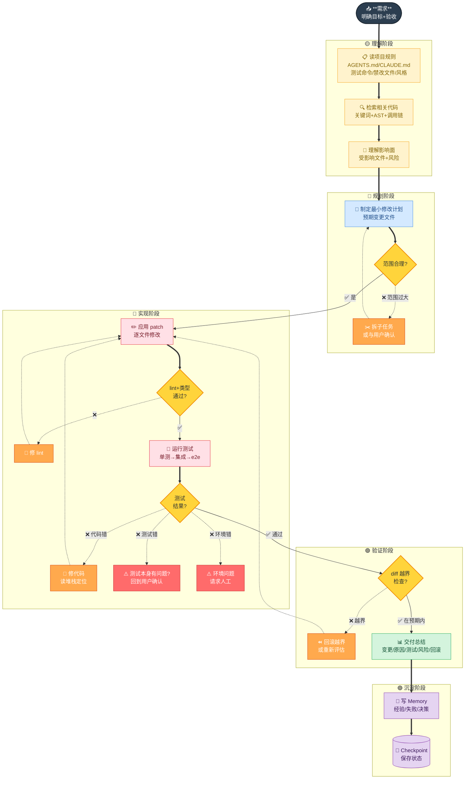

# 🏛️ 第 14 章 · 系统设计综合题

## **【第 14 章 · 系统设计综合题】端到端设计**

### **Q14.1 · 设计一个 Agent 评估系统，你会怎么做？**

我会分为数据层、执行层、轨迹层、指标层、报告层和分析层。重点不是只看最终答案，而是把 Agent 完成任务的过程也记录下来。

| 层次 | 负责什么 | 例子 |
| --- | --- | --- |
| 数据层 | 管理评估集和标准答案 | BFCL、GAIA、自建代码任务、RAG 问答 |
| 执行层 | 调用 Agent 跑任务 | 固定模型版本、固定工具权限、固定环境 |
| 轨迹层 | 记录执行过程 | prompt、context packets、tool calls、errors、diff |
| 指标层 | 按任务类型算分 | AST Match、Exact Match、Faithfulness、Test Pass Rate |
| 报告层 | 展示整体结果和失败样本 | 趋势图、错误样本、类别对比 |
| 分析层 | 失败归因和改进建议 | 检索错、工具错、压缩错、权限阻断、模型推理错 |

追问：如何降低评估成本？

答：分层评估。日常开发跑小样本快速评估，版本发布前跑标准评估，重大更新跑全面评估。还可以缓存工具结果、限制 max_samples、抽样评估。

---

### **Q14.2 · 设计一个 Agent Memory 系统，你会怎么做？**

我会把 memory 分为用户级、项目级、组织级，并为每条 memory 加 metadata，包括 scope、type、source、confidence、ttl、sensitivity、created_at、updated_at。

| 环节 | 关键动作 | 防止的问题 |
| --- | --- | --- |
| 写入前 | 价值判断、敏感信息过滤、人工确认重要规则 | 记忆污染、隐私泄露 |
| 存储时 | scope 隔离、来源追踪、置信度和 TTL | 跨项目误用、过期误导 |
| 检索时 | 先按用户和项目过滤，再做语义匹配 | 无权限召回、噪音注入 |
| 注入时 | 只注入少量高相关、高可信、未过期内容 | 上下文过载 |
| 维护时 | 可视化编辑、删除、deprecated 标记 | 旧记忆和新规则冲突 |

> 🚫 **不能进 Memory**：密钥/token/cookie · 邮箱/手机号/内部账号 · 一次性调试日志 · 未确认猜测 · 易过期业务状态 · 跨项目语义模糊的"经验"
>
> ⚖️ **冲突时谁赢**：① confidence 高的赢 → ② 同 conf 看时间最新 → ③ 同时间看 source 权威性（人工 > 用户确认 > 自动抽取）→ ④ 旧条目标记 deprecated 不删
>
> 📥 **注入策略**：Top-K ≤ 3 · 拼成 "Known facts:" 段 · 不混进 system prompt（避免被当强规则）· 注入前再过一次 token 预算

追问：如何避免 memory 污染？

答：用 scope 隔离项目，用 ttl 控制过期，用 source 追踪来源，用人工编辑纠错，用敏感信息过滤保护隐私。

---

### **Q14.3 · 设计一个 Agent 上下文压缩系统，你会怎么做？**

我会把压缩设计成结构化 handoff，而不是普通聊天摘要。压缩前先收集任务状态、工具结果、文件修改、测试结果和未完成事项；压缩后保留最近几轮原文和结构化摘要，旧工具结果归档但不全部注入上下文。

| 阶段 | 做什么 | 关键检查 |
| --- | --- | --- |
| PreCompact | 保存 diff、测试结果、待办、用户约束 | 是否有未记录的关键失败 |
| Summarize | 输出固定 handoff 模板 | 目标、现状、已完成、未完成、关键文件、下一步 |
| Reload | 重新加载项目强规则和最近上下文 | 摘要不能替代 AGENTS.md 这类强规则 |
| Verify | 让 Agent 复述当前任务状态 | 是否能说清下一步和不能违反的约束 |
| Continue | 基于摘要继续任务 | 是否重复失败路径 |

> ⚠️ **核心铁律**：summary **不能**替代强规则——AGENTS.md 必须在 PostCompact 重载，否则模型会忘记不能违反的约定。

追问：如何防止压缩后任务跑偏？

答：压缩摘要中强制保留原始目标、未完成 checklist、关键约束和下一步。压缩后可以做一致性检查，比如让模型根据摘要复述当前任务状态，确认没有丢关键内容。

---

### **Q14.4 · 设计一个 Coding Agent 的权限系统，你会怎么做？**

我会按“资源、动作、身份、环境、风险等级”设计权限，而不是只做一个 allow/deny。

| 维度 | 示例 | 控制方式 |
| --- | --- | --- |
| 资源 | 项目文件、敏感文件、外部网络、数据库、CI、发布系统 | scope、路径规则、ACL |
| 动作 | 读、写、执行、删除、提交、发布 | 只读、workspace-write、审批、高危禁用 |
| 身份 | 用户、团队、服务账号 | RBAC、项目权限、审计主体 |
| 环境 | 本地、测试、预发、生产 | 环境隔离、生产强审批 |
| 风险 | 普通读取、修改代码、迁移 DB、发布上线 | 风险评分、人工确认、日志留存 |

### **附：常见动作的默认风险等级**

| 风险 | 资源 / 动作 | 默认策略 |
| --- | --- | --- |
| 🟢 Low | 读源码 / 搜索 / lint / 跑只读测试 | 直接执行 |
| 🟢 Low | 写 workspace 内的非配置文件 | 直接执行 |
| 🟡 Medium | 安装依赖 / 改 lockfile / 跑 e2e | 沙箱 + 限制 |
| 🟡 Medium | 调外部 HTTP API（非生产）| 沙箱 + 网络白名单 |
| 🔴 High | git push（非主干）/ 创建 PR / 改 CI 配置 | 人工审批 |
| 🔴 High | 数据库迁移（测试环境）/ 改环境变量 | 人工审批 |
| ⛔ Forbidden | 读 .env / 写密钥 / curl \| bash | 拒绝 |
| ⛔ Forbidden | git push main / force push / drop table | 拒绝 |
| ⛔ Forbidden | 生产数据库写入 / 生产配置修改 | 拒绝 |

### **附：常见动作的默认风险等级**

| 风险 | 资源 / 动作 | 默认策略 |
| --- | --- | --- |
| 🟢 Low | 读源码 / 搜索 / lint / 跑只读测试 | 直接执行 |
| 🟢 Low | 写 workspace 内的非配置文件 | 直接执行 |
| 🟡 Medium | 安装依赖 / 改 lockfile / 跑 e2e | 沙箱 + 限制 |
| 🟡 Medium | 调外部 HTTP API（非生产）| 沙箱 + 网络白名单 |
| 🔴 High | git push（非主干）/ 创建 PR / 改 CI 配置 | 人工审批 |
| 🔴 High | 数据库迁移（测试环境）/ 改环境变量 | 人工审批 |
| ⛔ Forbidden | 读 .env / 写密钥 / curl \| bash | 拒绝 |
| ⛔ Forbidden | git push main / force push / drop table | 拒绝 |
| ⛔ Forbidden | 生产数据库写入 / 生产配置修改 | 拒绝 |

权限系统的核心口径：模型可以建议动作，但是否允许执行必须由确定性的权限引擎决定。

追问：如何判断命令危险？

答：可以结合规则匹配、路径检查、命令白名单、黑名单和上下文判断。例如 `rm -rf`、`curl | bash`、读取 `.env`、执行数据库迁移、`git push main` 都属于高风险。

---

---

---

### **【追问扩展】开放式系统设计 4 题**

### **Q14.5 · 设计一个企业知识库 Agent，你会怎么做？**

我会先做知识源接入，包括文档、FAQ、工单、制度、代码和接口文档。然后做权限过滤、清洗切分、索引构建。检索上用 hybrid search 加 rerank，复杂关系问题引入 GraphRAG。Agent 层支持多轮检索、证据引用、拒答和人工反馈。评估层看 context precision、context recall、faithfulness 和 answer relevance。安全层做 ACL、脱敏和审计。

追问：如何避免回答编造？

回答：要求答案必须基于检索证据，无法找到证据时拒答。对关键结论附引用或证据片段，并用 faithfulness 指标持续评估。

---

### **Q14.6 · 设计一个 Coding Agent，你会怎么做？**

我会从流程、上下文、工具、安全和评估五块设计。这个题要强调“不是自动补全工具，而是受控的软件工程执行系统”。

| 模块 | 设计重点 | 面试表达 |
| --- | --- | --- |
| 流程 | 需求理解、影响面分析、计划、实现、验证、总结 | 不直接改代码，先确认边界 |
| 上下文 | 项目规则、相关文件、历史 summary、当前状态 | 只读高相关信息，避免全仓库噪音 |
| 工具 | 文件搜索、读写、patch、Shell、测试、Git diff | 工具结果要结构化回填 |
| 安全 | workspace 限制、危险命令审批、敏感文件保护 | 模型不能绕过权限引擎 |
| 评估 | 测试通过率、patch 接受率、人工修改次数、任务完成率 | 交付必须可验证 |

追问：如何支持断点续跑？

回答：保存状态文件、checkpoint、已修改文件、测试结果和下一步计划。会话中断后重新加载这些产物，而不是依赖聊天历史。

---

### **Q14.7 · 设计一个 Agent 评估平台，你会怎么做？**

平台需要支持评估集管理、任务执行、轨迹记录、指标计算和报告分析。

评估集按任务类型分类，比如工具调用、RAG 问答、代码修改、长任务、记忆召回。执行时记录 prompt、上下文、工具调用、输出和耗时。指标包括准确率、任务完成率、工具调用正确率、RAG faithfulness、测试通过率、成本和延迟。报告要能展示失败样本和失败归因。

追问：如何接入 CI？

回答：版本发布前自动跑标准评估集，结果低于阈值阻断发布。日常开发跑小样本 smoke test，重大模型或 prompt 变更跑全量评估。

---

### **Q14.8 · 设计一个 Agent Memory 服务，你会怎么做？**

> 🔁 **重复题，统一以【第 14 章 · Q63 设计 Agent Memory 系统】为准**——那里有完整 Memory Store 流程图 + 7 字段 schema + 冲突仲裁口径。
>
> **本节唯一补充**：Memory 服务要做到**跨 Agent 产品复用**，可以通过 MCP 或统一 HTTP API 暴露 Memory 服务，让不同 Agent（Claude Code / Cursor / Codex / 自研）通过同一接口读写。关键是**统一 scope 定义、权限模型、数据格式**——这一点比内部实现细节更重要。

---
