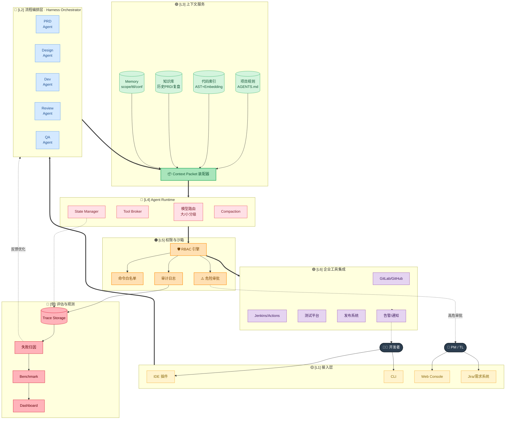
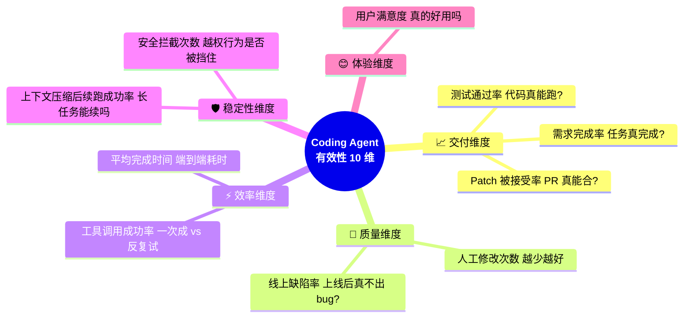

# 🎤 第 15 章 · 面试表达汇总

## **【第 15 章 · 面试表达汇总】**

> 📝 本章把分散在文档各处的如何讲清楚自己怎么收口面试内容汇总到一起。子节顺序按基础 → 进阶 → 短答递进。

## **【第 15.1 · 项目经验表达】面试讲项目模板**

### **Q15.1.1 · 如果面试官问你做过什么 Agent 相关实践，你怎么讲？**

可以这样讲：

> 我最近重点研究和实践的是 Agent 工程化，尤其是 Coding Agent 从需求到交付的流程控制。我的理解是，单靠模型直接改代码不够稳定，所以需要一套 Harness 机制，把需求拆成 PRD、技术方案、开发、Review、测试验证和交付总结等阶段。每个阶段都有明确输入输出，同时通过 AGENTS.md、`.harness/`、checkpoint、summary 和 memory 保存项目规则、任务状态和历史经验。这样即使对话中断或上下文被压缩，也能恢复任务，不会完全依赖聊天历史。

追问：这个实践的难点是什么？

答：难点在于如何控制上下文和流程边界。读太多历史会引入噪音，读太少又会漏掉关键经验；流程太松 Agent 容易跳步，流程太重又影响效率。所以需要最小上下文读取、阶段门控和可恢复状态设计。

---

### **Q15.1.2 · 你如何理解 Agent 工程化？**

Agent 工程化不是简单写 prompt，而是把 Agent 放进真实生产流程中，让它可控、可观测、可恢复、可评估。

它包括：

```text
规则工程：明确项目约束
上下文工程：控制模型输入
工具工程：标准化工具调用
状态工程：保存任务进度
记忆工程：沉淀可复用经验
权限工程：控制风险动作
压缩工程：支持长任务
评估工程：量化能力表现
```

追问：为什么 Agent 工程化重要？

答：因为真实业务不是 demo。任务会中断，需求会变化，工具会失败，模型会误判。工程化是把 Agent 从“偶尔好用”变成“稳定可用”的关键。

---

### **Q15.1.3 · 如果让你设计一个企业内部 Coding Agent 平台，你会怎么做？**

我会按“入口、流程、上下文、工具、权限、评估”六层设计，而不是只做一个聊天入口。

| 层次 | 职责 | 关键设计 |
| --- | --- | --- |
| 入口层 | 接 IDE、CLI、Web、需求系统 | 用户身份、项目选择、任务创建 |
| 流程层 | PRD、方案、开发、Review、测试、上线准备 | 阶段门控、失败回流、人工确认 |
| 上下文层 | 组装项目规则、相关文件、历史需求、当前状态 | Context Packet、去重、优先级、压缩摘要 |
| 工具层 | 接代码仓库、CI、测试平台、知识库、发布系统 | 统一工具 schema、错误恢复、轨迹记录 |
| 权限层 | 控制文件写入、命令执行、网络访问和上线动作 | 沙箱、审批、白名单、审计日志 |
| 评估层 | 衡量任务效果和失败原因 | 完成率、测试通过率、人工介入、安全拦截 |



面试收口可以说：企业内部 Coding Agent 的价值不只是自动写代码，而是把需求交付过程变成可审计、可恢复、可评估的系统。

追问：你会如何保证安全？

答：通过沙箱、审批、白名单命令、敏感文件拦截、危险操作 Hook、审计日志和人工确认节点来保证安全。上线、数据库迁移、生产配置修改这类动作必须人工审批。

---

### **Q15.1.4 · 如何衡量一个 Coding Agent 是否真正有效？**

不能只看它能不能生成代码，而要看：

```text
需求完成率
测试通过率
Patch 被接受率
人工修改次数
平均完成时间
工具调用成功率
上下文压缩后续跑成功率
线上缺陷率
安全拦截次数
用户满意度
```



如果 Agent 生成了很多代码但测试不过，或者需要大量人工返工，就不算有效。

追问：你会如何做持续评估？

答：建立固定评估集和真实任务回放集，定期跑 benchmark，同时记录线上使用数据，如任务成功率、失败原因、人工介入点。重要版本发布前做标准评估，日常开发做低成本快速评估。

---


## **【第 15.2 · 主动补充的高级观点】Agent 工程化 7 条金句**


### **Q15.2.1 · Agent 不是越自主越好**

很多面试官会喜欢这个观点。Agent 的自主性需要边界。完全自主容易跳过确认、误用工具、扩大修改范围。生产环境里更现实的做法是“阶段内自主，阶段间受控”。比如在开发阶段内可以自主搜索和修改，但从方案进入开发、从测试进入上线，必须满足门控条件。

这个观点可以结合 Harness 讲。

---

### **Q15.2.2 · Agent 的关键不是记住更多，而是忘得更好**

长期记忆、RAG、长上下文都能让 Agent 看到更多信息，但更多不等于更好。真正难的是筛选、压缩、过期、去重和冲突处理。上下文工程的本质是让每个 token 都有价值。

这个观点可以用来回答上下文工程和 memory 题。

---

### **Q15.2.3 · Agent 评估要分任务类型，不要用一个指标评估所有能力**

工具调用看 AST Match，问答看 Exact Match 或 faithfulness，开放生成看 LLM Judge 和人工验证，代码任务看测试通过率和 patch 接受率，长任务看续跑成功率和状态保持率。

这个观点可以联系到第 8 章的 BFCL、GAIA、LLM Judge、Win Rate 评估体系——每种任务对应不同评估手段。

---

### **Q15.2.4 · Agent 的安全不应该只靠模型自觉**

模型可以判断风险，但最终权限必须由确定性系统控制。比如是否允许读取 `.env`、是否允许 `git push`、是否允许执行数据库迁移，不能只让模型自己决定。要有权限引擎、沙箱、审批和审计。

---

### **Q15.2.5 · 项目规则文件是 Agent 工程化的低成本入口**

不管使用哪种 Coding Agent，先维护好 AGENTS.md、CLAUDE.md 或类似规则文件，都能显著提高稳定性。因为它把项目约定从聊天窗口转移到仓库文件，支持版本控制和团队共享。

这个观点很适合结合 Codex、Claude Code、Harness 一起讲。

---

### **Q15.2.6 · Workflow 和 Agent 最好结合，而不是互相替代**

Workflow 提供阶段和边界，Agent 提供灵活推理和执行。研发交付、客服处理、合规审查、运维排障都适合这种组合。完全固定流程不够灵活，完全自由 Agent 不够可控。

---

### **Q15.2.7 · 生产级 Agent 的最终形态更像 Agent OS**

它会有工具、权限、记忆、上下文、压缩、Hooks、评估、观测和工作流。模型只是其中的推理核心。未来竞争点可能不只是模型本身，而是谁能把 Agent 放进真实流程里稳定运行。

---


---

## **【第 15.3 · 高频追问】幻觉/规划/恢复**

### **Q15.3.1 · Agent 为什么容易 hallucination？怎么缓解？**

Agent 幻觉常来自缺少上下文、错误记忆、工具结果误读、模型过度推断。

缓解方式包括：让 Agent 优先读真实文件和工具结果；要求引用证据；不确定时提问；减少无关上下文；使用评估和测试验证；对关键动作加入人工确认。

---

### **Q15.3.2 · Agent 如何做任务规划？**

可以用显式计划，如 TODO list、阶段计划、子任务拆分。也可以用 workflow 限制阶段，比如先 PRD，再方案，再开发。

复杂任务中，规划应该可更新。工具结果可能推翻原计划，所以 Agent 需要根据观察结果动态调整。

---

### **Q15.3.3 · 多 Agent 协作有什么价值？**

多 Agent 可以按角色拆分，比如 Planner 负责需求，Architect 负责方案，Coder 负责编码，Reviewer 负责审查，Tester 负责测试，Releaser 负责上线准备。

价值是让每个角色聚焦不同目标，减少一个 Agent 在同一上下文里同时承担太多职责。

风险是通信成本、状态同步和责任边界复杂。

---

### **Q15.3.4 · Agent 如何做错误恢复？**

错误恢复依赖状态记录和反馈循环。工具失败后，Agent 需要记录失败命令、错误信息、已尝试方案，然后调整计划。

比如测试失败时，不应该直接总结完成，而是回到开发阶段修复。Harness 里的失败回流就是这个思想。

---

### **Q15.3.5 · 如何减少 Agent 的 AI 痕迹或模板化输出？**

从写作角度，可以减少固定句式、过度排比、符号装饰和机械总结。让段落围绕真实观察推进，加入具体细节、犹豫、判断和取舍。

从 Agent 系统角度，可以通过项目风格记忆、写作样例、输出约束和人工反馈让模型更贴近真实团队文档风格。

---


## **【第 15.4 · 框架对比与项目包装】LangGraph vs AutoGen / STAR**

### **Q15.4.1 · LangGraph 和 AutoGen 怎么选？**

```text
LangGraph：
  特点：图编排，节点 + 边 + 状态，强可控
  优势：状态机式工作流、可视化、可中断/可恢复
  适合：流程相对固定但需要 LLM 决策的场景
        客服工单、审批流、ETL with LLM

AutoGen：
  特点：多 Agent 对话编排，角色 + 群聊 + 共识
  优势：多 Agent 协作天然支持、对话式开发体验好
  适合：需要多角色协作的场景
        代码 Review、辩论式分析、复杂研究任务

二选一口径：
  - 流程清晰、状态复杂 → LangGraph
  - 角色多、协作动态 → AutoGen
  - 都要 → 用 LangGraph 做骨架，AutoGen 做单个节点内部的多 Agent
```

追问：那 LangChain 现在还用吗？

答：LangChain 现在更多被定位为"基础抽象层"——Document、Embedding、VectorStore、LLM 封装。复杂编排已经迁移到 LangGraph 了。生产环境真正用 LangChain 的链式调用越来越少，用它的工具适配层（loaders、splitters、retrievers）还是常见。

---

### **Q15.4.2 · 项目用 STAR 怎么包装？**

STAR = Situation / Task / Action / Result，面试官最爱听的结构。

烂例子：
> 我做了一个客服 Agent，用了 RAG 和 Function Calling，效果不错。

STAR 版本：
> **Situation**: 业务客服每天处理 5000+ 工单，30% 是重复 FAQ 类问题，但人工平均要 8 分钟/单，且夜间无人覆盖。
> **Task**: 我负责设计并落地一个 RAG + Agent 系统，目标是把 FAQ 类工单的人工介入率从 100% 降到 30% 以下。
> **Action**:
>   1. 抓取 3 个月历史工单 + 内部知识库，做 chunking（按问答对切，平均 200 token）+ embedding，hybrid search (BM25 + 向量) + cross-encoder rerank
>   2. Agent 层用 ReAct，工具有：knowledge_search / order_lookup / refund_eligibility_check
>   3. 设计了置信度阈值（< 0.7 自动转人工，附 Agent 推理轨迹）
>   4. 上线前用 200 条真实工单做回归测试，调 prompt + 阈值
> **Result**: 上线 6 周后，FAQ 工单的 AI 处理率达到 65%，平均响应时间从 8 分钟降到 45 秒，人工转接率从 100% 降到 12%，月节省人力成本 X 万。

数字 + 对比 + 时间窗，比"效果不错"有说服力 10 倍。

追问：如果数字不好看怎么办？

答：讲过程亮点 + 学到的教训。比如"准确率只到 70%，没达到 80% 的目标，后来分析发现 chunking 策略对长文档不友好，后续切到 hierarchical chunking 后提升到 78%"——展现你能看清问题、能迭代，比硬吹数字可信。

---

### **Q15.4.3 · 如何一句话回答"AI 从对话转向干活"？**

> Chatbot 卖的是"我能告诉你怎么做"，Agent 卖的是"我能替你做了"。前者的价值在信息差，后者的价值在执行力。所以未来 Agent 产品的核心竞争力不只是模型能力，而是工具生态 + 权限沙箱 + 工作流 + 评估闭环——能不能真的把事情做完、做对、做得可追溯。

可以接：
> 这也是为什么 Coding Agent / Office Agent / RPA-style Agent 最近这么火——它们都在尝试把"建议"变成"动作"。

---


## **【第 15.5 · 高级版完整回答】可以直接背的增强版**

### **如果问：你怎么看 Agent 开发的难点？**

我会说，Agent 开发的难点不只是模型调用，而是如何把模型放进一个可控的任务执行系统。具体包括上下文怎么装配、RAG 怎么召回、工具怎么调用、状态怎么保存、长会话怎么压缩、记忆怎么治理、权限怎么控制、失败怎么恢复，以及最终怎么评估。很多 Agent demo 看起来很好，是因为任务短、上下文简单；但真实生产环境里，任务会中断，工具会失败，知识会过期，权限会受限，所以必须做工程化设计。

---

### **如果问：你怎么设计 Agent 的上下文？**

我会把上下文拆成不同层级。最高优先级是系统安全和用户当前任务，其次是项目规则、相关文件、最近工具结果和当前状态，再往后是压缩摘要和长期记忆。每个上下文片段最好都有来源、优先级、作用域和去重 key。这样可以避免上下文变成一大段不可控文本。我的原则是，不追求塞得多，而是让模型每一轮看到高信号信息。

---

### **如果问：RAG 怎么做才能稳定？**

我会从知识源清洗、chunking、hybrid search、rerank、query rewrite、权限过滤和评估几个环节做。RAG 不只是向量检索，企业场景里还要处理精确关键词、权限、文档层级、表格、代码和历史版本。复杂问题可以用 Agentic RAG 或 GraphRAG，多跳检索要保留证据链。评估时不只看最终答案，还要看 context precision、context recall、faithfulness 和 answer relevance。

---

### **如果问：你怎么理解 Agent memory？**

我会把 memory 分为强规则、用户偏好、项目经验和当前状态。强规则应该写进项目规则文件，自动 memory 只保存稳定、可复用的信息。每条 memory 都应该有 scope、source、confidence 和 ttl，防止过期、冲突和跨项目污染。Memory 不是越多越好，真正重要的是检索相关记忆，并且只在需要时注入上下文。

---

### **如果问：Coding Agent 为什么需要 Harness？**

因为 Coding Agent 如果直接拿需求改代码，很容易跳过需求确认、方案评审和测试验证。Harness 把研发任务拆成 PRD、技术方案、开发、Review、测试、上线准备和总结沉淀，每个阶段都有输入输出和门控条件。它解决的是上下文不可控、过程不可恢复、交付不可验证、经验不可复用的问题。我的理解是，Harness 不是让模型更聪明，而是让模型的行为更符合真实研发流程。

---

### **如果问：你怎么比较几类 Coding Agent 产品？**

我会从运行方式、规则系统、记忆机制、上下文压缩、工具生态、权限沙箱、Hooks 生命周期、团队治理和评估观测几个维度看。轻量本地运行时适合个人快速 coding，生命周期平台适合团队治理和长任务自动化，Harness 类系统适合把 Agent 放进需求到交付的流程。不同产品不是简单谁更强，而是设计目标不同。

---

### **如果问：Agent 怎么评估？**

要按任务类型评估。工具调用看函数名和参数是否正确，可以用 AST 匹配；真实世界任务看最终答案和任务完成率，可以用准精确匹配；开放式生成可以用 LLM Judge、Win Rate 和人工验证；代码任务看测试通过率、patch 接受率、人工修改次数；长任务看压缩后续跑成功率和状态保持率。评估系统最好能记录轨迹，方便失败归因。

---

### **如果问：未来 Agent 产品的发展方向是什么？**

我认为会从“单次对话助手”走向“可治理的任务执行系统”。未来 Agent 产品会越来越重视上下文工程、工具生态、权限沙箱、长期记忆、压缩交接、Hooks、评估和工作流。模型能力会继续提升，但真正能落地的 Agent，一定要能被团队控制、观测、恢复和评估。

---


## **【第 15.6 · 面试压轴金句】总结口径**

如果最后让你总结“你对 Agent 的理解”，可以这样说：

> 我理解 Agent 的关键不只是模型能力，而是模型外面的工程系统。一个可用的 Agent 需要上下文装配、工具调用、状态管理、记忆、压缩、安全和评估共同支撑。比如 Coding Agent 不能只靠模型直接改代码，它还需要项目规则、阶段门控、测试验证、checkpoint 和交付总结。BFCL、GAIA 这类 benchmark 可以评估工具调用和综合任务能力，LLM Judge、Win Rate 可以评估开放式生成质量。真正落地时，还要考虑权限沙箱、长任务压缩、记忆治理和持续评估。我的判断是，未来 Agent 会从单次对话助手，逐步变成可治理、可恢复、可协作的工程运行时。

---


## **【第 15.7 · 短答合集】可以直接背的短答案**

Agent 是什么？

> Agent 是能围绕目标进行多轮推理、工具调用和状态更新的任务执行系统，不只是聊天模型。

Agent 和 Chatbot 区别？

> Chatbot 主要生成回复，Agent 会调用工具并改变外部状态。

上下文工程是什么？

> 管理模型在每轮调用时看到什么信息，包括规则、历史、工具结果、记忆、文件和压缩摘要。

Memory 和 Compaction 区别？

> Memory 是跨会话长期经验，Compaction 是当前会话的上下文瘦身和任务交接。

BFCL 评估什么？

> 评估函数调用能力，看模型是否选对函数、填对参数、判断是否需要调用工具。

AST 匹配为什么重要？

> 它比较函数调用结构，而不是字符串表面形式，可以忽略参数顺序和格式差异。

GAIA 评估什么？

> 评估通用 AI 助手在真实世界任务中的综合能力，包括多步推理、工具使用、网页浏览、文件处理等。

LLM Judge 是什么？

> 用大模型作为评委，对开放式生成结果进行多维度评分。

Win Rate 是什么？

> 成对比较生成结果和参考结果，统计生成结果胜出的比例。

Harness 是什么？

> 一套面向研发交付的 Agent 工程化框架，用阶段、状态、记忆和产物让 Agent 更可控、可恢复、可验证。

Codex 和 Claude Code 区别？

> Codex 更像轻量本地 Agent runtime，Claude Code 更像生命周期更完整、Hooks 更显式的 Agent 平台。

Coding Agent 最大难点？

> 不是写代码本身，而是上下文控制、工具安全、长任务状态保持、测试验证和交付可追溯。

Agent 怎么评估？

> 按任务类型评估，包括工具调用准确率、任务完成率、Exact Match、测试通过率、响应时间、token 成本、错误恢复率等。

Agent 怎么保证安全？

> 通过权限模式、沙箱、审批、敏感路径拦截、危险命令检测和审计日志保证安全。

Agent 工程化是什么？

> 把 Agent 从一次性对话能力，变成可控制、可观测、可恢复、可评估、可持续演进的工程系统。

---

## **【第 15.8 · 进阶专题速记】30 行可背短答**

| 问题 | 一句话答案 |
| --- | --- |
| Tool Response 用什么角色塞回？ | user 角色（兼容性最广）或 tool 角色（OpenAI 原生），带 tool_call_id 关联 |
| SFT 为什么 mask observation？ | observation 是环境输出不是模型该学的，否则模型会"记住"具体数值而不去真调工具 |
| GRPO 比 PPO 好在哪？ | 不要 critic 网络，省一半显存，靠组内相对打分代替绝对价值估计 |
| Agent 死循环怎么破？ | 最大步数 + tool_call hash 检测 + 信息增量检测，触发后降级或转人工 |
| ReSum 是什么？ | 递归摘要，越早的内容压得越狠，token 预算可控且有信息梯度 |
| MCP vs A2A？ | MCP 是工具协议（USB-C），A2A 是 Agent 通信协议（HTTP），不同层 |
| Skills vs Function Calling？ | Function Calling 是函数调用接口，Skills 是能力包（含 prompt + tools + 资源） |
| Workflow + Agent 怎么用？ | 标准流程走 Workflow，异常分支切 Agent，置信度低再转人工 |
| Multi-Agent 三层？ | 路由（轻、快）→ 管理（规划、聚合）→ 执行（专精单能力） |
| A2A 防死锁三件套？ | 业务超时 + 心跳超时 + 重试上限，心跳走独立通道 |
| Multi-Agent 三大挑战？ | 推理断层 / 结果对齐 / 可观测性 |
| 端侧 Agent 关键？ | 小模型 + 量化 + 混合推理，本地优先、隐私优先 |
| 多模态 Agent 关键？ | 视觉 token 极大，要分级处理 + 缓存 embedding |
| 高并发 Agent 关键？ | 看 P99 不看均值，流式输出 + 模型分级 + KV cache 服务化 |
| LangGraph vs AutoGen？ | 流程主导 → LangGraph，角色协作主导 → AutoGen |
| STAR 包装关键？ | 数字 + 对比 + 时间窗，过程有迭代有反思 |
